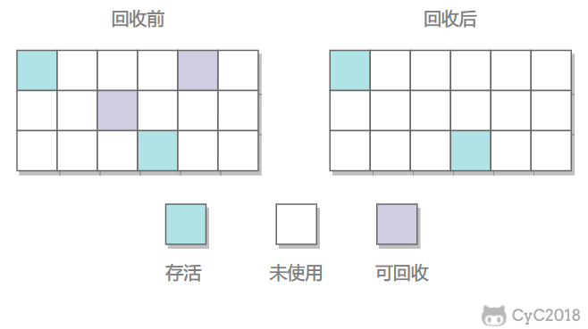
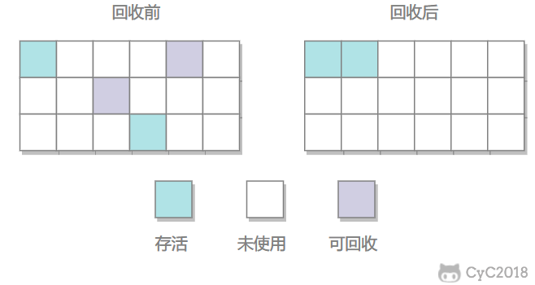
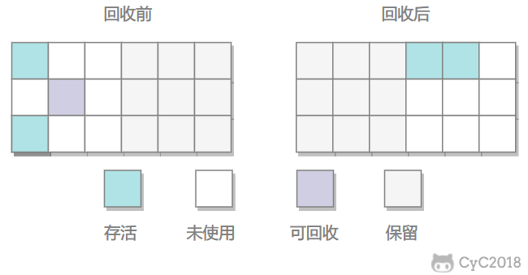
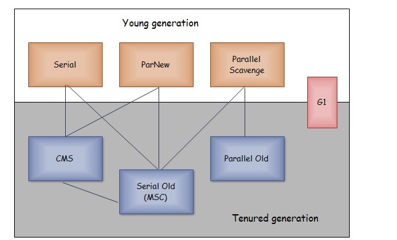

# JVM 垃圾回收

[TOC]

## 为什么需要进行垃圾回收

如果不对已经没有用处的对象进行回收，随着程序运行，对象就会越来越多，这些对象占用的内存空间就不能重复利用，导致内存耗尽，也就是内存泄漏。因此必须要有一些方法来对不再使用的对象的内存进行回收，以便于这一块内存可以再利用。

## 判断一个对象是否可以回收的方法

### 1. 引用计数法

当一个对象被引用时，它的引用计数增加 1，反之，当引用失效时引用计数减 1。

引用计数法实现简单，但是有一个致命问题，也就是如果两个对象互相引用，那么他们的引用计数都不会是 0，这种情况下虚拟机无法判断是否需要回收这两个对象。

### 2. 可达性分析法

现在主流的虚拟机大都是采用可达性分析法来判断对象是否需要被回收的。可达性分析法以 GC Roots 对象为起点，以树状向下查找，走过的路径为引用链，没有与引用链相连的对象就是不可用的。

要注意的是，并不是不可达的对象就必须马上回收，真正判断一个对象要被回收，需要经过两次标记的过程：

1. 第一次标记：经过可达性分析发现对象没有和 GC Roots 连接的引用链。
2. 第二次标记：再进行一次筛选，判断该对象是否有必要执行 finalize 方法，如果对象已经调用了或者没有覆盖 finalize 方法，那么虚拟机判定该对象是没有必要执行 finalize 方法，标记这个对象要被回收。

如果该对象有必要执行 finalize 方法，那么对象会被放置在一个叫做 F-Queue 的队列之中，之后会由虚拟机自动建立，由低优先级的 finalize 方法去执行（执行时只去触发对象的 finalize 方法，但是并不等待他运行结束，防止有的对象 finalize 进行缓慢，或者死循环，会导致队列持续等待，进而内存回收系统崩溃）。稍后 GC 会对 F-Queue 队列中的对象进行第二次标记，当 finalize 方法执行后成功将对象连接到引用链上任何一个对象，那么这个对象就被拯救成功了，不然则被回收。

#### Java 中可以作为 GC Roots 的对象

- 虚拟机栈（栈桢中的本地变量表）中的引用的对象
- 方法区中的类静态属性引用的对象
- 方法区中的常量引用的对象
- 本地方法栈中 JNI 的引用的对象

#### finalize 方法

类似 C++ 中的析构函数，可以用于关闭外部资源。但是 try-finally 等方式可以做得更好，并且该方法运行代价很高，不确定性大，无法保证各个对象的调用顺序，因此最好不要使用。

当一个对象可被回收时，如果需要执行该对象的 finalize 方法，那么就有可能在该方法中让对象重新被引用，从而实现自救。finalize 只能进行一次，如果回收的对象之前调用了 finalize 方法自救，后面回收时不会再调用该方法。

## 方法区回收

因为方法区主要存放永久代对象，而永久代对象的回收率比新生代低很多，所以在方法区上进行回收性价比不高。

### 常量的回收

相当于这个常量已经废弃了。比如常量池中有一个字符串对象“abc”，当系统中没有字符串引用这个对象时，那么这个常量在 GC 时将被回收。

### 类的卸载

类的卸载条件很多，需要满足以下三个条件，并且**满足了条件也不一定会被卸载**：

- 该类所有的实例都已经被回收，此时堆中不存在该类的任何实例。
- 加载该类的 ClassLoader 已经被回收。
- 该类对应的 Class 对象没有在任何地方被引用，也就无法在任何地方通过反射访问该类方法。

## 四种垃圾回收算法

### 标记-清除算法

分为标记和清除两个阶段：

1. 标记：检查每个对象是否为存活对象，如果是存活对象就打上标记。
2. 清除：对没有标记的对象进行回收并清除标志位，并且会判断回收分块与前一个空闲分块是否连续，如果连续就合并这两个分块。

回收就是把对象作为分块连接到“空闲链表”这个单向链表上，之后遍历这个链表就可以找到分块。

这个方法的缺点是标记和清除的效率不高，会产生内存碎片。

### 标记-整理算法

根据老年代的特点特出的一种标记算法，标记过程仍然与“标记-清除”算法一样，但后续步骤不是直接对可回收对象回收，而是让所有存活的对象向一端移动，然后直接清理掉端边界以外的内存。

这个方法不会产生内存碎片，但是需要移动大量对象，处理效率比较低。

### 复制算法

将内存分为大小相同的两块，每次使用其中的一块。当这一块的内存使用完后，就将还存活的对象复制到另一块去，然后再把使用的空间一次清理掉。这样就使每次的内存回收都是对内存区间的一半进行回收。

这个方法的优点是回收简单，且不会产生内存碎片。缺点是需要移动对象，只用了一半的内存空间。

现在的商用虚拟机都用这种方法回收新生代，但不是分为大小相等的两块，而是**一块较大的 Eden 空间和两块较小的 Survivor 空间，每次使用 Eden 和其中一块 Survivor**。在回收时，将 Eden 和 Survivor 中还存活着的对象全部复制到另一块 Survivor 上，最后清理 Eden 和使用过的那一块 Survivor。

HotSpot 虚拟机的 Eden 和 Survivor 大小比例默认为 8:1，保证了内存的利用率达到 90%。如果每次回收有多于 10% 的对象存活，那么一块 Survivor 就不够用了，此时需要依赖于老年代进行空间分配担保，也就是借用老年代的空间存储放不下的对象。

### 分代收集算法

当前虚拟机的垃圾收集都采用分代收集算法，这种算法没有什么新的思想，只是根据对象存活周期的不同将内存分为几块。一般将 Java 堆分为新生代和老年代，这样我们就可以根据各个年代的特点选择合适的垃圾收集算法。

比如在新生代中，每次收集都会有大量对象死去，所以可以选择“复制”算法，只需要付出少量对象的复制成本就可以完成每次垃圾收集。而老年代的对象存活几率是比较高的，而且没有额外的空间对它进行分配担保，所以我们必须选择“标记-清除”或“标记-整理”算法进行垃圾收集。

## Full GC 和 Minor GC

- Minor GC：只回收新生代，由于新生代存活时间短，因此 Minor GC 会频繁执行，速度一般比较快。
- Full GC：回收新生代和老年代，由于老年代存活时间长，因此 Full GC 很少执行，速度也比 Minor GC 慢很多。

---

**Full GC 触发条件**

1. 调用 System.gc() 方法

2. 老年代空间不足

3. 空间分配担保失败

4. JDK 1.7 以前的永久代空间不足

5. Concurrent Mode Failure

## 垃圾收集器

以上是 HotSpot 虚拟机中的 7 个垃圾收集器，连线表示垃圾收集器可以配合使用。

|     垃圾收集器     | 并发/并行  |    回收代     |        回收算法        |   目标    |
| ----------------- | --------- | ------------- | --------------------- | --------- |
| Serial            | 单 GC 线程 | 新生代        | 复制算法               | 响应速度优先          |
| ParNew            | 多 GC 线程 | 新生代        | 复制算法               |  响应速度优先         |
| Parallel Scavenge | 多 GC 线程 | 新生代        | 复制算法               | 吞吐量优先 |
| CMS               | 并发       | 老年代        | 标记-清除算法          |   响应速度优先        |
| Serial Old        | 单 GC 线程 | 老年代        | 标记-整理算法          |   响应速度优先        |
| Parallel Old      | 多 GC 线程 | 老年代        | 标记-整理算法          |  吞吐量优先         |
| G1                | 并发      | 新生代和老年代 | 复制算法、标记-整理算法 |   响应速度优先        |

### 新生代垃圾收集器

#### Serial

Serial（串行）收集器是最基本、发展历史最久的垃圾收集器。它在进行垃圾收集时，必须暂停其他所有的工作线程，直至 Serial 收集器收集结束为止（这个停顿也叫“Stop The World”）。这项工作是由虚拟机在后台自动发起和自动完成的，在用户不可见的情况下把用户正常工作的线程全部停掉，这对很多应用来说是难以接收的。

目前 Seiral 收集器依然是 HotSpot 虚拟机运行在 Client 模式下的默认的新生代收集器。它也有着优于其他收集器的地方：简单而高效（与其他收集器的单线程相比），对于限定单个 CPU 的环境来说，Serial 收集器由于没有线程交互的开销，专心做垃圾收集自然可以获得更高的单线程收集效率。

#### ParNew

ParNew 收集器就是 Serial 收集器的多线程版本，也是一个新生代收集器。除了使用多线程进行垃圾收集外，其余行为包括 Serial 收集器可用的所有控制参数、收集算法、停顿、对象分配规则、回收策略等与 Serial 收集器完全相同，两者共用了相当多的代码。

ParNew 收集器除了使用多线程收集外，其他与 Serial 收集器相比并无太多创新之处，但它却是许多运行在 Server 模式下的虚拟机中首选的新生代收集器，其中有一个与性能无关的重要原因是，除了 Serial 收集器外，目前只有它能和 CMS 收集器配合工作。

ParNew 收集器在单 CPU 的环境中绝对不会有比 Serial 收集器有更好的效果，甚至由于存在线程交互的开销，该收集器在通过超线程技术实现的两个 CPU 的环境中都不能百分之百地保证可以超越。在多 CPU 环境下，随着 CPU 的数量增加，它对于 GC 时系统资源的有效利用是很有好处的。它默认开启的收集线程数与 CPU 的数量相同，在 CPU 非常多的情况下可使用 `-XX:ParallerGCThreads` 参数设置。

#### Parallel Scavenge

Parallel Scavenge 收集器也是一个并行的多线程新生代收集器，它也使用复制算法。Parallel Scavenge 收集器的特点是它的关注点与其他收集器不同，CMS 等收集器的关注点是尽可能缩短垃圾收集时用户线程的停顿时间，而 Parallel Scavenge 收集器的目标是达到一个可控制的吞吐量。

停顿时间越短就越适合需要与用户交互的程序，良好的响应速度能提升用户体验。而高吞吐量则可以高效率地利用 CPU 时间，尽快完成程序的运算任务，主要适合在后台运算而不需要太多交互的任务。

Parallel Scavenge 收集器除了会显而易见地提供可以精确控制吞吐量的参数，还提供了一个参数 `-XX:+UseAdaptiveSizePolicy`，这是一个开关参数，打开参数后，就不需要手工指定新生代的大小、Eden 和 Survivor 区的比例、晋升老年代对象年龄等细节参数了，虚拟机会根据当前系统的运行情况收集性能监控信息，动态调整这些参数以提供最合适的停顿时间或者最大的吞吐量，这种方式称为 GC 自适应的调节策略（GC Ergonomics）。自适应调节策略也是 Parallel Scavenge 收集器与 ParNew 收集器的一个重要区别。

另外值得注意的一点是，Parallel Scavenge 收集器无法与 CMS 收集器配合使用，所以在 JDK 1.6 推出 Parallel Old 之前，如果新生代选择 Parallel Scavenge 收集器，老年代只有 Serial Old 收集器能与之配合使用。

### 老年代垃圾收集器

#### Serial Old

Serial Old 是 Serial 收集器的老年代版本，它同样是一个单线程收集器，使用标记-整理算法。

此收集器的主要意义也是在于给 Client 模式下的虚拟机使用。如果在 Server 模式下，它还有两大用途：

- 在 JDK1.5 以及之前版本（Parallel Old 诞生以前）中与 Parallel Scavenge 收集器搭配使用。
- 作为 CMS 收集器的后备预案，在并发收集发生 Concurrent Mode Failure 时使用。

#### Parallel Old

Parallel Old 收集器是 Parallel Scavenge 收集器的老年代版本，使用多线程和标记-整理算法。前面已经提到过，这个收集器是在 JDK 1.6 中才开始提供的，在此之前，如果新生代选择了 Parallel Scavenge 收集器，老年代除了 Serial Old 以外别无选择，所以在 Parallel Old 诞生以后，“吞吐量优先”收集器终于有了比较名副其实的应用组合，在注重吞吐量以及 CPU 资源敏感的场合，都可以优先考虑 Parallel Scavenge 加 Parallel Old 收集器。Parallel Old 收集器的工作流程与 Parallel Scavenge 相同。

#### CMS

CMS（Concurrent Mark Sweep）收集器是一种以获取最短回收停顿时间为目标的收集器，它非常符合那些集中在互联网站或者 B/S 系统的服务端上的 Java 应用，这些应用都非常重视服务的响应速度。从名字“Mark Sweep”上就可以看出它是基于“标记-清除”算法实现的。

CMS 收集器工作的整个流程分为以下 4 个步骤：

1. 初始标记（CMS initial mark）：仅仅只是标记一下 GC Roots 能直接关联到的对象，速度很快，需要“Stop The World”。
2. 并发标记（CMS concurrent mark）：进行 GC Roots Tracing 的过程，在整个过程中耗时最长。
3. 重新标记（CMS remark）：为了修正并发标记期间因用户程序继续运作而导致标记产生变动的那一部分对象的标记记录，这个阶段的停顿时间一般会比初始标记阶段稍长一些，但远比并发标记的时间短。此阶段也需要“Stop The World”。
4. 并发清除（CMS concurrent sweep）

由于整个过程中耗时最长的并发标记和并发清除过程收集器线程都可以与用户线程一起工作，所以，从总体上来说，CMS 收集器的内存回收过程是与用户线程一起并发执行的。

**优点**

CMS 是一款优秀的收集器，它的主要优点在名字上已经体现出来了：**并发收集、低停顿**，因此 CMS 收集器也被称为并发低停顿收集器（Concurrent Low Pause Collector）。

**缺点**

- 对 CPU 资源非常敏感：其实，面向并发设计的程序都对 CPU 资源比较敏感。在并发阶段，它虽然不会导致用户线程停顿，但会因为占用了一部分线程（或者说 CPU 资源）而导致应用程序变慢，总吞吐量会降低。CMS 默认启动的回收线程数是 `(CPU 数量 + 3) / 4`，也就是当 CPU 在 4 个以上时，并发回收时垃圾收集线程不少于 25% 的 CPU 资源，并且随着 CPU 数量的增加而下降。但是**当 CPU 不足 4 个时（比如 2 个），CMS 对用户程序的影响就可能变得很大**，如果本来 CPU 负载就比较大，还要分出一半的运算能力去执行收集器线程，就可能导致用户程序的执行速度忽然降低了 50%，其实也让人无法接受。
- 无法处理浮动垃圾（Floating Garbage）：可能出现“Concurrent Mode Failure”失败而导致另一次 Full GC 的产生。**由于 CMS 并发清理阶段用户线程还在运行着，伴随程序运行自然就还会有新的垃圾不断产生**。这一部分垃圾出现在标记过程之后，CMS 无法再当次收集中处理掉它们，只好留待下一次 GC 时再清理掉。这一部分垃圾就被称为“浮动垃圾”。也是由于在垃圾收集阶段用户线程还需要运行，那也就还需要预留有足够的内存空间给用户线程使用，因此 CMS 收集器不能像其他收集器那样等到老年代几乎完全被填满了再进行收集，需要预留一部分空间提供并发收集时的程序运作使用。
- 标记-清除算法导致的空间碎片：CMS 是一款基于“标记-清除”算法实现的收集器，这意味着收集结束时会有大量空间碎片产生。空间碎片过多时，将会给大对象分配带来很大麻烦，往往出现老年代空间剩余，但无法找到足够大连续空间来分配当前对象。

### G1 垃圾收集器

G1（Garbage-First）收集器是当今收集器技术发展最前沿的成果之一，它是一款**面向服务端应用**的垃圾收集器，HotSpot 开发团队赋予它的使命是（在比较长期的）未来可以替换掉 JDK 1.5 中发布的 CMS 收集器。与其他 GC 收集器相比，G1 具备如下特点：

- **并行与并发**：G1 能充分利用多 CPU、多核环境下的硬件优势，使用多个 CPU 来缩短“Stop The World”停顿时间，部分其他收集器原本需要停顿 Java 线程执行的 GC 动作，G1 收集器仍然可以通过并发的方式让 Java 程序继续执行。
- **分代收集**：与其他收集器一样，分代概念在 G1 中依然得以保留。虽然 G1 可以不需要其他收集器配合就能独立管理整个 GC 堆，但它能够采用不同方式去处理新创建的对象和已存活一段时间、熬过多次 GC 的旧对象来获取更好的收集效果。
- **空间整合**：G1 从整体来看是基于“标记-整理”算法实现的收集器，从局部（两个Region之间）上来看是基于“复制”算法实现的。这意味着 G1 运行期间不会产生内存空间碎片，收集后能提供规整的可用内存。此特性有利于程序长时间运行，分配大对象时不会因为无法找到连续内存空间而提前触发下一次 GC。
- **可预测的停顿**：这是 G1 相对 CMS 的一大优势，降低停顿时间是 G1 和 CMS 共同的关注点，但 G1 除了降低停顿外，还能建立可预测的停顿时间模型，能让使用者明确指定在一个长度为 M 毫秒的时间片段内，消耗在 GC 上的时间不得超过 N 毫秒，这几乎已经是实时 Java（RTSJ）的垃圾收集器的特征了。

---

**横跨整个堆内存**

在 G1 之前的其他收集器进行收集的范围都是整个新生代或者老生代，而 G1 不再是这样。G1 在使用时，Java 堆的内存布局与其他收集器有很大区别，它将整个 Java 堆划分为多个大小相等的独立区域（Region），虽然还保留新生代和老年代的概念，但新生代和老年代不再是物理隔离的了，而都是一部分 Region（不需要连续）的集合。

**建立可预测的时间模型**

G1 收集器之所以能建立可预测的停顿时间模型，是因为它可以有计划地避免在整个 Java 堆中进行全区域的垃圾收集。G1 跟踪各个 Region 里面的垃圾堆积的价值大小（回收所获得的空间大小以及回收所需时间的经验值），在后台维护一个优先列表，每次根据允许的收集时间，优先回收价值最大的 Region（这也就是“Garbage-First”名称的来由）。这种使用 Region 划分内存空间以及有优先级的区域回收方式，保证了G1收集器在有限的时间内可以获取尽可能高的收集效率。

**避免全堆扫描 —— Remembered Set**

G1 把 Java 堆分为多个 Region，就是“化整为零”。但是 Region 不可能是孤立的，一个对象分配在某个 Region中，可以与整个 Java 堆任意的对象发生引用关系。在做可达性分析确定对象是否存活的时候，需要扫描整个 Java 堆才能保证准确性，这显然是对 GC 效率的极大伤害。

为了避免全堆扫描的发生，虚拟机为 G1 中每个 Region 维护了一个与之对应的 Remembered Set。虚拟机发现程序在对 Reference 类型的数据进行写操作时，会产生一个 Write Barrier 暂时中断写操作，检查 Reference 引用的对象是否处于不同的 Region 之中（在分代的例子中就是检查是否老年代中的对象引用了新生代中的对象），如果是，便通过 CardTable 把相关引用信息记录到被引用对象所属的 Region 的 Remembered Set 之中。当进行内存回收时，在 GC 根节点的枚举范围中加入 Remembered Set 即可保证不对全堆扫描也不会有遗漏。

---

如果不计算维护 Remembered Set 的操作，G1 收集器的运作大致可划分为以下几个步骤：

1. 初始标记（Initial Marking）：仅仅只是标记一下 GC Roots 能直接关联到的对象，并且修改 TAMS（Nest Top Mark Start）的值，让下一阶段用户程序并发运行时，能在正确可以的 Region 中创建对象，此阶段需要停顿线程，但耗时很短。
2. 并发标记（Concurrent Marking）：从 GC Root 开始对堆中对象进行可达性分析，找到存活对象，此阶段耗时较长，但可与用户程序并发执行。
3. 最终标记（Final Marking）：为了修正在并发标记期间因用户程序继续运作而导致标记产生变动的那一部分标记记录，虚拟机将这段时间对象变化记录在线程的 Remembered Set Logs 里面，最终标记阶段需要把 Remembered Set Logs 的数据合并到 Remembered Set 中，这阶段需要停顿线程，但是可并行执行。
4. 筛选回收（Live Data Counting and Evacuation）：首先对各个 Region 中的回收价值和成本进行排序，根据用户所期望的 GC 停顿是时间来制定回收计划。此阶段其实也可以做到与用户程序一起并发执行，但是因为只回收一部分 Region，时间是用户可控制的，而且停顿用户线程将大幅度提高收集效率。
