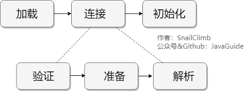

# JVM 类加载

要点：

- 类加载过程
- 类加载器

## 类加载过程

Class 文件需要加载到虚拟机中之后才能运行和使用，那么虚拟机是如何加载这些 Class 文件呢？系统加载 Class 类型的文件主要三步: **加载->连接->初始化**。连接过程又可分为三步: **验证->准备->解析**。

### 加载

### 验证

### 准备

### 解析

### 初始化

## 类加载器

### 双亲委派模型

每一个类都有一个对应它的类加载器。系统中的 ClassLoder 在协同工作的时候会默认使用 双亲委派模型 。即在类加载的时候，系统会首先判断当前类是否被加载过。已经被加载的类会直接返回，否则才会尝试加载。**加载的时候，首先会把该请求委派该父类加载器的 loadClass() 处理，因此所有的请求最终都应该传送到顶层的启动类加载器 BootstrapClassLoader 中。当父类加载器无法处理时，才由自己来处理**。当父类加载器为null时，会使用启动类加载器 BootstrapClassLoader 作为父类加载器。

#### 双亲委派模型的好处

双亲委派模型保证了Java程序的稳定运行，可以避免类的重复加载（JVM 区分不同类的方式不仅仅根据类名，相同的类文件被不同的类加载器加载产生的是两个不同的类），也保证了 Java 的核心 API 不被篡改。如果不用没有使用双亲委派模型，而是每个类加载器加载自己的话就会出现一些问题，比如我们编写一个称为 java.lang.Object 类的话，那么程序运行的时候，系统就会出现多个不同的 Object 类。

#### 如果我们不想用双亲委派模型怎么办

为了避免双亲委托机制，我们可以自己定义一个类加载器，然后重载 loadClass() 即可。

### 自定义类加载器

除了 BootstrapClassLoader 其他类加载器均由 Java 实现且全部继承自 java.lang.ClassLoader。如果我们要自定义自己的类加载器，很明显需要继承 ClassLoader。
