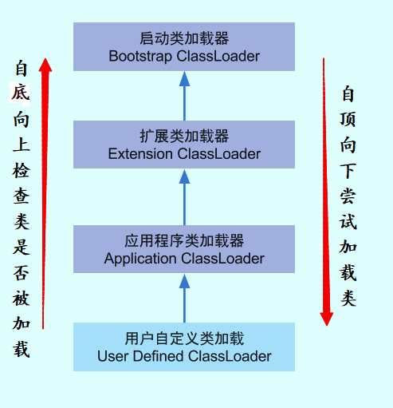

# JVM 类加载

[TOC]

## 类加载过程

系统加载 class 文件主要三步：**加载 -> 链接 -> 初始化**。其中链接过程又可分为三步：**验证 -> 准备 -> 解析**。

**1. 加载**

通过 ClassLoader 加载 class 文件字节码，生成 Class 对象。

**2. 验证**

检查加载的 Class 的正确性和安全性。

**3. 准备**

为类变量分配存储空间并设置类变量初始值。

**4. 解析**

JVM 将常量池内的符号引用转换为直接引用。

**5. 初始化**

执行类变量赋值和静态代码块。

---

**ClassLoader.loadClass() 和 Class.forName() 的区别**

- ClassLoader.loadClass() 只会执行第一步加载，不会执行后面的链接和初始化，无法执行类的静态代码块。
- Class.forName() 会执行完初始化，可以执行类的静态代码块。

## 类加载器 ClassLoader

### 双亲委派模型

每一个类都有一个对应它的类加载器。系统中的 ClassLoder 在协同工作的时候会默认使用双亲委派模型。

在类加载的时候，系统会首先判断当前类是否被加载过。已经被加载的类会直接返回，否则才会尝试加载。**加载的时候，首先会把该请求委派该父类加载器的 loadClass() 处理，因此所有的请求最终都应该传送到顶层的启动类加载器 BootstrapClassLoader 中。当父类加载器无法处理时，才由自己来处理**。当父类加载器为 null 时，会使用启动类加载器 BootstrapClassLoader 作为父类加载器。

---

**双亲委派模型的好处**

双亲委派模型保证了 Java 程序的稳定运行，可以避免类的重复加载（JVM 区分不同类的方式不仅仅根据类名，相同的类文件被不同的类加载器加载产生的是两个不同的类），也保证了 Java 的核心 API 不被篡改。如果不用没有使用双亲委派模型，而是每个类加载器加载自己的话就会出现一些问题，比如我们编写一个称为 java.lang.Object 类的话，那么程序运行的时候，系统就会出现多个不同的 Object 类。

---

**如果我们不想用双亲委派模型怎么办**

为了避免双亲委托机制，我们可以自己定义一个类加载器，然后重写 loadClass() 即可。

### 自定义类加载器

除了 BootstrapClassLoader 其他类加载器均由 Java 实现且全部继承自 java.lang.ClassLoader。如果我们要自定义自己的类加载器，很明显需要继承 ClassLoader。
