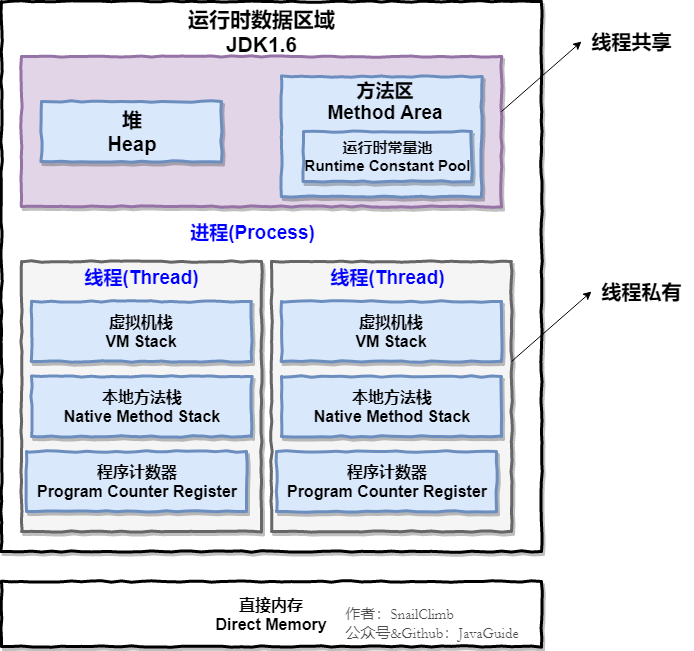
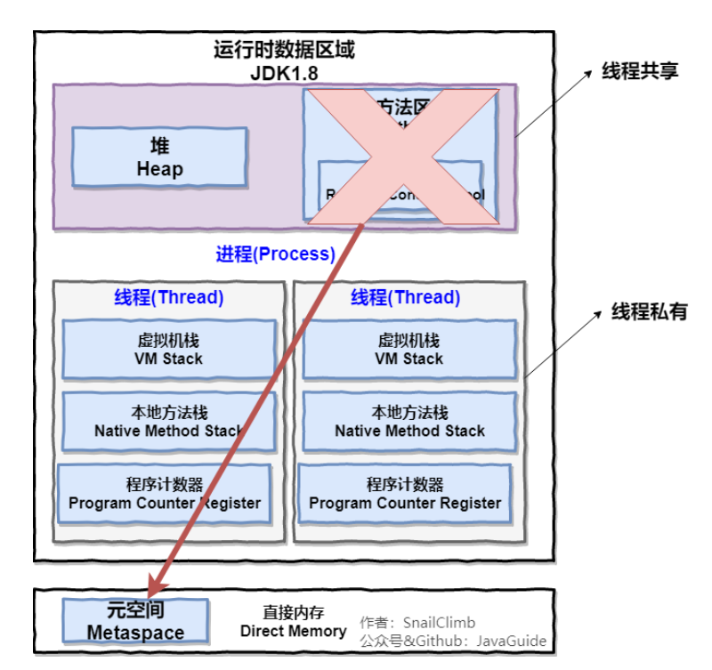

# JVM

[TOC]

## 运行时数据区域

JDK1.8 之前：



JDK1.8 之后：方法区常量池移动到了堆中



线程私有的：

- 程序计数器
- 虚拟机栈
- 本地方法栈

线程共享的：

- 堆
- 方法区
- 直接内存 (非运行时数据区的一部分)

---

程序计数器：

- 当前线程所执行的字节码行号指示器（逻辑）
- 改变计数器的值来选取下一条需要执行的字节码指令
- 和线程是一对一的关系（线程私有）
- 对 Java 方法计数，如果是 Native 方法则计数器的值为 Undefined
- 不会发生内存泄漏

---

JDK 1.7 之前，方法区位于永久代，永久代和堆相互隔离，永久代的大小在启动 JVM 时可以设置一个固定值，不可变。
JDK 1.7 中，存储在永久代的部分数据就已经转移到 Java Heap 或者 Native Memory。但永久代仍存在于 JDK 1.7 中，并没有完全移除，譬如符号引用（Symbols）转移到了 Native Memory，字符串常量池（Interned Strings）转移到了 Java heap，类的静态变量（Class Statics）转移到了 Java heap。
JDK 1.8 中，取消永久代，方法存放于元空间（Metaspace），元空间仍然与堆不相连，但与堆共享物理内存，逻辑上可认为在堆中。

> Native Memory：本地内存，也称为 C-Heap，是供 JVM 自身进程使用的。当 Java Heap 空间不足时会触发 GC，但 Native Memory 空间不够却不会触发 GC。

[Java方法区、永久代、元空间、常量池详解](https://blog.csdn.net/u011635492/article/details/81046174)

## 四种引用类型

### 1. 强引用

使用 new 关键字创建一个新对象的方式来创建强引用。被强引用关联的对象不会被回收。

```java
Object obj = new Object();
```

### 2. 软引用

使用 SoftReference 类来创建软引用。被软引用关联的对象在内存不够时才会被回收。

```java
Object obj = new Object();
SoftReference<Object> sf = new SoftReference<>(obj);
obj = null;  // 使对象只被软引用关联
```

### 3. 弱引用

使用 WeakReference 类来创建弱引用。被弱引用关联的对象只能存活到下一次垃圾回收时。

```java
Object obj = new Object();
WeakReference<Object> wf = new WeakReference<>(obj);
obj = null;  // 使对象只被弱引用关联
```

### 4. 虚引用

又称为幽灵引用或者幻影引用，使用 PhantomReference 类来创建虚引用。一个对象是否有虚引用的存在，不会对其生存时间造成影响，也无法通过虚引用得到一个对象。为一个对象设置虚引用的唯一目的是能在这个对象被回收时收到一个系统通知。

```java
Object obj = new Object();
PhantomReference<Object> pf = new PhantomReference<>(obj, null);
obj = null;  // 使对象只被虚引用关联
```

## 内存分配策略

**1. 对象优先在 Eden 区分配**

大多数情况下，对象在新生代的 Eden 区上分配，当 Eden 空间不足时，进行一次 Minor GC。

**2. 大对象直接进入老年代**

大对象是指需要连续内存空间的对象，最典型的大对象是那种很长的字符串以及数组。

经常出现大对象会提前触发垃圾收集以获取足够的连续空间分配给大对象。

JVM 启动时使用 `-XX:PretenureSizeThreshold` 参数设定阈值，大于此值的对象直接在老年代分配，避免在 Eden 和 Survivor 之间的大量内存复制。

**3. 长期存活的对象也进入老年代**

为对象定义年龄计数器，对象在 Eden 出生并经过 Minor GC 依然存活，将移动到 Survivor 中，年龄就增加 1 岁，增加到一定年龄则移动到老年代中。

JVM 启动时使用 `-XX:MaxTenuringThreshold` 参数设定年龄的阈值。

**4. 动态对象年龄判定**

虚拟机并不是永远要求对象的年龄必须达到 MaxTenuringThreshold 才能晋升老年代，如果在 Survivor 中相同年龄所有对象大小的总和大于 Survivor 空间的一半，则年龄大于或等于该年龄的对象可以直接进入老年代，无需等到 MaxTenuringThreshold 中要求的年龄。

**5. 空间分配担保**

在发生 Minor GC 之前，虚拟机先检查老年代最大可用的连续空间是否大于新生代所有对象总空间。如果条件成立的话，那么 Minor GC 可以确认是安全的。如果不成立的话虚拟机会查看 HandlePromotionFailure 的值是否允许担保失败，如果允许那么就会继续检查老年代最大可用的连续空间是否大于历次晋升到老年代对象的平均大小，如果大于，将尝试着进行一次 Minor GC；如果小于，或者 HandlePromotionFailure 的值不允许冒险，那么就要进行一次 Full GC。

## JVM 垃圾回收

[JVM 垃圾回收.md](JVM%20垃圾回收.md)

## JVM 类加载

[JVM 类加载.md](JVM%20类加载.md)

## JVM 运行堆和栈信息

[获取 JVM 进程的线程堆栈 dump 和堆 dump](http://0000-bigtree.github.io/blog/2017/03/05/get-java-process-stack.html)