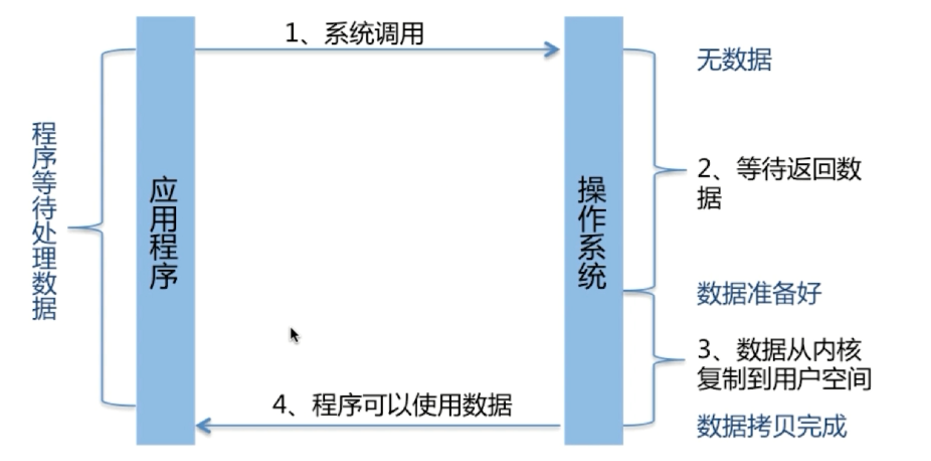
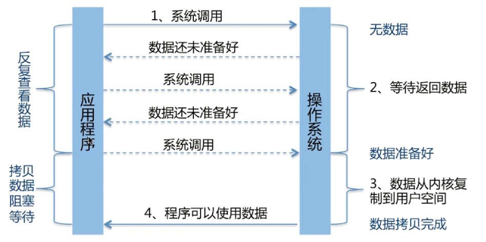
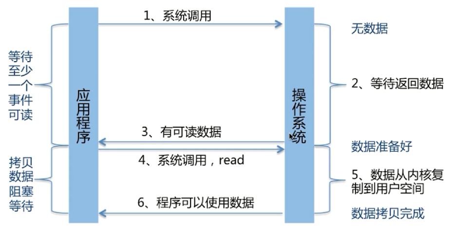
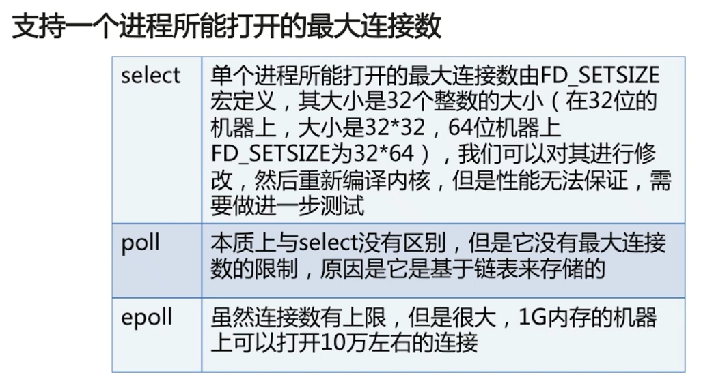
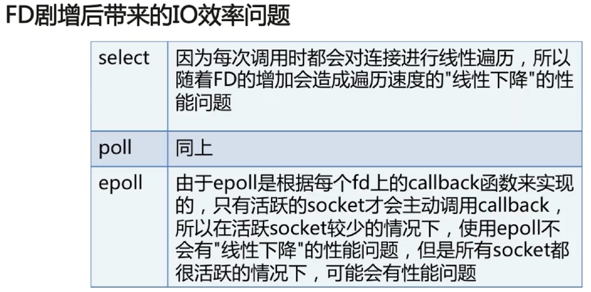
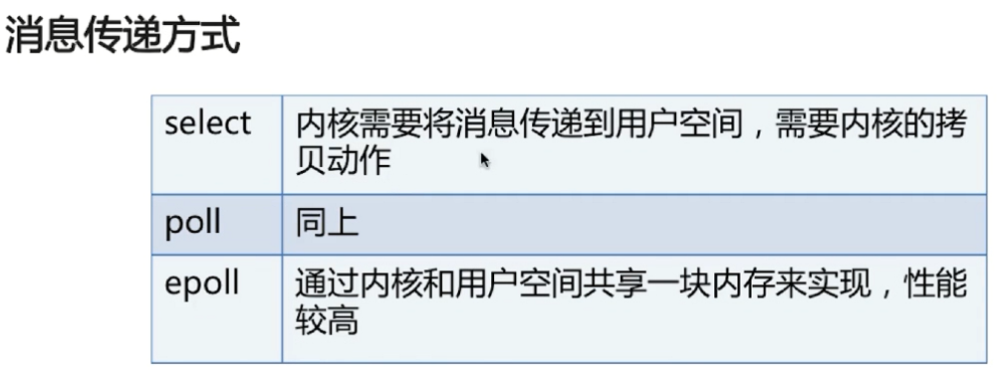
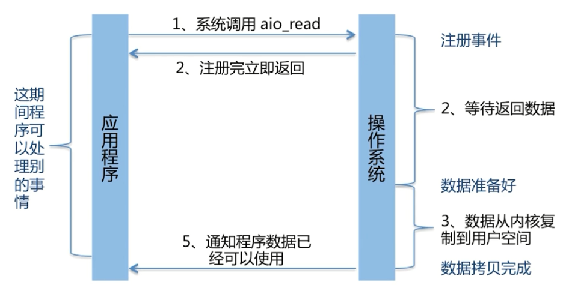

# Java IO

[TOC]

## 一些基本概念

Java 中的 BIO、NIO和 AIO 理解为是 Java 语言对操作系统的各种 IO 模型的封装。程序员在使用这些 API 的时候，不需要关心操作系统层面的知识，也不需要根据不同操作系统编写不同的代码。只需要使用 Java 的 API 就可以了。

### 同步与异步

- 同步： 同步就是发起一个调用后，被调用者未处理完请求之前，调用不返回。
- 异步： 异步就是发起一个调用后，立刻得到被调用者的回应表示已接收到请求，但是被调用者并没有返回结果，此时我们可以处理其他的请求，被调用者通常依靠事件，回调等机制来通知调用者其返回结果。

同步和异步的区别最大在于异步的话调用者不需要等待处理结果，被调用者会通过回调等机制来通知调用者其返回结果。

### 阻塞和非阻塞

阻塞和非阻塞主要是说操作执行过程中会不会被操作系统挂起，进入阻塞状态。

- 阻塞： 阻塞就是发起一个请求，调用者一直等待请求结果返回，也就是当前线程会被挂起，无法从事其他任务，只有当条件就绪才能继续。
- 非阻塞： 非阻塞就是发起一个请求，调用者不用一直等着结果返回，可以先去干其他事情。

**调用同步方法未必会被阻塞**，如果这个同步方法没有执行导致阻塞的操作，线程不会进入阻塞状态。

## BIO (Blocking IO)

**同步阻塞 IO**，数据的读写必须阻塞在一个线程内等待其完成。

java.io 和 java.net 包下的一些类和接口，比如基于字节流的 InputStream，OutputStream，基于字符流的 Reader，Writer 等。

## NIO (Non-Blocking IO)

NIO 是一种**多路复用、同步非阻塞 IO **模型，在 Java 1.4 中引入了 NIO 框架，对应 java.nio 包，提供了 Channel , Selector，Buffer 等抽象。

IO 多路复用：调用系统级别的 select/poll/epoll

## AIO

也就是 NIO 2。在 Java 7 中引入了 NIO 的改进版 NIO 2,它是异步非阻塞的 IO 模型。AIO 是**基于事件和回调机制**实现的，也就是应用操作之后会直接返回，不会堵塞在那里，当后台处理完成，操作系统会通知相应的线程进行后续的操作。

