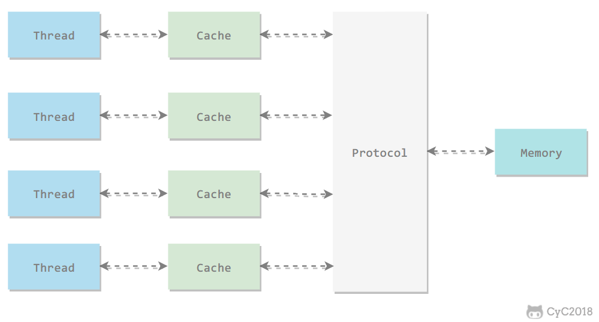
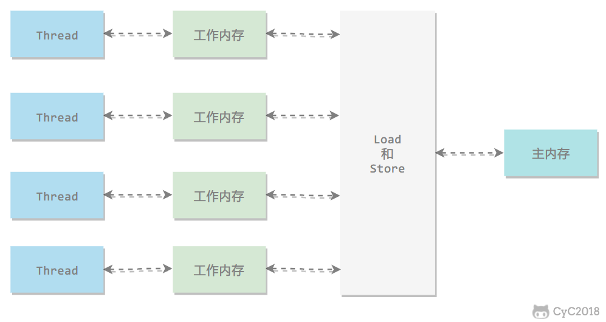
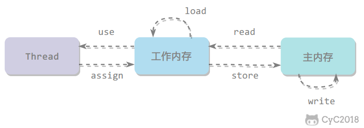
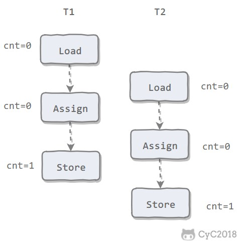
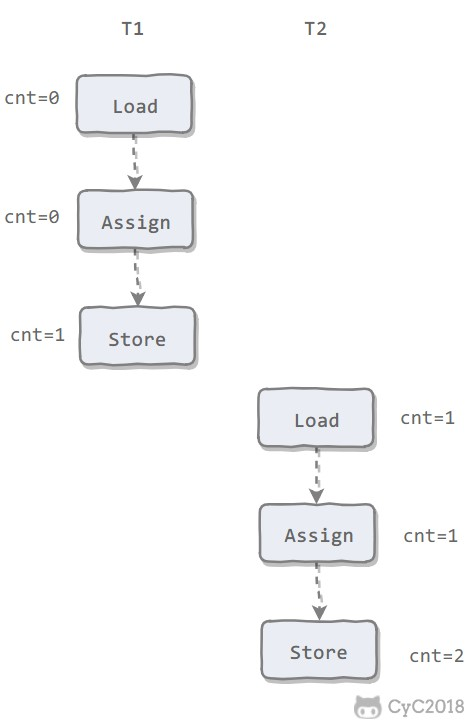
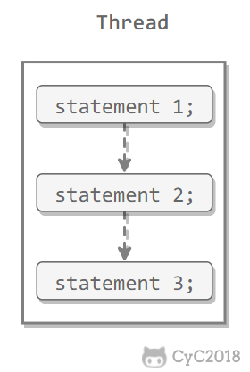
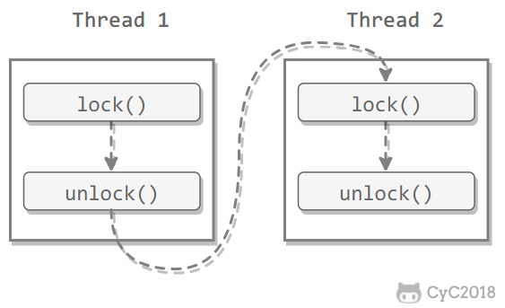
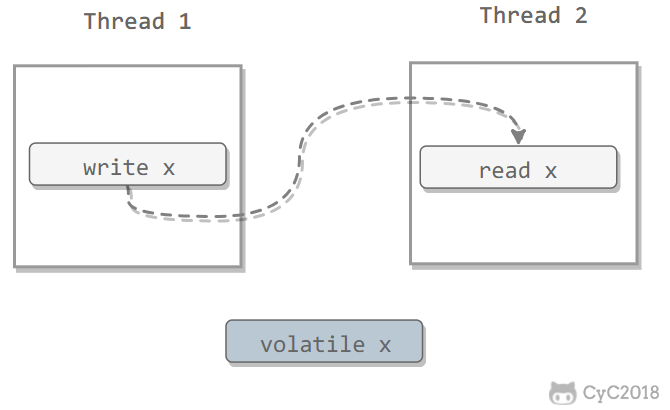
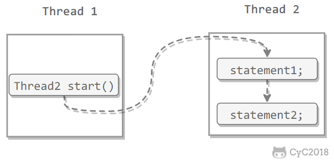
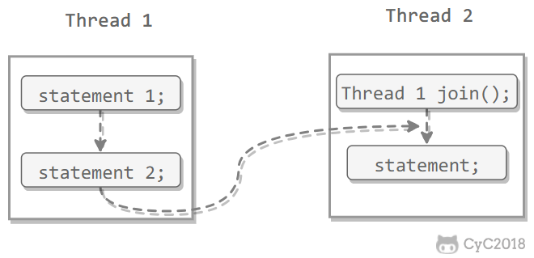

# Java 内存模型

[TOC]

## Java 内存模型（JMM）作用

Java 内存模型试图屏蔽各种硬件和操作系统的内存访问差异，以实现让 Java 程序在各种平台下都能达到一致的内存访问效果。

## 主内存与工作内存

处理器上的寄存器的读写的速度比内存快几个数量级，为了解决这种速度矛盾，在它们之间加入了高速缓存。

加入高速缓存带来了一个新的问题：缓存一致性。如果多个缓存共享同一块主内存区域，那么多个缓存的数据可能会不一致，需要一些**缓存一致性协议**来解决这个问题。

> 在多处理器下，为了保证各个处理器的缓存是一致的，就会实现缓存一致性协议，每个处理器通过嗅探在总线上传播的数据来检查自己缓存的值是不是过期了，当处理器发现自己缓存行对应的内存地址被修改，就会将当前处理器的缓存行设置成无效状态，当处理器对这个数据进行修改操作的时候，会重新从系统内存中把数据读到处理器缓存里。



所有的变量都存储在主内存中，每个线程还有自己的工作内存，工作内存存储在高速缓存或者寄存器中，保存了该线程使用的变量的主内存副本拷贝。

线程只能直接操作工作内存中的变量，不同线程之间的变量值传递需要通过主内存来完成。



## 内存间交互操作

Java 内存模型定义了 8 个操作来完成主内存和工作内存的交互操作。



- read：把一个变量的值从主内存传输到工作内存中
- load：在 read 之后执行，把 read 得到的值放入工作内存的变量副本中
- use：把工作内存中一个变量的值传递给执行引擎
- assign：把一个从执行引擎接收到的值赋给工作内存的变量
- store：把工作内存的一个变量的值传送到主内存中
- write：在 store 之后执行，把 store 得到的值放入主内存的变量中
- lock：作用于主内存的变量
- unlock

## 内存模型三大特征

### 1. 原子性

Java 内存模型保证了 read、load、use、assign、store、write、lock 和 unlock 操作具有原子性，例如对一个 int 类型的变量执行 assign 赋值操作，这个操作就是原子性的。但是 Java 内存模型允许虚拟机将没有被 volatile 修饰的 64 位数据（long，double）的读写操作划分为两次 32 位的操作来进行，即 load、store、read 和 write 操作可以不具备原子性。

有一个错误认识就是，int 等原子性的类型在多线程环境中不会出现线程安全问题。前面的线程不安全示例代码中，cnt 属于 int 类型变量，1000 个线程对它进行自增操作之后，得到的值为 997 而不是 1000。

为了方便讨论，将内存间的交互操作简化为 3 个：load、assign、store。

下图演示了两个线程同时对 cnt 进行操作，load、assign、store 这一系列操作整体上看不具备原子性，那么在 T1 修改 cnt 并且还没有将修改后的值写入主内存，T2 依然可以读入旧值。可以看出，这两个线程虽然执行了两次自增运算，但是主内存中 cnt 的值最后为 1 而不是 2。因此对 int 类型读写操作满足原子性只是说明 load、assign、store 这些单个操作具备原子性。



AtomicInteger 能保证多个线程修改的原子性。



使用 AtomicInteger 重写之前线程不安全的代码之后得到以下线程安全实现：

```java
public class AtomicExample {
    private AtomicInteger cnt = new AtomicInteger();

    public void add() {
        cnt.incrementAndGet();
    }

    public int get() {
        return cnt.get();
    }

    public static void main(String[] args) throws InterruptedException {
        final int threadSize = 1000;
        AtomicExample example = new AtomicExample(); // 只修改这条语句
        final CountDownLatch countDownLatch = new CountDownLatch(threadSize);
        ExecutorService executorService = Executors.newCachedThreadPool();
        for (int i = 0; i < threadSize; i++) {
            executorService.execute(() -> {
                example.add();
                countDownLatch.countDown();
            });
        }
        countDownLatch.await();
        executorService.shutdown();
        System.out.println(example.get());
    }
}

/*
输出
1000
*/
```

除了使用原子类之外，也可以使用 synchronized 互斥锁来保证操作的原子性。它对应的内存间交互操作为：lock 和 unlock，在虚拟机实现上对应的字节码指令为 monitorenter 和 monitorexit。

```java
public class AtomicSynchronizedExample {
    private int cnt = 0;

    public synchronized void add() {
        cnt++;
    }

    public synchronized int get() {
        return cnt;
    }

    public static void main(String[] args) throws InterruptedException {
        final int threadSize = 1000;
        AtomicSynchronizedExample example = new AtomicSynchronizedExample();
        final CountDownLatch countDownLatch = new CountDownLatch(threadSize);
        ExecutorService executorService = Executors.newCachedThreadPool();
        for (int i = 0; i < threadSize; i++) {
            executorService.execute(() -> {
                example.add();
                countDownLatch.countDown();
            });
        }
        countDownLatch.await();
        executorService.shutdown();
        System.out.println(example.get());
    }
}

/*
输出
1000
*/
```

### 2. 可见性

可见性指当一个线程修改了共享变量的值，其它线程能够立即得知这个修改。Java 内存模型是通过在变量修改后将新值同步回主内存，在变量读取前从主内存刷新变量值来实现可见性的。

主要有三种实现可见性的方式：

- 使用 synchronized 关键字，对一个变量执行 unlock 操作之前，必须把变量值同步回主内存。
- 使用 volatile 关键字。
- final，被 final 关键字修饰的字段在构造器中一旦初始化完成，并且没有发生 this 逃逸（其它线程通过 this 引用访问到初始化了一半的对象），那么其它线程就能看见 final 字段的值。

对前面的线程不安全示例中的 cnt 变量使用 volatile 修饰，不能解决线程不安全问题，**因为 volatile 并不能保证操作的原子性**。

#### synchronized 关键字

进入 synchronized 块的内存语义是将块内使用到的变量从线程的工作内存中清除，这样在使用该变量时，就会直接从主内存中获取。退出 synchronized 块的内存语义是把块内对共享变量的修改刷新到主内存。

#### volatile 关键字

当一个变量被声明为 volatile 时，线程在写入变量时不会把值缓存在寄存器或者其他地方，而是会把值刷新回主内存。当其他线程读取该共享变量时，会从主内存重新获取最新值，而不是使用当前线程的工作内存中的值。

### 3. 有序性

有序性是指：在本线程内观察，所有操作都是有序的。在一个线程观察另一个线程，所有操作都是无序的，无序是因为发生了指令重排序。Java 内存模型允许编译器和处理器对指令进行重排序以提高运行性能，并且只会对不存在数据依赖性的指令重排序。重排序过程不会影响到单线程程序的执行，却会影响到多线程并发执行的正确性。

volatile 关键字通过添加**内存屏障**的方式来禁止指令重排序，即重排序时不能把后面的指令放到内存屏障之前。

写 volatile 变量时，可以保证 volatile 写之前的操作不会被编译器重排序到 volatile 写之后；读 volatile 变量时，可以保证 volatile 读之后的操作不会被编译器重排序到 volatile 读之前。

> 内存屏障（Memory Barrier），也称内存栅栏，内存栅障，屏障指令等，是一类同步屏障指令，它使得 CPU 或编译器在对内存进行操作的时候, 严格按照一定的顺序来执行, 也就是说在内存屏障之前的指令和内存屏障之后的指令不会由于系统优化等原因而导致乱序。

也可以通过 synchronized 来保证有序性，它保证每个时刻只有一个线程执行同步代码，相当于是让线程顺序执行同步代码。

## 先行发生原则

上面提到了可以用 volatile 和 synchronized 来保证有序性。除此之外，JVM 还规定了先行发生原则，让一个操作无需控制就能先于另一个操作完成。

### 1. 单一线程原则（Single Thread rule）

在一个线程内，在程序前面的操作先行发生于后面的操作。



### 2. 管程锁定规则（Monitor Lock Rule）

一个 unlock 操作先行发生于后面对同一个锁的 lock 操作。



### 3. volatile 变量规则（Volatile Variable Rule）

对一个 volatile 变量的写操作先行发生于后面对这个变量的读操作。



### 4. 线程启动规则（Thread Start Rule）

Thread 对象的 start() 方法调用先行发生于此线程的每一个动作。



### 5. 线程加入规则（Thread Join Rule）

Thread 对象的结束先行发生于 join() 方法返回。



### 6. 线程中断规则（Thread Interruption Rule）

对线程 interrupt() 方法的调用先行发生于被中断线程的代码检测到中断事件的发生，可以通过 interrupted() 方法检测到是否有中断发生。

### 7. 对象终结规则（Finalizer Rule）

一个对象的初始化完成（构造函数执行结束）先行发生于它的 finalize() 方法的开始。

### 8. 传递性（Transitivity）

如果操作 A 先行发生于操作 B，操作 B 先行发生于操作 C，那么操作 A 先行发生于操作 C。
