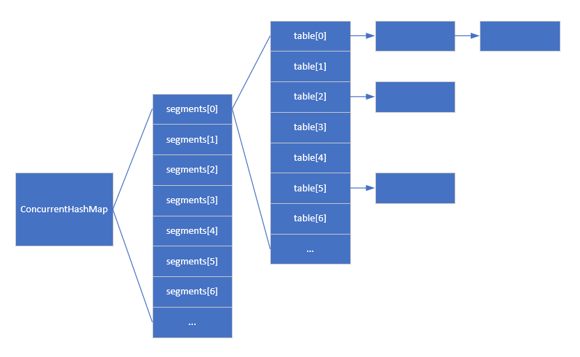

# ConcurrentHashMap

[TOC]

## 实现原理

JDK 1.7 中使用了分段锁的方法来提高性能。其中分段锁 Segment 是继承自 ReentrantLock 的。JDK 1.7 中的 ConcurrentHashMap 维护了一个 Segment 数组，每个 Segment 里面有一个 HashEntry 数组。查找时首先根据哈希值找到对应的段 Segment，然后在这个段中再根据哈希值找到对应的 HashEntry 数组下标，也就是在每个段中就类似 HashMap 的查找了。put 方法加锁时是对一个 Segment 加锁的，因此如果两个线程操作不同的 Segment 那么是不会发生竞争的。



```java
/**
 * Segment 数组，存放数据时首先需要定位到具体的 Segment 中。
 */
final Segment<K,V>[] segments;

transient Set<K> keySet;
transient Set<Map.Entry<K,V>> entrySet;
```

```java
static final class Segment<K,V> extends ReentrantLock implements Serializable {

    private static final long serialVersionUID = 2249069246763182397L;

    // 和 HashMap 中的 HashEntry 作用一样，真正存放数据的桶
    transient volatile HashEntry<K,V>[] table;

    transient int count;

    transient int modCount;

    transient int threshold;

    final float loadFactor;

}
```

---

JDK 1.8 中没有使用分段锁，而是在 put 的时候使用了 CAS + synchronized 的方法。

## 关键源码

### JDK 1.7

#### hash

```java
private int hash(Object k) {
    int h = hashSeed;

    if ((0 != h) && (k instanceof String)) {
        return sun.misc.Hashing.stringHash32((String) k);
    }

    h ^= k.hashCode();

    // 此处使用的是 Wang/Jenkins 哈希的变种算法！
    h += (h << 15) ^ 0xffffcd7d;
    h ^= (h >>> 10);
    h += (h << 3);
    h ^= (h >>> 6);
    h += (h << 2) + (h << 14);
    return h ^ (h >>> 16);
}
```

#### put

```java
public V put(K key, V value) {
    Segment<K,V> s;
    // 值不能为 null，会抛出 NullPointerException 异常
    if (value == null)
        throw new NullPointerException();

    // 根据键得到哈希值
    int hash = hash(key);

    // 根据哈希值获取 Segment 的下标
    int j = (hash >>> segmentShift) & segmentMask;
    if ((s = (Segment<K,V>)UNSAFE.getObject          // nonvolatile; recheck
         (segments, (j << SSHIFT) + SBASE)) == null) //  in ensureSegment
        s = ensureSegment(j);

    // 调用 Segment 的 put 方法
    return s.put(key, hash, value, false);
}

// Segment 的 put 方法
final V put(K key, int hash, V value, boolean onlyIfAbsent) {
    // 首先尝试获取锁，如果获取失败说明有竞争，调用 scanAndLockForPut 方法继续尝试
    HashEntry<K,V> node = tryLock() ? null :
        scanAndLockForPut(key, hash, value);

    V oldValue;
    try {
        HashEntry<K,V>[] tab = table;

        // 根据哈希值得到桶下标
        int index = (tab.length - 1) & hash;

        // 得到这个桶中的链表头
        HashEntry<K,V> first = entryAt(tab, index);

        // 遍历链表
        for (HashEntry<K,V> e = first;;) {
            if (e != null) {
                K k;
                // 如果找到了对应键的 entry
                if ((k = e.key) == key ||
                    (e.hash == hash && key.equals(k))) {
                    // 首先设置旧的值
                    oldValue = e.value;
                    // 如果没有设置 onlyIfAbsent 这个条件，就修改 entry 的值
                    if (!onlyIfAbsent) {
                        e.value = value;
                        ++modCount;
                    }
                    break;
                }
                e = e.next;
            }
            else {
                // 如果 node 不为 null，说明有竞争
                if (node != null)
                    node.setNext(first);
                // 如果 node 为 null，说明没有竞争
                else
                    node = new HashEntry<K,V>(hash, key, value, first);

                // 新的元素数量
                int c = count + 1;

                // 如果新的元素数量超过阈值且原数组长度不超过最大容量，就扩容
                if (c > threshold && tab.length < MAXIMUM_CAPACITY)
                    rehash(node);
                // 否则直接添加新的 entry
                else
                    setEntryAt(tab, index, node);

                ++modCount;

                // 更新元素数量
                count = c;

                // 没有旧的值，因此 oldValue 是 null
                oldValue = null;
                break;
            }
        }
    } finally {
        unlock();
    }
    return oldValue;
}
```

#### get

```java
public V get(Object key) {
    Segment<K,V> s; // manually integrate access methods to reduce overhead
    HashEntry<K,V>[] tab;

    // 根据键得到哈希值
    int h = hash(key);

    // 得到 Segment 下标
    long u = (((h >>> segmentShift) & segmentMask) << SSHIFT) + SBASE;

    // 找到键值对所在的 Segment
    if ((s = (Segment<K,V>)UNSAFE.getObjectVolatile(segments, u)) != null &&
        (tab = s.table) != null) {

        // 根据键值对找到桶，然后遍历这个桶中的链表来查找目标键值对
        for (HashEntry<K,V> e = (HashEntry<K,V>) UNSAFE.getObjectVolatile
                 (tab, ((long)(((tab.length - 1) & h)) << TSHIFT) + TBASE);
             e != null; e = e.next) {
            K k;

            // 如果找到了目标键值对，返回它的值
            if ((k = e.key) == key || (e.hash == h && key.equals(k)))
                return e.value;
        }
    }

    // 没找到目标键值对，返回 null
    return null;
}
```

### JDK 1.8

#### spread

```java
static final int spread(int h) {
    return (h ^ (h >>> 16)) & HASH_BITS;
}
```

#### put（未整理完成）

```java
public V put(K key, V value) {
    return putVal(key, value, false);
}

final V putVal(K key, V value, boolean onlyIfAbsent) {
    // 如果键或者值为 null，抛出 NullPointerException 异常
    if (key == null || value == null) throw new NullPointerException();

    // 根据键得到哈希值
    int hash = spread(key.hashCode());
    int binCount = 0;

    for (Node<K,V>[] tab = table;;) {
        Node<K,V> f; int n, i, fh;

        // 如果数组为 null 或者长度为 0，初始化数组
        if (tab == null || (n = tab.length) == 0)
            tab = initTable();
        // 如果是空的桶，使用 CAS 操作来添加节点，不加锁
        else if ((f = tabAt(tab, i = (n - 1) & hash)) == null) {
            if (casTabAt(tab, i, null,
                            new Node<K,V>(hash, key, value, null)))
                break;                   // no lock when adding to empty bin
        }
        // 如果正在执行扩容，则帮助转移这个节点
        else if ((fh = f.hash) == MOVED)
            tab = helpTransfer(tab, f);
        // 否则使用同步
        else {
            V oldVal = null;
            synchronized (f) {
                if (tabAt(tab, i) == f) {
                    // 链表节点
                    if (fh >= 0) {
                        binCount = 1;
                        // 遍历链表
                        for (Node<K,V> e = f;; ++binCount) {
                            K ek;
                            // 如果找到了键相同的节点
                            if (e.hash == hash &&
                                ((ek = e.key) == key ||
                                    (ek != null && key.equals(ek)))) {
                                oldVal = e.val;
                                // 如果允许修改，就修改节点的值
                                if (!onlyIfAbsent)
                                    e.val = value;
                                break;
                            }
                            Node<K,V> pred = e;
                            // 如果没找到键相同的节点，就插入一个新节点到链表尾部
                            if ((e = e.next) == null) {
                                pred.next = new Node<K,V>(hash, key,
                                                            value, null);
                                break;
                            }
                        }
                    }
                    // 如果是红黑树节点
                    else if (f instanceof TreeBin) {
                        Node<K,V> p;
                        binCount = 2;
                        if ((p = ((TreeBin<K,V>)f).putTreeVal(hash, key,
                                                        value)) != null) {
                            oldVal = p.val;
                            if (!onlyIfAbsent)
                                p.val = value;
                        }
                    }
                }
            }
            if (binCount != 0) {
                // 如果节点个数大于阈值，转换为红黑树
                if (binCount >= TREEIFY_THRESHOLD)
                    treeifyBin(tab, i);
                if (oldVal != null)
                    return oldVal;
                break;
            }
        }
    }
    // 添加计数，如果表太小而且尚未调整大小，则启动转移。
    // 如果已经调整大小，则在工作可用时帮助执行转移。
    // 在转移后重新检查占用情况，看是否已经需要另一个调整大小，因为限制是增加的。
    addCount(1L, binCount);
    return null;
}
```

#### get

```java
public V get(Object key) {
    Node<K,V>[] tab; Node<K,V> e, p; int n, eh; K ek;

    // 根据键得到哈希值
    int h = spread(key.hashCode());

    // 如果桶数组合法且对应下标的桶不是空的
    if ((tab = table) != null && (n = tab.length) > 0 &&
        (e = tabAt(tab, (n - 1) & h)) != null) {

        // 如果该位置第一个节点就是目标键值对，返回它的值
        if ((eh = e.hash) == h) {
            if ((ek = e.key) == key || (ek != null && key.equals(ek)))
                return e.val;
        }
        // 如果第一个节点的哈希值小于 0，调用节点的 find 方法查找
        else if (eh < 0)
            return (p = e.find(h, key)) != null ? p.val : null;

        // 遍历链表查找目标键值对
        while ((e = e.next) != null) {
            if (e.hash == h &&
                ((ek = e.key) == key || (ek != null && key.equals(ek))))
                return e.val;
        }
    }
    return null;
}
```