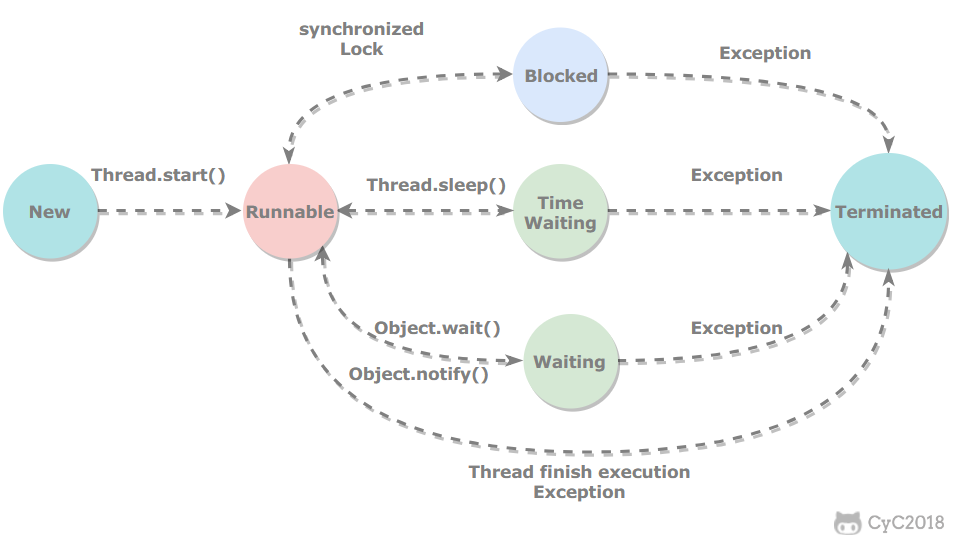

# Java 并发

[TOC]

## 线程状态转换



### 新建（New）

创建后尚未启动。

### 可运行（Runnable）

可能正在运行，也可能正在等待 CPU 时间片。

包含了操作系统线程状态中的运行和就绪两种状态。

### 阻塞（Blocked）

等待获取一个排它锁，如果其线程释放了锁就会结束此状态。

### 无限期等待（Waiting）

等待其它线程显式地唤醒，否则不会被分配 CPU 时间片。

|                 进入方法                  |               退出方法                |
| :--------------------------------------: | :----------------------------------: |
|              Object.wait()               | Object.notify() / Object.notifyAll() |
| 没有设置 Timeout 参数的 Thread.join() 方法 |          被调用的线程执行完毕          |
|          LockSupport.park() 方法          |      LockSupport.unpark(Thread)      |

### 限期等待（Timed Waiting）

无需等待其它线程显式地唤醒，在一定时间之后会被系统自动唤醒。

> 调用 `Thread.sleep()` 方法使线程进入限期等待状态时，常常用“使一个线程睡眠”进行描述。调用 `Object.wait()` 方法使线程进入限期等待或者无限期等待时，常常用“挂起一个线程”进行描述。睡眠和挂起是用来描述行为，而阻塞和等待用来描述状态。阻塞和等待的区别在于，阻塞是被动的，它是在等待获取一个排它锁。而等待是主动的，通过调用 `Thread.sleep()` 和 `Object.wait()` 等方法进入。

|                进入方法                 |                    退出方法                     |
| :-------------------------------------: | :--------------------------------------------: |
|           Thread.sleep() 方法           |                    时间结束                     |
|            Object.wait() 方法           | 时间结束 / Object.notify() / Object.notifyAll() |
| 设置了 Timeout 参数的 Thread.join() 方法 | 时间结束 / Object.notify() / Object.notifyAll() |
|      LockSupport.parkNanos() 方法       |           LockSupport.unpark(Thread)           |
|      LockSupport.parkUntil() 方法       |           LockSupport.unpark(Thread)           |

### 终止（Terminated）

可以是线程结束任务之后自己结束，或者产生了异常而结束。

## 使用线程的方式

### 继承 Thread 类

需要实现 `run()` 方法，因为 Thread 类也实现了 Runable 接口。

当调用 `start()` 方法启动一个线程时，虚拟机会将该线程放入就绪队列中等待被调度，当一个线程被调度时会执行该线程的 `run()` 方法。

```java
public class MyThread extends Thread {
    @Override
    public void run() {
        // ...
    }
}

public static void main(String[] args) {
    MyThread mt = new MyThread();
    mt.start();
}
```

#### Thread 类的 start() 和 run() 的区别

调用 `thread.start()` 后，调度器会在新的线程中执行 `run()` 方法，不会阻塞当前线程。而直接调用 `run()` 则是在当前调用线程中执行，可能会阻塞当前线程。

### 实现 Runnable 接口

需要实现 run() 方法。

这种方法依然需要通过 Thread 对象调用 start() 方法来启动线程。

```java
public class MyRunnable implements Runnable {
    @Override
    public void run() {
        // ...
    }
}

public static void main(String[] args) {
    MyRunnable instance = new MyRunnable();
    Thread thread = new Thread(instance);
    thread.start();
}
```

### 实现 Callable 接口

与 Runnable 相比，Callable 可以有返回值，返回值通过 FutureTask 进行封装。

```java
public class MyCallable implements Callable<Integer> {
    public Integer call() {
        return 123;
    }
}

public static void main(String[] args) throws ExecutionException, InterruptedException {
    MyCallable mc = new MyCallable();
    FutureTask<Integer> ft = new FutureTask<>(mc);
    Thread thread = new Thread(ft);
    thread.start();
    System.out.println(ft.get());
}
```

### 实现接口 vs 继承 Thread 类

实现接口会更好一些，因为：

- Java 不支持多重继承，因此继承了 Thread 类就无法继承其它类，但是可以实现多个接口。
- 类可能只要求可执行就行，继承整个 Thread 类开销过大。

## 基础线程机制

### 线程池 Executor

线程池 Executor 管理多个异步任务的执行，而无需开发者显式管理线程的生命周期。

Java 里有三种 Executor：

- CachedThreadPool：一个任务创建一个线程，初始线程数为 0，最大线程数为 `Integer.MAX_VALUE`，阻塞队列为同步队列，存活时间 60s。加入同步队列的任务会被马上执行，同步队列里最多只有一个任务。
- FixedThreadPool：所有任务只能使用固定大小的线程，阻塞队列长度为 `Integer.MAX_VALUE`，存活时间 0s，只要线程个数比核心线程数多且空闲则回收。
- SingleThreadExecutor：相当于大小为 1 的 FixedThreadPool。

```java
public static void main(String[] args) {
    ExecutorService executorService = Executors.newCachedThreadPool();
    for (int i = 0; i < 5; i++) {
        executorService.execute(new MyRunnable());
    }
    executorService.shutdown();
}
```

#### 线程池关键参数

- corePoolSize：核心线程个数，即创建线程池时拥有的线程数量。
- maximumPoolSize：最大线程个数，即线程池里的线程最多可以增加到多少个。
- workQueue：任务队列，保存等待执行的任务的阻塞队列。线程池里的线程会去任务队列里获取任务并执行。
- keepAliveTime：超过核心线程个数的闲置的线程的存活时间，超过这个时间的会被回收。
- ThreadFactory：创建线程的工厂类。
- RejectedExecutionHandler：线程达到最大线程数，且任务队列满了之后的拒绝策略。

### 守护线程 Daemon

当所有非守护线程（用户线程）结束时，程序也就终止，不管是否存在守护线程。主线程属于非守护线程。

```java
public static void main(String[] args) {
    Thread thread = new Thread(new MyRunnable());
    thread.setDaemon(true);  // 将 thread 设置为守护线程
}
```

### 休眠 sleep

调用 `Thread.sleep(millisec)` 方法会使得线程进入限期等待状态，并且**不会释放已经占有的锁**。

当其他线程使用 `interrupt()` 中断处于休眠状态的线程时，休眠状态的线程会抛出 InterruptedException，因为异常不能跨线程传播回主线程中，因此必须在本地进行处理。线程中抛出的其它异常也同样需要在本地进行处理。

```java
public void run() {
    try {
        Thread.sleep(3000);
    } catch (InterruptedException e) {
        e.printStackTrace();
    }
}
```

### 让出 yield

调用 `Thread.yield()` 暗示线程调度器当前线程请求让出 CPU 时间片，可以切换给其它线程来执行。该方法只是对线程调度器的一个建议，而且也只是建议具有相同优先级的其它线程可以运行，调度器也可以忽视。如果请求成功，会进入就绪态。

```java
public void run() {
    Thread.yield();
}
```

## 中断

### interrupt 方法

调用一个线程的 `interrupt()` 方法会将该线程的中断标志设置为 true 并立即返回，通过设置线程的中断标志并没有直接终止该线程的执行，而是被中断的线程根据中断状态自行处理。

如果一个线程在执行一个无限循环，并且没有执行 `wait()/sleep()` 等会抛出 InterruptedException 的操作，那么调用线程的 `interrupt()` 方法就无法使线程提前结束。

### isInterrupted 方法

检测一个线程的中断标志是否被设置为 true。这个方法不会清除中断标志。

```java
public boolean isInterrupted() {
    return isInterrupted(false);  // false 表明不清除中断标志
}
```

### interrupted 方法

调用 `interrupted()` 方法用来检测当前线程是否被中断，与 `isInterrupted()` 不同的是，该方法如果发现线程中断标志为 true，则会清除中断标志。并且该方法是静态方法，可以直接使用 `Thread.interrupted()` 调用。

需要注意的是，这个方法是获取当前调用这个方法的线程的中断标志，而不是线程实例对象的中断标志。也就是说不管使用 `threadObj.interrupted()` 还是使用 `Thread.interrupted()` 效果都是一样的。

```java
public static boolean interrupted() {
    return currentThread().isInterrupted(true);  // true 表明清除中断标志
}
```

### InterruptedException

通过调用一个线程的 `interrupt()` 来中断该线程，如果该线程处于阻塞、限期等待或者无限期等待状态，那么就会抛出 InterruptedException，从而提前结束该线程。但是不能中断 I/O 阻塞和 synchronized 锁阻塞。

### 线程池的中断

调用 Executor 的 `shutdown()` 方法会等待线程都执行完毕之后再关闭，但是如果调用的是 `shutdownNow()` 方法，则相当于调用每个线程的 `interrupt()` 方法。

以下使用 Lambda 创建线程，相当于创建了一个匿名内部线程。

```java
public static void main(String[] args) {
    ExecutorService executorService = Executors.newCachedThreadPool();
    executorService.execute(() -> {
        try {
            Thread.sleep(2000);
            System.out.println("Thread run");
        } catch (InterruptedException e) {
            e.printStackTrace();
        }
    });
    executorService.shutdownNow();
    System.out.println("Main run");
}
```

如果只想中断 Executor 中的一个线程，可以通过使用 `submit()` 方法来提交一个线程，它会返回一个 Future<?> 对象，通过调用该对象的 `cancel(true)` 方法就可以中断线程。

```java
Future<?> future = executorService.submit(() -> {
    // ..
});
future.cancel(true);
```

## ThreadLocal

ThreadLocal 提供了线程本地变量，如果创建了一个 ThreadLocal 变量，那么访问这个变量的每个线程都会获得这个变量的一个本地副本。

### ThreadLocal 实现原理

每个线程中都有两个 ThreadLocalMap 的成员变量，分别为 threadLocals 和 inheritableThreadLocal。默认情况下这两个变量都为 null，在该线程中第一次调用 ThreadLocal 的 get 或 set 方法时才会创建他们。其实每个线程的本地变量不是存在 ThreadLocal 实例里，而是存放在各自的 threadLocals 变量中。

ThreadLocalMap 是一种 HashMap，其中的 key 是当前 ThreadLocal 的实例对象的引用，value 是通过 set 方法传递的值。

```java
// 一个 ThreadLocal 实例对象
ThreadLocal<String> tl1 = new ThreadLocal<>();

// 线程中调用时
tl1.set("123");

// 这时这个线程中 threadLocals 的情况
{
  tl1: "123"
}
```

ThreadLocal 不具有继承性，如果一个线程中再创建一个子线程，那么这个子线程是无法获取到父线程的 threadLocals 里面的值的。为了解决这个问题就有了 InheritableThreadLocal 类。

```java
// 一个 InheritableThreadLocal 实例对象
ThreadLocal<String> tl1 = new InheritableThreadLocal<>();

tl1.set("123");
Thread child = new Thread(new Runnable() {
    @Override
    public void run() {
        System.out.println(tl1.get());  // 输出 "123"
    }
});
```

## 互斥同步

Java 提供了两种锁机制来控制多个线程对共享资源的互斥访问，第一个是 JVM 实现的 synchronized 关键字，而另一个是 JDK 实现的重入锁 ReentrantLock。

### synchronized 关键字

1. 同步一个代码块

它只作用于同一个对象，如果调用两个对象上的同步代码块，就不会进行同步。

```java
public void func() {
    synchronized (obj) {
        // ...
    }
}
```

2. 同步一个方法

它和同步代码块一样，作用于同一个对象。

```java
public synchronized void func () {
    // ...
}
```

3. 同步一个类

作用于整个类，也就是说两个线程调用同一个类的不同对象上的这种同步语句，也会进行同步。

```java
public void func() {
    synchronized (SynchronizedExample.class) {
        // ...
    }
}
```

4. 同步一个静态方法

同样作用于整个类。

```java
public synchronized static void fun() {
    // ...
}
```

### 重入锁 ReentrantLock

ReentrantLock 是 java.util.concurrent（J.U.C）包中的锁。

```java
public class LockExample {
    private Lock lock = new ReentrantLock();

    public void func() {
        lock.lock();
        try {
            for (int i = 0; i < 10; i++) {
                System.out.print(i + " ");
            }
        } finally {
            lock.unlock();  // finally 中确保释放锁，从而避免发生死锁。
        }
    }
}
```

#### ReentrantLock实现原理

重入意味着获取锁的粒度是线程。要想支持重入性，就要解决两个问题：

1. 在线程获取锁的时候，如果已经获取锁的线程是当前线程的话则直接再次获取成功；
2. 由于锁会被获取n次，那么只有锁在被释放同样的n次之后，该锁才算是完全释放成功。

在尝试获取锁时，判断当前锁是否被占用，如果没有被占用，就直接获取（如果使用公平锁，在尝试获取锁的时候还要判断同步队列中是否有优先级在当前线程之前的，如果有则获取失败）；如果被占用了，判断占用者是否是当前线程，如果是，就将计数加1，相当于再次获得锁，如果不是，就获取失败。
在尝试释放锁时，将计数减1，如果计数变为0，锁就被完全释放了。

### 比较

1. 锁的实现

synchronized 是 JVM 实现的，而 ReentrantLock 是 JDK 实现的。

2. 性能

新版本 Java 对 synchronized 进行了很多优化，例如自旋锁等，synchronized 与 ReentrantLock 大致相同。

3. 等待可中断

当持有锁的线程长期不释放锁的时候，正在等待的线程可以选择放弃等待，改为处理其他事情。

ReentrantLock 可中断，而 synchronized 不行。

4. 公平锁

公平锁是指多个线程在等待同一个锁时，必须按照申请锁的时间顺序来依次获得锁。

synchronized 中的锁是非公平的，ReentrantLock 默认情况下也是非公平的，但是也可以是公平的。

5. 锁绑定多个条件

一个 ReentrantLock 可以同时绑定多个 Condition 对象。

除非需要使用 ReentrantLock 的高级功能，否则优先使用 synchronized。这是因为 synchronized 是 JVM 实现的一种锁机制，JVM 原生地支持它，而 ReentrantLock 不是所有的 JDK 版本都支持。并且使用 synchronized 不用担心没有释放锁而导致死锁问题，因为 JVM 会确保锁的释放。

### 锁的类型

- 可重入锁：已经获得该锁的对象可以再次获得该锁；
- 可中断锁：可以在等待获取锁的过程中中断；
- 公平锁：按照线程等待锁的时间来调整获取锁的优先级，等待时间越长的线程优先级越高，正因为如此，公平锁需要频繁线程切换；**非公平锁**相反，可以减少线程频繁切换，提高吞吐量，但非公平锁会存在“线程饥饿”的问题，可能某个线程很长时间都拿不到锁，一直等待；
- 读写锁：读和写分开处理的锁，允许多个线程同时读，但是写的时候必须同步；
- 自旋锁：有的等待获取锁只需要等待很短的时间，这种时候如果频繁切换线程开销较大，因此可以让一个线程反复尝试获得锁，也就是自旋；
- 乐观锁：总是假定别的线程不会修改，只是提交操作时检查数据是否被修改过；**悲观锁**相反，总是假定别人会修改，因此每次提交操作前都要上锁；

## 线程之间的协作

### thread.join

在线程中调用另一个线程的 `join()` 方法，会将当前线程挂起，而不是忙等待，直到目标线程结束。

### obj.wait, obj.notify, obj.notifyAll

调用 `wait()` 使得线程等待某个条件满足，线程在等待时会被挂起，其它线程可以调用 `notify()` 或者 `notifyAll()` 来唤醒挂起的线程。

`notify()` 随机唤醒一个正在等待的线程，`notifyAll()` 唤醒所有正在等待的线程。`notify()` 和 `notifyAll()` 都只能唤醒在此之前处于等待状态的线程。此外被唤醒的线程不能马上从 `wait()` 方法返回并继续执行，它必须在获取了共享对象的监视器锁后才可以返回。

只能用在同步方法或者同步控制块中使用，否则会在运行时抛出 IllegalMonitorStateException。

使用 `wait()` 挂起期间，**线程会释放锁**。这是因为，如果没有释放锁，那么其它线程就无法进入对象的同步方法或者同步控制块中，那么就无法执行 `notify()` 或者 `notifyAll()` 来唤醒挂起的线程，造成死锁。

#### wait 和 sleep 的区别

- `wait()` 是 Object 的方法，而 `sleep()` 是 Thread 的静态方法。
- `wait()` 会释放锁，`sleep()` 不会。

### await(), signal(), signalAll()

java.util.concurrent 类库中提供了 Condition 类来实现线程之间的协调，可以在 Condition 上调用 `await()` 方法使线程等待，其它线程调用 `signal()` 或 `signalAll()` 方法唤醒等待的线程。

相比于 `wait()` 这种等待方式，`await()` 可以指定等待的条件，因此更加灵活。

使用 Lock 来获取一个 Condition 对象。

## JUC 包

[Java JUC 包.md](Java%20JUC%20包.md)

## 多线程开发良好的实践

- 给线程起个有意义的名字，这样可以方便找 Bug。
- 缩小同步范围，从而减少锁争用。例如对于 synchronized，应该尽量使用同步块而不是同步方法。
- 多用同步工具少用 `wait()` 和 `notify()`。首先，CountDownLatch, CyclicBarrier, Semaphore 和 Exchanger 这些同步类简化了编码操作，而用 `wait()` 和 `notify()` 很难实现复杂控制流；其次，这些同步类是由最好的企业编写和维护，在后续的 JDK 中还会不断优化和完善。
- 使用 BlockingQueue 实现生产者消费者问题。
- 多用并发集合少用同步集合，例如应该使用 ConcurrentHashMap 而不是 Hashtable。
- 使用本地变量和不可变类来保证线程安全。
- 使用线程池而不是直接创建线程，这是因为创建线程代价很高，线程池可以有效地利用有限的线程来启动任务。
