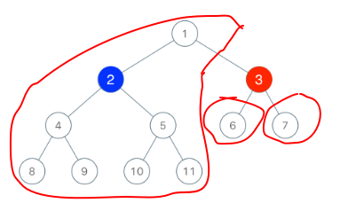

# 1145.二叉树着色游戏

**题目描述**

[1145.二叉树着色游戏](https://leetcode-cn.com/problems/binary-tree-coloring-game/)

**解答**

要赢的话，我们就要从 x 的三个附近节点考虑，也就是考虑选择 x 的父节点或者左节点或者右结点，三个选择能控制的范围如图所示。这三个范围内，如果有一个范围的节点数量大于 `n / 2`，就说明我们可以赢。

可以使用 dfs 来计算 x 的左子树和右子树的节点数，然后就可以得到选择 x 的父节点能控制的节点数量为 `n - (1 + left + right)`。



```java
class Solution {
    private int left;  // x 的左子树节点数
    private int right;  // x 的右子树节点数

    public boolean btreeGameWinningMove(TreeNode root, int n, int x) {
        nodes(root, x);
        int p = n - (1 + left + right);
        return Math.max(p, Math.max(left, right)) > n / 2;
    }

    private int nodes(TreeNode root, int x) {
        if (root == null) return 0;
        int l = nodes(root.left, x);
        int r = nodes(root.right, x);
        if (root.val == x) {
            left = l;
            right = r;
        }
        return 1 + l + r;
    }
}
```