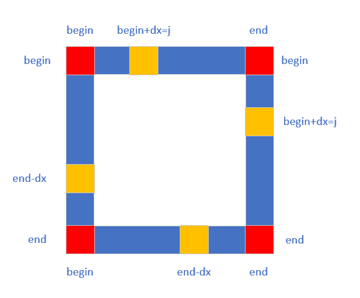

# 48.旋转图像

**题目描述**

[48.旋转图像](https://leetcode-cn.com/problems/rotate-image/)

**解答**

一层一层考虑，对于第 i 层，我们需要把四个边进行旋转，每次旋转要交换 `4*(end-begin)` 个元素。按照下面的规则进行交换。

```
dx 是距离 begin 的偏移量
matrix[begin][begin+dx] -> matrix[begin+dx][end]
matrix[begin+dx][end] -> matrix[end][end-dx]
matrix[end][end-dx] -> matrix[end-dx][begin]
matrix[end-dx][begin] -> matrix[begin][begin+dx]
```



```java
class Solution {
    public void rotate(int[][] matrix) {
        int N = matrix.length;
        for (int i = 0; i < N / 2; i++) {
            int begin = i, end = N - 1 - i;
            for (int j = begin; j < end; j++) {
                int dx = j - begin;
                int tmp = matrix[begin][j];
                matrix[begin][begin + dx] = matrix[end - dx][begin];
                matrix[end - dx][begin] = matrix[end][end - dx];
                matrix[end][end - dx] = matrix[begin + dx][end];
                matrix[begin + dx][end] = tmp;
            }
        }
    }
}
```