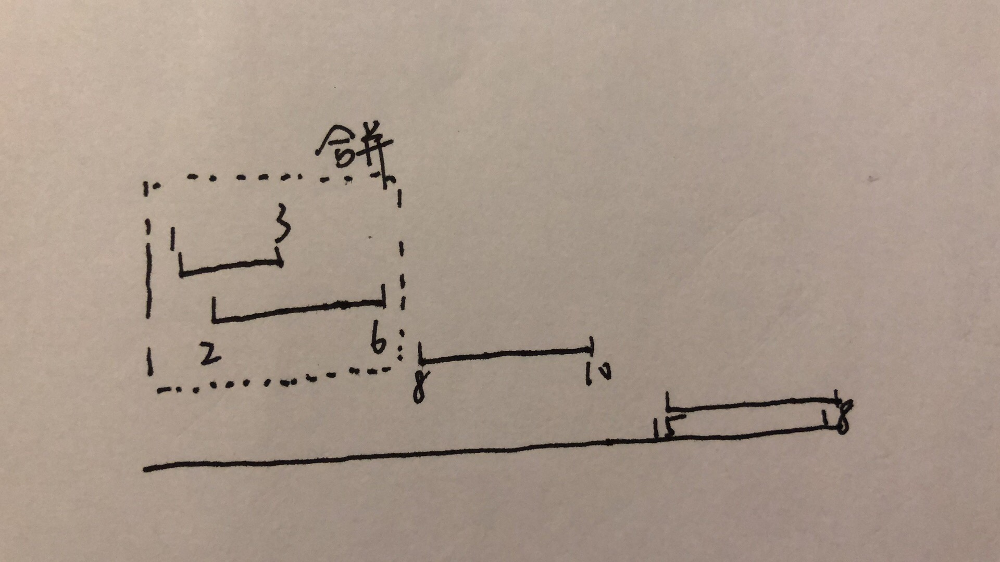

# 56.合并区间

**题目描述**

[56. 合并区间](https://leetcode-cn.com/problems/merge-intervals/)

**解答**

1. 根据区间起点进行排序。
2. 如果下一个区间能够和上一个区间（区间列表中的最后一个区间）合并，也就是下一个区间的开始比上一个区间的结束小，就合并。
3. 如果不能，就把这个区间添加进区间列表。



```java
class Solution {
    public int[][] merge(int[][] intervals) {
        if (intervals.length == 0) return intervals;

        // 根据区间起始的大小将区间排序
        Arrays.sort(intervals, Comparator.comparingInt(a -> a[0]));

        List<int[]> ans = new ArrayList<>();
        for (int[] interval : intervals) {
            if (ans.isEmpty() || ans.get(ans.size() - 1)[1] < interval[0]) {
                // 不能合并
                ans.add(interval);
            } else {
                // 能合并
                ans.get(ans.size() - 1)[1] = Math.max(ans.get(ans.size() - 1)[1], interval[1]);
            }
        }

        return ans.toArray(new int[ans.size()][2]);
    }
}
```