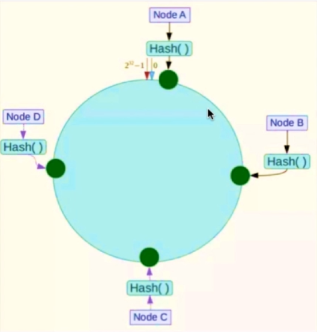
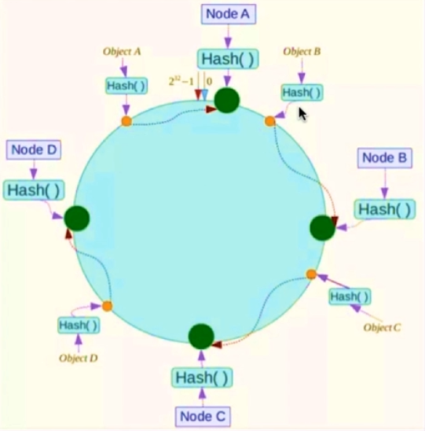
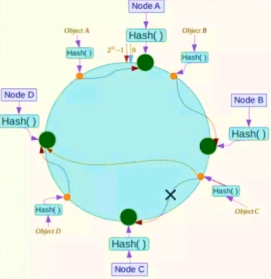
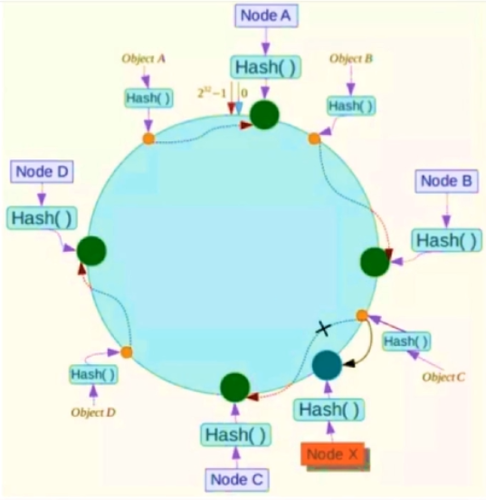
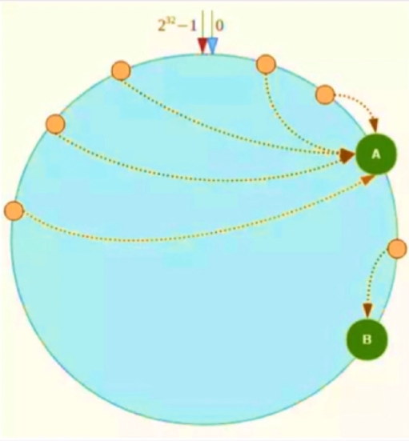
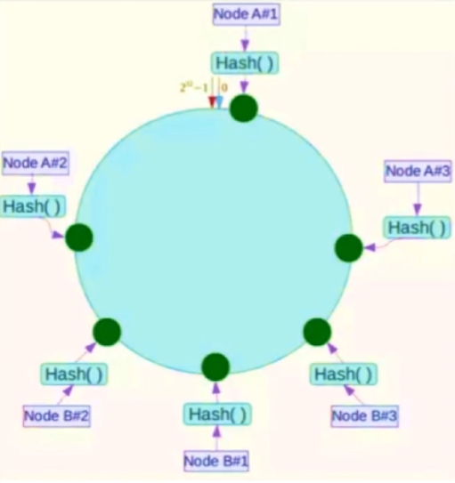

# Redis

要点：

- 为什么要用 Redis（缓存）
- Redis 为什么快
- Redis 数据结构模型
- Redis 底层数据类型基础
- Redis 内存管理
- 缓存雪崩和缓存穿透
- Pipeline
- Redis 的同步机制
- Redis 集群

## 为什么要用 Redis（缓存）

1. 高性能：Redis（缓存）将数据存储在内存中，从内存中读取数据比使用数据库从硬盘中读取数据要快得多
2. 高并发：缓存能承受的并发请求连接数比数据库大得多

## Redis 为什么快

1. C语言开发，执行效率高。
2. 纯内存访问，速度比读取磁盘快很多个数量级。
3. 数据结构类型简单，对数据的操作也简单，不像关系型数据库各种约束。
4. 单线程：第一，单线程简化算法的实现，并发的数据结构实现不但困难且测试也麻烦。第二，单线程避免了线程切换以及加锁释放锁带来的消耗，对于服务端开发来说，锁和线程切换通常是性能杀手。这里的单线程只是处理请求是单线程，而不是整个Redis进程只有一个线程。
5. 非阻塞多路IO复用：Redis使用epoll（Linux中）作为IO多路复用技术的实现，再加上Redis自身的事件处理模型将epoll的read、write、close等都转换成事件，不在网络I/O上浪费过多的时间。实现对多个文件描述符FD读写的监控，提高性能。

[搞懂Redis到底快在哪里](https://mp.weixin.qq.com/s?__biz=MjM5NTY1MjY0MQ==&mid=2650745383&idx=3&sn=c7546a9ad8d23a51505f332d428fec34&chksm=befebf698989367ffff100dcde67785d1fbeceff4c814fba2a93443c967d39775b58cd78c92f&mpshare=1&scene=1&srcid=#rd)

## Redis 数据结构模型

### 1. String

简单的 key-value 类型，value 除了可以是 string 也可以是数字。

### 2. Hash

hash 是一个 string 类型的 field 和 value 的映射表，hash 特别适合用于存储对象，后续操作的时候，你可以直接仅仅修改这个对象中的某个字段的值。

### 3. List

list 的实现为一个双向链表，即可以支持反向查找和遍历，更方便操作，不过带来了部分额外的内存开销。

### 4. Set

set 对外提供的功能与 list 类似是一个列表的功能，特殊之处在于 set 是可以自动排重的。
当你需要存储一个列表数据，又不希望出现重复数据时，set 是一个很好的选择，并且 set 提供了判断某个成员是否在一个 set 集合内的重要接口，这个也是 list 所不能提供的。可以基于 set 轻易实现交集、并集、差集的操作。

### 5. SortedSet

和 set 相比，sorted set 增加了一个权重参数 score，使得集合中的元素能够按 score 进行有序排列。

**除了上述数据结构外，Redis还支持用于计数的HyperLogLog，用于存储地理位置信息的Geo等。**

## Redis 底层数据类型基础

1. 简单动态字符串
2. 链表
3. 字典
4. 跳表
5. 整数集合
6. 压缩列表
7. 对象

## Redis 内存管理

[Redis内存管理.md](Redis内存管理.md)

## 缓存雪崩和缓存穿透

[缓存雪崩和缓存穿透.md](缓存雪崩和缓存穿透.md)

## Pipeline

Redis 提供了批量执行命令的方法，即使用 pipeline。

- Pipeline 和 Linux 的管道类似
- Redis 基于请求/响应模型，单个请求处理需要一一应答
- Pipeline 批量执行指令，节省多次 IO 往返的时间
- 有顺序依赖的指令建议分批发送

## Redis 的同步机制

### 主从同步

#### 全同步

1. slave发送sync命令到master
2. master启动一个后台进程，将Redis中的数据快照保存到文件中（bgsave）
3. master将保存数据快照过程中收到的写命令缓存起来
4. master完成写文件操作后，将该文件发给从节点
5. slave接受到文件后保存在磁盘中，然后加载文件到内存中去恢复数据快照
6. master将这期间收集的增量写命令发送给从节点，进行回放

#### 增量同步

1. master接收到用户的操作指令，判断是否要传播到从节点（一般增删改需要，查询不需要）
2. 将操作记录追加到 AOF 文件
3. 将操作扩散到其他slave：对其主从库，确保slave是该操作对应的结点；往响应缓存写入指令
4. 将缓存中的数据发给slave

**主从模式的弊端是无法保证高可用性，一旦master挂掉，Redis 无法对外提供写入操作。**

### Redis Sentinel

解决主从同步master宕机后的主从切换问题。

哨兵功能：

- 监控：检查主从服务器是否运行正常
- 提醒：通过API向管理员或其他应用程序发送故障通知
- 自动故障迁移：主从切换

## Redis 集群

为了从海量数据里快速找到所需数据，可以将数据分片存储在多个结点上，通常使用计算哈希值然后取模来决定数据应该映射到哪个结点上。

如果只是对结点数量取模，那么一旦结点数量改变，数据映射就会出错。为了解决这个问题，引入了一致性哈希算法。

### 一致性哈希算法

一致性哈希算法不是对结点数量取模，而是对一个固定的值（Redis 是 2^32）取模，将哈希值空间组织成虚拟的圆环。

将结点的某个属性进行hash运算，映射到这个圆环上。

数据进行hash运算，映射到圆环上，然后顺时针找到最近的一个存储节点，存储到该结点上。

假设Node C宕机，那么数据会映射到下一个最近的结点即Node D上。只有宕机结点到其逆时针最近的结点之间的数据会受到影响（映射到Node B和Node C之间的那些数据）会受到影响。

如果新增了一个结点Node X，此时Node A，Node B和Node D仍然不会受到影响。只有新增结点到其逆时针最近的结点之间的数据会受影响（映射到Node B 和 Node X 之间的那些数据）。

可以看出通过引入一致性哈希算法，不管增减结点都只需要对一小部分数据进行重新处理。提高了可用性和扩展性。

一致性哈希算法还有个问题就是**数据倾斜问题**

当存储结点很少时，可能出现如上图所示，大量数据存储到 Node A 而少量存储到 Node B，导致倾斜。

解决方法是引入虚拟结点，对每个服务结点映射到多个位置，好比有了多个服务结点。最终存储时根据虚拟结点找到真实结点然后存储。实际中虚拟结点数量通常设置为32甚至更高。

