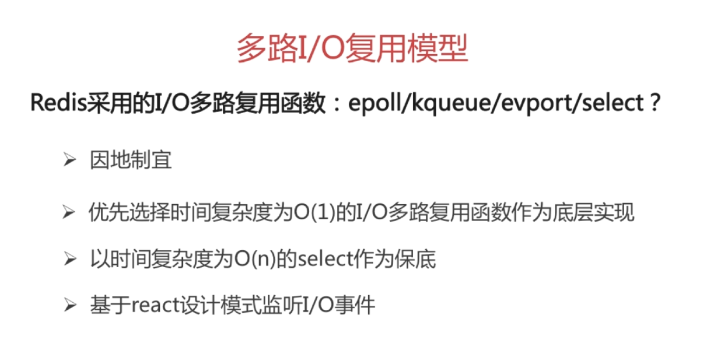

# Redis

要点：

- 为什么要用 Redis（缓存）
- Redis 为什么快
- Redis 数据结构模型
- Redis 底层数据类型基础
- Redis 内存管理
- 缓存雪崩和缓存穿透

## 为什么要用 Redis（缓存）

1. 高性能：Redis（缓存）将数据存储在内存中，从内存中读取数据比使用数据库从硬盘中读取数据要快得多
2. 高并发：缓存能承受的并发请求连接数比数据库大得多

## Redis 为什么快

1. C语言开发，执行效率高。
2. 纯内存访问，速度比读取磁盘快很多个数量级。
3. 数据结构类型简单，对数据的操作也简单，不像关系型数据库各种约束。
4. 单线程：第一，单线程简化算法的实现，并发的数据结构实现不但困难且测试也麻烦。第二，单线程避免了线程切换以及加锁释放锁带来的消耗，对于服务端开发来说，锁和线程切换通常是性能杀手。这里的单线程只是处理请求是单线程，而不是整个Redis进程只有一个线程。
5. 非阻塞多路IO复用：Redis使用epoll（Linux中）作为IO多路复用技术的实现，再加上Redis自身的事件处理模型将epoll的read、write、close等都转换成事件，不在网络I/O上浪费过多的时间。实现对多个文件描述符FD读写的监控，提高性能。

[搞懂Redis到底快在哪里](https://mp.weixin.qq.com/s?__biz=MjM5NTY1MjY0MQ==&mid=2650745383&idx=3&sn=c7546a9ad8d23a51505f332d428fec34&chksm=befebf698989367ffff100dcde67785d1fbeceff4c814fba2a93443c967d39775b58cd78c92f&mpshare=1&scene=1&srcid=#rd)

## Redis 数据结构模型

### 1. String

简单的 key-value 类型，value 除了可以是 string 也可以是数字。

### 2. Hash

hash 是一个 string 类型的 field 和 value 的映射表，hash 特别适合用于存储对象，后续操作的时候，你可以直接仅仅修改这个对象中的某个字段的值。

### 3. List

list 的实现为一个双向链表，即可以支持反向查找和遍历，更方便操作，不过带来了部分额外的内存开销。

### 4. Set

set 对外提供的功能与 list 类似是一个列表的功能，特殊之处在于 set 是可以自动排重的。
当你需要存储一个列表数据，又不希望出现重复数据时，set 是一个很好的选择，并且 set 提供了判断某个成员是否在一个 set 集合内的重要接口，这个也是 list 所不能提供的。可以基于 set 轻易实现交集、并集、差集的操作。

### 5. SortedSet

和 set 相比，sorted set 增加了一个权重参数 score，使得集合中的元素能够按 score 进行有序排列。

**除了上述数据结构外，Redis还支持用于计数的HyperLogLog，用于存储地理位置信息的Geo等。**

## Redis 底层数据类型基础

1. 简单动态字符串
2. 链表
3. 字典
4. 跳表
5. 整数集合
6. 压缩列表
7. 对象

## Redis 内存管理

[Redis内存管理.md](Redis内存管理.md)

## 缓存雪崩和缓存穿透

[缓存雪崩和缓存穿透.md](缓存雪崩和缓存穿透.md)