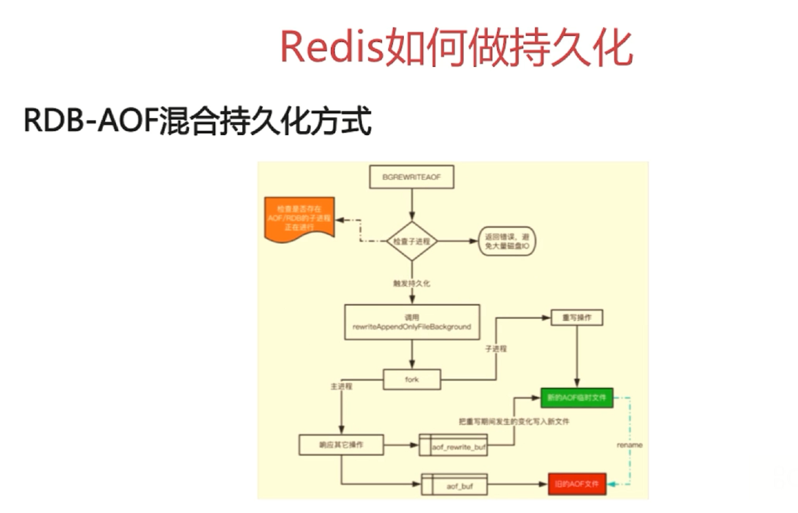

# Redis内存管理

[TOC]

## 过期键删除

Redis 中有个设置时间过期的功能，即对存储在 Redis 数据库中的键可以设置一个过期时间。

Redis 通过**定期删除**和**惰性删除**两种方式来删除过期的键。

- 定期删除：默认是每隔 100ms 就**随机抽取**一些设置了过期时间的键，检查其是否过期，如果过期就删除。（随机抽取是因为假如 Redis 存了几十万个键，每隔 100ms 就遍历所有的设置过期时间的键的话，就会给 CPU 带来很大的负载）
- 惰性删除 ：由于定期删除是随机抽取一些键，可能会导致很多过期的键到了时间却没有被删除掉，因此还需要惰性删除。惰性删除就是当访问到一个已经过期的键时，才去删除这个键。

## 数据汰淘策略

如果定期删除漏掉了很多过期的键，然后也没有被查询（没有被惰性删除），大量过期的键堆积在内存里，会导致 Redis 内存块耗尽。为了解决这个问题，就需要数据淘汰策略。

Redis 具体以下淘汰策略：

|             策略             |                        描述                         |
| ---------------------------- | --------------------------------------------------- |
| volatile-lru                 | 从已设置过期时间的数据集中挑选最近最少使用的数据淘汰     |
| volatile-ttl                 | 从已设置过期时间的数据集中挑选将要过期的数据淘汰        |
| volatile-random              | 从已设置过期时间的数据集中任意选择数据淘汰              |
| volatile-lfu（Redis 4.0 后） | 从已设置过期时间的数据集中挑选最近访问频率最低的数据淘汰 |
| allkeys-lru                  | 从所有数据集中挑选最近最少使用的数据淘汰                |
| allkeys-random               | 从所有数据集中任意选择数据进行淘汰                     |
| allkeys-lfu（Redis 4.0 后）  | 从所有数据集中挑选最近问频率最低的数据淘汰              |
| noeviction                   | 禁止驱逐数据                                         |

作为内存数据库，出于对性能和内存消耗的考虑，Redis 的淘汰算法实际实现上并非针对所有键，而是抽样一小部分并且从中选出被淘汰的键。

使用 Redis 缓存数据时，为了提高缓存命中率，需要保证缓存数据都是热点数据。可以将内存最大使用量设置为热点数据占用的内存量，然后启用 allkeys-lru 淘汰策略，将最近最少使用的数据淘汰。

## 持久化

Redis 是内存型数据库，为了保证数据在断电后不会丢失，需要将内存中的数据持久化到硬盘上。

| 持久化类型 |                 优点                  |             缺点             |
| :-------: | :----------------------------------: | :-------------------------: |
|    RDB    |      全量数据快照，文件小，恢复快       | 无法保存最近一次快照之后的数据 |
|    AOF    | 可读性高，适合保存增量数据，数据不易丢失 |    文件体积大，恢复时间长     |

### 1. RDB 持久化（快照持久化）

RDB 持久化方式是将某个时间点的数据全部写入磁盘。

RDB 持久化的触发方式有手动和自动两种。

- 手动：save 命令（阻塞当前进程）或者 bgsave 命令（创建子进程来处理，不阻塞当前进程）。
- 自动：自动触发有几种情况：

1. 在配置文件中通过 `save m n`，指定当 m 秒内发生 n 次变化时，会触发 bgsave。
2. 主从复制时，主节点自动触发。
3. 执行 Debug Reload。
4. 执行 shutdown 且没有开启 AOF 持久化。

可以将快照复制到其它服务器从而创建具有相同数据的服务器副本。缺点：

- 如果数据量很大，保存快照的时间会很长。
- 如果系统发生故障，将会丢失最后一次创建快照之后的数据。

### 2. AOF 持久化

AOF 持久化方式是将每一条写命令添加到 AOF 文件（Append Only File）的末尾，类似于 MySQL 的 binlog。

使用 AOF 持久化需要设置同步选项，从而确保写命令同步到磁盘文件上的时机。这是因为对文件进行写入并不会马上将内容同步到磁盘上，而是先存储到缓冲区，然后由操作系统决定什么时候同步到磁盘。有以下同步选项：

- **always**：每个写命令都同步，这个选项会严重减低服务器的性能。
- **everysec**：每秒同步一次，这个选项比较合适，可以保证系统崩溃时只会丢失一秒左右的数据，并且 Redis 每秒执行一次同步对服务器性能几乎没有任何影响。
- **no**：让操作系统来决定何时同步，这个选项并不能给服务器性能带来多大的提升，而且也会增加系统崩溃时数据丢失的数量。

随着服务器写请求的增多，AOF 文件会越来越大。Redis 提供了一种将 AOF 重写的特性，能够去除 AOF 文件中的冗余写命令：

1. 调用 fork，创建一个子进程。
2. 子进程把新的 AOF 写到一个临时文件里，不依赖原来的 AOF 文件。
3. 主进程持续将新的变动同时写到内存和原来的 AOF 文件里。
4. 主进程获取子进程重写 AOF 的完成信号，往新 AOF 同步增量变动。
5. 使用新的AOF文件替换掉旧的 AOF 文件。

### 3. RDB和AOF文件共存情况下的恢复流程

1. 优先尝试加载 AOF 文件。
2. 如果 AOF 文件不存在，就尝试加载 RDB 文件。
3. 如果 RDB 文件也不存在，就加载失败。

### 4. RDB-AOF 混合持久化

RDB 做镜像全量持久化，AOF 做增量持久化。

