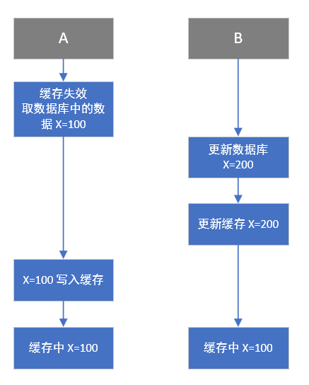
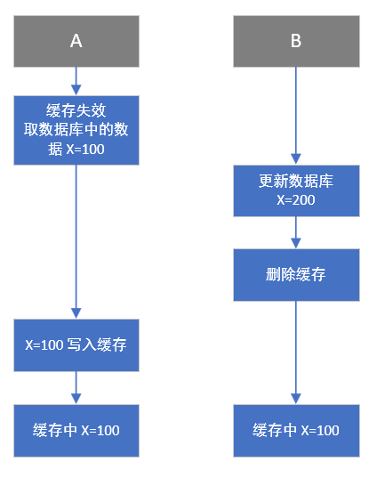
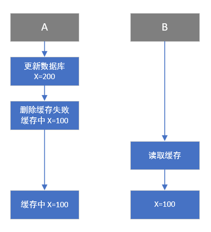
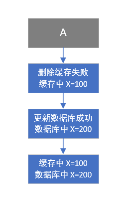
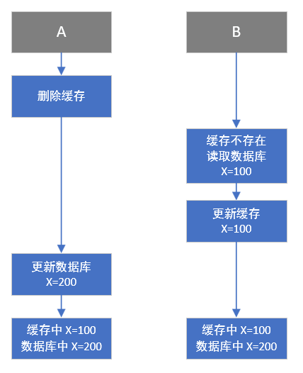

# 缓存数据库双写一致性问题

要点：

- 一致性问题产生原因
- 解决方案

## 一致性问题产生原因

- 不具有原子性：写缓存和写数据库是两个分开的操作，可能一个成功一个失败，除非没有对数据进行修改，否则必然会导致数据库和缓存结果不一致。
- 不具有隔离性：在并发环境下，处理请求的多个线程会同时修改一个共享资源，这时他们的先后次序会影响最后的结果。

## 解决方案

### 读请求和写请求串行化（除非必须严格一致，否则不要使用这个方法）

将读请求和写请求都发送到同一个队列里，一个写请求在执行时会阻塞后面的请求：先删除缓存，然后更新数据库，再更新缓存，等数据库和缓存都更新成功，再执行队列中的下一条请求。这样如果写请求没有完成之前，读请求无法进行数据读取，也就不会出现读的缓存和数据库数据不一致的情况。

但是，串行化之后，也就意味着处理请求变成了会阻塞的，失去了并发能力。所以说除非必须严格一致，否则不要使用这个方法。

[数据库与缓存更新与读取操作进行异步串行化](https://zq99299.github.io/note-book/cache-pdp/037.html#为什么上亿流量高并发场景下，缓存会出现这个问题？)

### 先更新数据库，再更新缓存

#### 适合场景

- 读请求占大多数，很少有写请求的网站，比如个人博客，一些手册类的网站。
- 网站数据量不大（几十万的文章数据）；
- 很少会去更新数据（一般文章写好后，不会去更新）。

#### 存在问题

**问题一：资源浪费**

如果是更新一些很少被访问到的数据，是没有必要写入缓存中的，这些冷门数据的命中率低，放缓存中是在浪费内存。

**问题二：脏数据**

这是由于出现了并发操作的原因导致的，如同时有两个请求 A 和 B 对数据进行了更新操作，由于网络原因，可能存在以下情况：

这就出现了 A 数据覆盖了 B 数据的情况，此时就产生了脏数据，如果没有缓存定时过期机制，此时的脏数据需要等待下一次的更新，才会对缓存进行更新，虽然用户看到数据出现问题，会再重新更新一次，但这已经有多了一次不必要的请求了，写请求量大的时候，容易造成众多不必要的更新请求。

**问题三：请求时间**

如果缓存不是一种简单的数据缓存，而是需要经过较为复杂的运算，才能得出缓存值，这时候，请求将会在计算缓存值上，耗费一部分时间，而这就导致了请求的响应时间变长，增加系统的负担，降低了系统的处理能力。

**问题四：频繁写入**

在写请求很多，而读请求很少的场景下，频繁对缓存进行更新，但是却一直没有读取，缓存就没有起到其应该有的作用，反而占用了内存资源和写缓存的时间。

### 先更新数据库，再删除缓存

#### 存在问题

**问题一：脏数据**

与“先更新数据库，再更新缓存”类似，从数据库读取旧的记录的线程把缓存覆盖了。

**问题二：缓存删除失败**

一个线程在处理时，删除缓存失败，另一个线程本来应该从数据库读取然后写入缓存，但由于缓存没有被删除，直接读取到了旧的缓存。

解决方案

1. 设置缓存的有效时间（最简单的方案）

优点：

- 简单，易操作。即使缓存中是旧数据，其存在时间也较短。

缺点：

- 会存在短时间内的旧数据。
- 如果数据量太多，缓存有效时间短，容易发生一段时间内缓存大量失效，此时的数据库压力突然剧增，引发缓存雪崩现象。

2. 使用消息队列

先更新数据库，然后删除缓存，如果缓存删除失败，把要删除的 key 加入消息队列中，下一次从消息队列取出时再执行删除，重复这个过程直到删除成功。

优点：

- 不会引发缓存雪崩。
- 只删除需要删除的缓存。

缺点：

- 引入了消息队列，增加了系统的复杂性。

### 先删除缓存，再更新数据库

#### 存在问题

**问题一：脏数据**

或者下面的情况

以上两种情况都能造成脏数据的产生。

解决方案

1. 设置缓存的有效时间

优点：

- 简单，易操作。即使缓存中是旧数据，其存在时间也较短。

缺点：

- 会存在短时间内的旧数据。
- 如果数据量太多，缓存有效时间短，容易发生一段时间内缓存大量失效，此时的数据库压力突然剧增，引发缓存雪崩现象。

2. 使用消息队列

先淘汰缓存；
更新数据库；
将需要淘汰的缓存 key 发送到消息队列；
另起一程序拉取消息队列的数据；
对需要删除的 key 进行删除，直至删除为止。

优点：

- 保证了缓存的删除。
- 不会增加更新的处理时间。
- 不会引发缓存雪崩。

缺点：

- 会增加一次缓存未命中次数。
- 引入了消息队列，增加了系统的复杂性。

[缓存数据库双写一致性问题](https://zhuanlan.zhihu.com/p/37549923)
