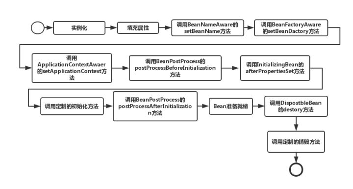

# Spring Bean

[TOC]

## Spring 中 Bean 是什么

- Bean 是一类对象。
- 他们是由 Spring IoC 容器管理的。
- 一个 Spring 应用程序由很多的 Bean 组成。

## 管理 Bean 的容器

### BeanFactory

BeanFactory 接口提供了一种能够管理任何类型对象的高级配置机制。

### ApplicationContext

ApplicationContext 接口表示 Spring IoC 容器，负责实例化，配置和组装 Bean。容器通过读取配置元数据获取有关要实例化，配置和组装的对象的指令。配置元数据以 XML，Java 注释或 Java 代码表示，它允许你表达组成应用程序的对象以及这些对象之间丰富的相互依赖性。

---

BeanFactory 采用了工厂设计模式，负责读取 Bean 配置文档，管理 Bean 的加载，实例化，维护 Bean 之间的依赖关系，负责 Bean 的生命周期。而 ApplicationContext 除了提供上述 BeanFactory 所能提供的功能之外，还提供了更完整的框架功能：国际化支持、AOP、事务等。同时 BeanFactory 在解析配置文件时并不会初始化对象，只有在使用 `getBean()` 方法时才会对该对象进行初始化，而 ApplicationContext 在解析配置文件时对配置文件中的所有对象都初始化了，`getBean()` 方法只是获取对象的过程。

## Bean 的作用域

当在 Spring 中定义一个 Bean 时，你必须声明该 Bean 的作用域的选项。Spring 框架支持以下五个作用域：

|      作用域       |                                            描述                                             |
| ---------------- | ------------------------------------------------------------------------------------------- |
| singleton（默认） | 在整个容器中，这个作用域的 Bean 只会生成一个实例                                                |
| prototype        | 每次通过 getBean 方法获取这个作用域的 Bean 时，都会生成一个新的实例                            |
| request          | 该作用域将 Bean 的定义限制为 HTTP 请求。只在 Web-Aware Spring ApplicationContext 的上下文中有效 |
| session          | 该作用域将 Bean 的定义限制为 HTTP 会话。只在 Web-Aware Spring ApplicationContext 的上下文中有效 |
| global-session   | 该作用域将 Bean 的定义限制为 HTTP 会话。只在 Web-Aware Spring ApplicationContext 的上下文中有效 |

## Spring 中 Bean 的生命周期

1. Spring 对 Bean 进行实例化（相当于程序中的 new）。
2. Spring 将值和 Bean 的引用注入进 Bean 对应的属性中。
3. 如果 Bean 实现了 BeanNameAware 接口，Spring 将 Bean 的 ID 传递给 setBeanName 方法。实现 BeanNameAware 主要是为了通过 Bean 的引用来获得 Bean 的 ID，一般业务中是很少有用到 Bean 的 ID 的。
4. 如果 Bean 实现了 BeanFactoryAware 接口，Spring 将调用 setBeanFactory 方法并把 BeanFactory 容器实例作为参数传入。实现 BeanFactoryAware 主要目的是为了获取 Spring 容器，如 Bean 通过 Spring 容器发布事件等。
5. 如果 Bean 实现了 ApplicationContextAware 接口，Spring 容器将调用 setApplicationContext 方法，把应用上下文作为参数传入。作用与 BeanFactory 类似都是为了获取 Spring 容器，不同的是 Spring 容器在调用 setApplicationContext 方法时会把它自己作为 setApplicationContext 的参数传入，而 Spring 容器在调用 setBeanFactory 前需要程序员自己指定（注入）setBeanFactory 里的参数 BeanFactory。
6. 如果 Bean 实现了 BeanPostProcess 接口，Spring 将调用它们的 postProcessBeforeInitialization（预初始化）方法。作用是在 Bean 实例创建成功后对进行增强处理，如对 Bean 进行修改，增加某个功能。
7. 如果 Bean 实现了 InitializingBean 接口，Spring 将调用它们的 afterPropertiesSet 方法，作用与在配置文件中对 Bean 使用 init-method 声明初始化的作用一样，都是在 Bean 的全部属性设置成功后执行的初始化方法。
8. 如果 Bean 实现了 BeanPostProcess 接口，Spring 将调用它们的 postProcessAfterInitialization（后初始化）方法。作用与 6 的一样，只不过 6 是在 Bean 初始化前执行的，而这个是在 Bean 初始化后执行的，时机不同。
9. 经过以上的工作后，Bean 将一直驻留在应用上下文中给应用使用，直到应用上下文被销毁。
10. 如果 Bean 实现了 DisposableBean 接口，Spring 将调用它的 destroy 方法，作用与在配置文件中对 Bean 使用 destroy-method 属性的作用一样，都是在 Bean 实例销毁前执行的方法。

[参考](https://www.zhihu.com/question/38597960/answer/77600561)