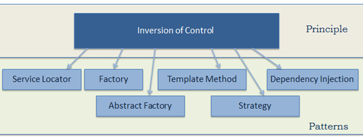

# 控制反转(IOC)与依赖注入(DI)

IOC（Inversion of Control，控制翻转）是 Spring 中一个非常非常重要的概念，它不是什么技术，而是一种解耦的设计思想。它的主要目的是借助于“第三方”(Spring 中的 IOC 容器) 实现具有依赖关系的对象之间的解耦（IOC 容器负责管理对象，你只管使用即可），从而降低代码之间的耦合度。**IOC 是一个原则，而不是一个模式，以下模式（但不限于）实现了 IOC 原则**。

**Spring IOC 容器就像是一个工厂一样，当我们需要创建一个对象的时候，只需要配置好配置文件/注解即可，完全不用考虑对象是如何被创建出来的**。 IOC 容器负责创建对象，将对象连接在一起，配置这些对象，并从创建中处理这些对象的整个生命周期，直到它们被完全销毁。

在实际项目中一个 Service 类如果有几百甚至上千个类作为它的底层，我们需要实例化这个 Service，你可能要每次都要搞清这个 Service 所有底层类的构造函数，这可能会把人逼疯。如果利用 IOC 的话，你只需要配置好，然后在需要的地方引用就行了，这大大增加了项目的可维护性且降低了开发难度。关于 Spring IOC 的理解，推荐看这一下知乎的一个回答：[https://www.zhihu.com/question/23277575/answer/169698662](https://www.zhihu.com/question/23277575/answer/169698662) ，非常不错。

控制翻转怎么理解呢？举个例子，对象 a 依赖了对象 b，当对象 a 需要使用 对象 b 的时候必须自己去创建。但是当系统引入了 IOC 容器后， 对象 a 和对象 b 之间就失去了直接的联系。这个时候，当对象 a 需要使用 对象 b 的时候， 我们可以指定 IOC 容器去创建一个对象 b 注入到对象 a 中。 对象 a 获得依赖对象 b 的过程，由主动行为变为了被动行为，控制权翻转，这就是控制反转名字的由来。

DI（Dependecy Inject，依赖注入）是实现控制反转的一种设计模式，依赖注入就是将实例变量传入到一个对象中去。

[Spring IOC容器源码分析](https://www.javadoop.com/post/spring-ioc)