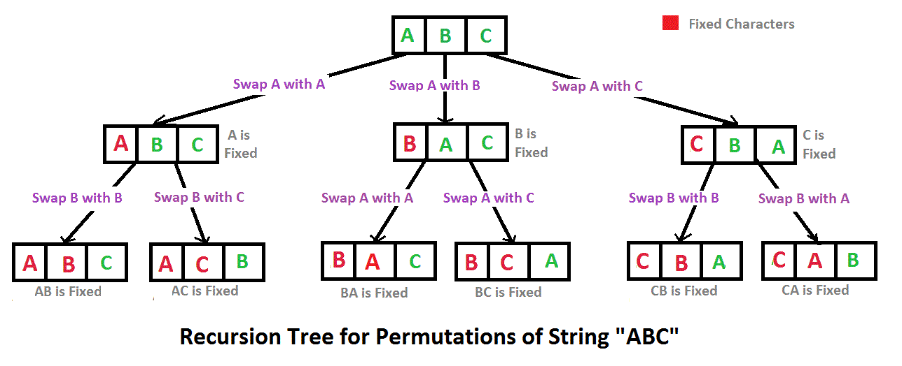

# 27. 字符串的排列

**题目描述**

输入一个字符串,按字典序打印出该字符串中字符的所有排列。例如输入字符串abc,则打印出由字符a,b,c所能排列出来的所有字符串abc,acb,bac,bca,cab和cba。

**输入描述**

> 输入一个字符串，长度不超过9（可能有字符重复），字符只包括大小写字母。

**解答**

递归



```java
import java.util.*;

public class Solution {
    private Set<String> set = new TreeSet<>();
    public ArrayList<String> Permutation(String str) {
        helper(str.toCharArray(), 0);
        return new ArrayList<>(set);
    }

    private void helper(char[] chars, int index) {
        if (index == chars.length - 1) {
            set.add(new String(chars));
            return;
        }
        for (int i = index; i < chars.length; i++) {
            swap(chars, index, i);
            helper(chars, index + 1);
            swap(chars, index, i);
        }
    }

    private void swap(char[] chars, int i, int j) {
        char tmp = chars[i];
        chars[i] = chars[j];
        chars[j] = tmp;
    }
}
```