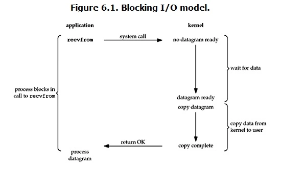
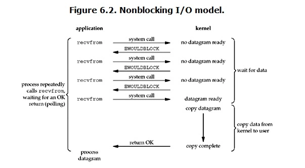
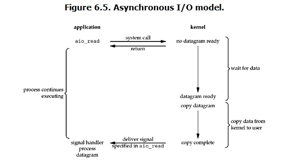

# 输入输出

[TOC]

## IO 模式

### 阻塞 IO

Linux 默认情况下 Socket IO 是阻塞 IO。



阻塞 IO 模式下，当用户进程调用了 recvfrom 这个系统调用，内核就开始 IO 的第一阶段准备数据。数据被拷贝到内核缓冲区是需要等待的。当数据准备完成后，会进入 IO 的第二阶段，内核把数据拷贝到用户进程缓冲区，并返回结果，这时用户进程才解除阻塞。

阻塞 IO 模式下，IO 的两个阶段都是阻塞的。一旦一个 IO 阻塞起来，就无法做其他事情，效率低。

### 非阻塞 IO

Linux 下可以设置 Socket 使其成为非阻塞的。



非阻塞 IO 模式下，当用户进程执行 recvfrom 时，如果内核中数据还没准备好，内核不会阻塞用户进程，而是会返回一个错误。从用户进程来说，它并不需要等待，而是马上就可以得到一个结果。当用户进程判断这是一个错误信息时，就知道数据还没准备好。用户进程不断执行这样的操作，直到数据准备完成，内核就将数据拷贝到用户进程缓冲区。

非阻塞 IO 模式下，用户进程需要不断查询直到数据准备完毕。这个过程很浪费 CPU 资源。

### 多路复用 IO

多路复用 IO 模式就是 select，poll，epoll 等（kqueue 是 bsd 系下的）。在多路复用 IO 模式下，单个进程可以处理多个 IO。多路复用 IO 模式在调用 select 时是阻塞的，只有等待 select 返回才能继续，因此还是属于阻塞的 IO 类型。


下面以 select 函数为例，多路复用 IO 模式下，用户进程调用 select 时会阻塞，select 会轮询其所负责的所有 Socket，当某个 Socket 有数据到达，select 就会返回，这时用户进程再调用 recvfrom 操作，内核会将数据从内核缓冲区拷贝到用户进程缓冲区。

所以多路复用 IO 其实是通过一种机制使得一个进程可以同时等待多个 fd（文件描述符），当其中某个 fd 变为可读时，select 函数就会返回。

需要注意的是，对于单个 IO 来说，这种方式比阻塞 IO 效率还要低，因为它进行了两次系统调用。多路复用 IO 并不能使得单个连接的处理更快，其优势是可以同时处理多个连接，当连接数多的时候，不需要花大量时间在等待某一个连接的数据准备上。

### 异步 IO

上面三种 IO 模式都是同步的。同步需要主动等待消息通知，而异步则是被动接收消息通知，通过回调、通知、状态等方式来被动获取消息。Linux 下的异步 IO 其实用的很少。异步 IO 同样不会阻塞进程。



异步 IO 模式下，用户进程调用 aio_read 后，内核会立即返回，不会阻塞用户进程，然后内核会等待数据准备完成，然后将数据拷贝到用户进程缓冲区，当操作完成后，内核会向用户进程发送一个信号，告诉用户进程数据拷贝完成，可以对数据进行操作了。

### 信号驱动 IO

信号驱动 IO 在实际中很少使用。


信号驱动 IO 与异步 IO 的区别在于，信号驱动 IO 是等待数据完成后，内核发送一个信号给用户进程，然后用户进程使用 recvfrom 去读取数据。而异步 IO 是等待数据和数据拷贝到用户进程缓冲区都完成后，内核发送一个信号给用户进程，用户进程可以直接处理数据。

## select，poll 和 epoll

select，poll 和 epoll 都是多路复用 IO 的实现。

### select

```c
int select(int n, fd_set *readfds, fd_set *writefds, fd_set *exceptfds, struct timeval *timeout);
```

select 函数监视的 fd 分3类，分别是 writefds，readfds 和 exceptfds。调用后 select 函数会阻塞，直到有 fd 就绪（有数据可读、可写、或者有except），或者超时（timeout 指定等待时间，如果立即返回设为 null 即可），函数返回。当 select 函数返回后，可以通过遍历 fd_set，来找到就绪的描述符。

---

select 目前几乎在所有的平台上支持，其良好跨平台支持是它的一个优点。

select 的几个缺点：

- 每次调用 select，都需要把 fd 集合从用户空间拷贝到内核空间，这个开销在 fd 很多时会很大。
- 同时每次调用 select 都需要在内核遍历传递进来的所有 fd，这个开销在 fd 很多时也很大。
- select 支持的 fd 数量太小了，默认是 1024。

### poll

```c
int poll(struct pollfd *fds, unsigned int nfds, int timeout);
```

poll 本质上和 select 没有区别，但是不同于 select 使用三个位图来表示三个 fdset 的方式，poll 只使用一个 pollfd 的指针实现。

```c
struct pollfd {
    int fd; /* file descriptor */
    short events; /* requested events to watch */
    short revents; /* returned events witnessed */
};
```

pollfd 并没有最大数量限制（因为是用链表存储的），但是数量过大后性能也是会下降。 和 select 函数一样，poll 返回后，需要遍历 pollfd 来获取就绪的描述符。

此外，poll 还有一个特点是“水平触发”，如果报告了 fd 后，没有被处理，那么下次 poll 时会再次报告该 fd。

**从上面看，select 和 poll 都需要在返回后，通过遍历 fd 来获取已经就绪的 socket。事实上，同时连接的大量客户端在一时刻可能只有很少的处于就绪状态，因此随着监视的描述符数量的增长，其效率也会线性下降。**

### epoll

epoll 提供了三个函数：

- epoll_create：用来创建一个 epoll 句柄，并返回 id；
- epoll_ctl：事件注册函数，将需要监听的事件和需要监听的 fd 交给 epoll 对象；
- epoll_wait：等待注册的事件被触发或者 timeout 发生。

函数定义如下：

```c
int epoll_create(int size); // size 用来告诉内核这个监听的数目一共有多大
int epoll_ctl(int epfd, int op, int fd, struct epoll_event *event);
int epoll_wait(int epfd, struct epoll_event * events, int maxevents, int timeout);
```

---

**epoll 是如何改进 select 和 poll 的缺点的**

对于多次拷贝 fd 的缺点，epoll 的解决方案是每次注册新的事件到 epoll 句柄中时，会把所有的 fd 拷贝进内核，而不是在 epoll_wait 的时候重复拷贝。epoll 保证了每个 fd 在整个过程中只会拷贝一次。

对于需要遍历所有 fd 的缺点，epoll 的解决方案中在注册事件时为每个 fd 指定一个回调函数，当设备就绪时就会调用这个回调函数，而这个回调函数会把就绪的 fd 加入一个就绪链表。epoll_wait 的工作实际上就是在这个就绪链表中查看有没有就绪的 fd。

对于支持的 fd 数量少的缺点，epoll 所支持的 fd 上限是最大可以打开文件的数目，这个数字一般远大于 2048，比如在 1GB 内存的机器上大约是 10 万左右，具体数目可以使用 `cat /proc/sys/fs/file-max` 察看，一般来说这个数目和系统内存有很大关系。
