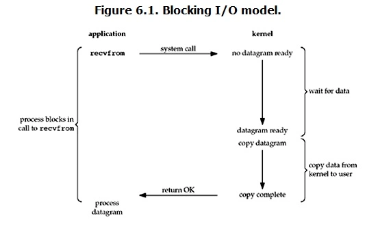
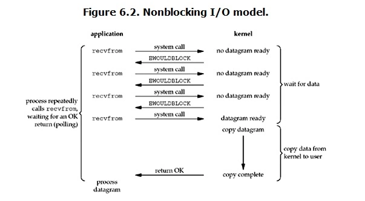
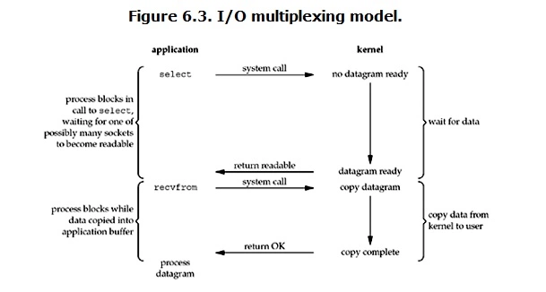
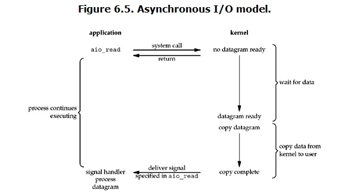
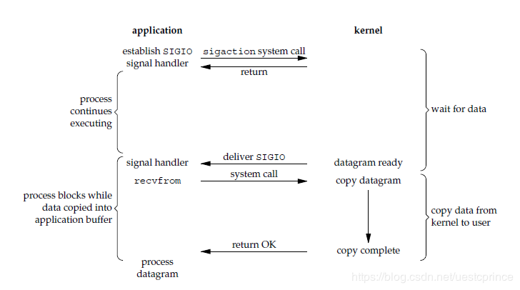

# 输入输出

[TOC]

## IO 模式

### 阻塞 IO

Linux 默认情况下 Socket IO 是阻塞 IO。

阻塞 IO 模式下，当用户进程调用了 recvfrom 这个系统调用，内核就开始 IO 的第一阶段准备数据。数据被拷贝到内核缓冲区是需要等待的。当数据准备完成后，会进入 IO 的第二阶段，内核把数据拷贝到用户进程缓冲区，并返回结果，这时用户进程才解除阻塞。

阻塞 IO 模式下，IO 的两个阶段都是阻塞的。一旦一个 IO 阻塞起来，就无法做其他事情，效率低。

### 非阻塞 IO

Linux 下可以设置 Socket 使其成为非阻塞的。

非阻塞 IO 模式下，当用户进程执行 recvfrom 时，如果内核中数据还没准备好，内核不会阻塞用户进程，而是会返回一个错误。从用户进程来说，它并不需要等待，而是马上就可以得到一个结果。当用户进程判断这是一个错误信息时，就知道数据还没准备好。用户进程不断执行这样的操作，直到数据准备完成，内核就将数据拷贝到用户进程缓冲区。

非阻塞 IO 模式下，用户进程需要不断查询直到数据准备完毕。这个过程很浪费 CPU 资源。

### 多路复用 IO

多路复用 IO 模式就是 select，poll，epoll 等（kqueue 是 bsd 系下的）。在多路复用 IO 模式下，单个进程可以处理多个 IO。多路复用 IO 模式在调用 select 时是阻塞的，只有等待 select 返回才能继续，因此还是属于阻塞的 IO 类型。

下面以 select 函数为例，多路复用 IO 模式下，用户进程调用 select 时会阻塞，select 会轮询其所负责的所有 Socket，当某个 Socket 有数据到达，select 就会返回，这时用户进程再调用 recvfrom 操作，内核会将数据从内核缓冲区拷贝到用户进程缓冲区。

所以多路复用 IO 其实是通过一种机制使得一个进程可以同时等待多个文件描述符，当其中某个文件描述符变为可读时，select 函数就会返回。

需要注意的是，对于单个 IO 来说，这种方式比阻塞 IO 效率还要低，因为它进行了两次系统调用。多路复用 IO 并不能使得单个连接的处理更快，其优势是可以同时处理多个连接，当连接数多的时候，不需要花大量时间在等待某一个连接的数据准备上。

### 异步 IO

上面三种 IO 模式都是同步的。同步需要主动等待消息通知，而异步则是被动接收消息通知，通过回调、通知、状态等方式来被动获取消息。Linux 下的异步 IO 其实用的很少。异步 IO 同样不会阻塞进程。

异步 IO 模式下，用户进程调用 aio_read 后，内核会立即返回，不会阻塞用户进程，然后内核会等待数据准备完成，然后将数据拷贝到用户进程缓冲区，当操作完成后，内核会向用户进程发送一个信号，告诉用户进程数据拷贝完成，可以对数据进行操作了。

### 信号驱动 IO

信号驱动 IO 在实际中很少使用。

信号驱动 IO 与异步 IO 的区别在于，信号驱动 IO 是等待数据完成后，内核发送一个信号给用户进程，然后用户进程使用 recvfrom 去读取数据。而异步 IO 是等待数据和数据拷贝到用户进程缓冲区都完成后，内核发送一个信号给用户进程，用户进程可以直接处理数据。

