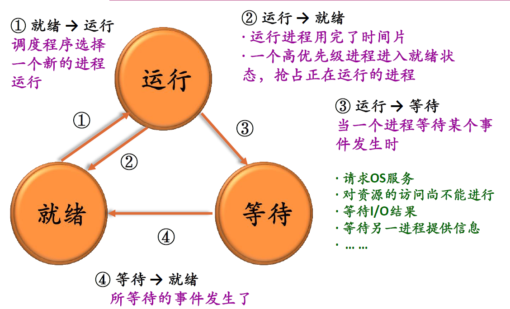
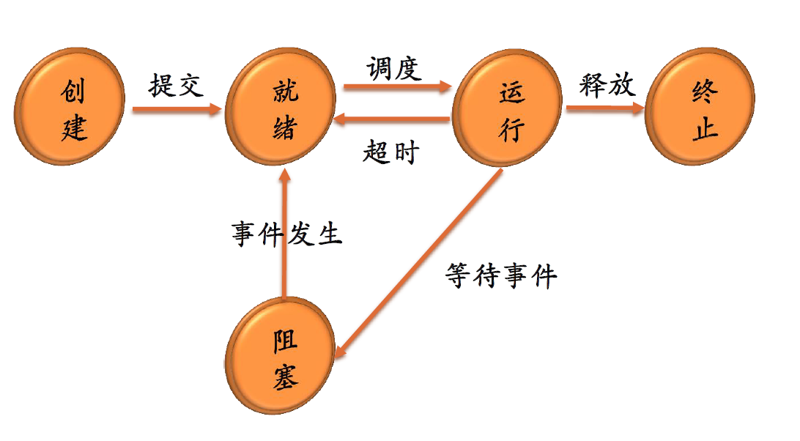
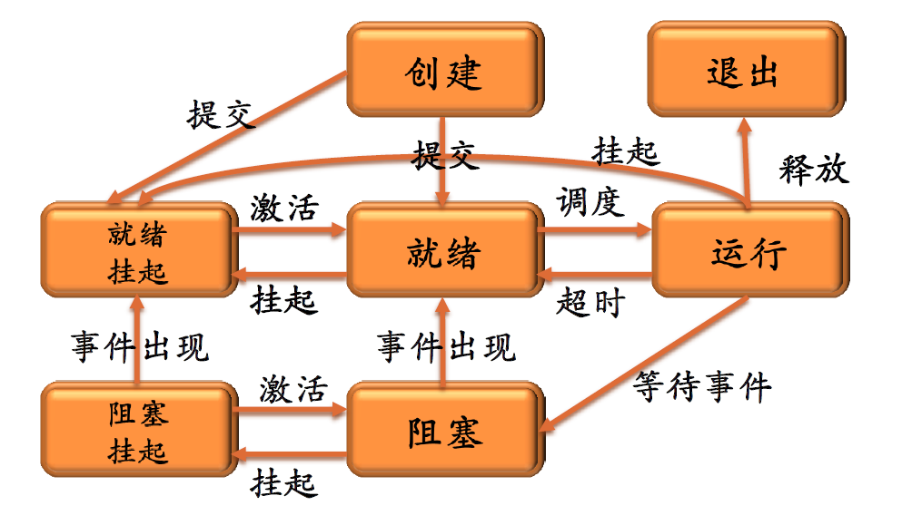
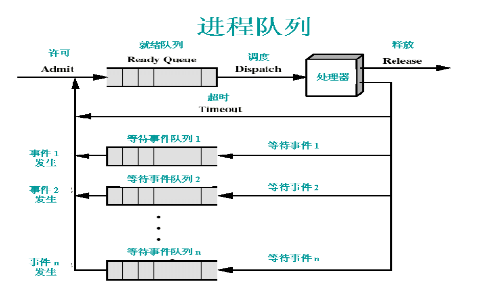

# 进程和线程

要点：

- 进程和线程的区别

## 进程和线程的区别

- 进程：进程是具有独立功能的程序关于**某个数据集合**上的**一次**运行活动，是系统进行**资源分配和调度的基本单位**。
- 线程：线程是进程的一个执行路径，一个进程中至少有一个线程，进程中的多个线程共享进程的资源。

操作系统分配资源时是分配个进程的，但是CPU分配时间片是分配到线程的。因为真正占用CPU运行的是线程，所以说线程是CPU分配的基本单位。

## 进程的基本概念

- 多道程序设计：允许多个程序同时进入内存并运行，其目的是为了提高系统效率。
- 并发环境：在一段时间间隔内，单处理器上有两个或两个以上的程序同时处于开始运行但尚未结束的状态，并且次序不是事先确定的。
- 并发程序：在并发环境中执行的程序。

### 进程控制块 PCB

又称进程描述符、进程属性。是操作系统用于管理控制进程的一个专门的数据结构。记录进程的各种属性，描述进程的动态变化的过程。

PCB 是操作系统感知进程存在的唯一标志。进程与 PCB 是一一对应的。

进程表是所有进程的 PCB 集合。

不同操作系统实现时，PCB 有一些不一样。

#### 进程描述信息

- 进程标识符（Process ID），唯一，通常是一个整数
- 进程名：通常基于可执行文件名，不唯一
- 用户标识符（User ID）
- 进程组关系

#### 进程控制信息

- 当前状态
- 优先级（Priority）
- 代码执行入口地址
- 程序的磁盘地址
- 运行统计信息（执行时间、页面调度）
- 进程间同步和通信
- 进程的队列指针
- 进程的消息队列指针

#### 所拥有的资源和使用情况

- 虚拟地址空间的状况
- 打开文件列表

#### CPU 现场信息

- 寄存器值（通用寄存器、程序计数器PC、程序状态字PSW、栈指针）
- 指向该进程页表的指针

### 进程状态

三个基本状态：运行态、就绪态、等待态

运行态：占有 CPU，并在 CPU 上允许
就绪态：具备运行条件，但由于没有空闲的 CPU，而暂时不能运行
等待态：因等待某个事件而暂时不能运行，比如等待 IO 数据。也叫阻塞态，封锁态，睡眠态。

三状态模型：

其他状态：

- 创建 new：已经完成创建一个进程的必要的工作，但尚未同意执行该进程。
- 终止 terminated：终止执行后，进程进入该状态。这个状态要进行资源回收。
- 挂起 suspend：用于调节负载，进程不占用内存空间，其进程映像交换到磁盘上。

五状态模型：

七状态模型：

## 线程的引入

线程是进程中的一个运行实体，是 CPU 的调度单位，有时将线程称为轻量级进程。

### 为什么要在进程中再引入线程？

- 应用的需要
- 开销的考虑：创建和销毁线程的消耗小；线程切换的消耗小；线程之间的通信不需要通过内核，可以共享进程中的资源。
- 性能的考虑：多处理器情况下，可以多个线程同时进行。

### 线程的属性

- 标识符 ID
- 状态和状态转换
- 不运行时需要保存的上下文
- 有自己的栈和栈指针
- 共享所在进程的地址空间和其他资源
- 可以创建、撤销另一个线程：程序开始时是以一个单线程进程方式运行的，即只有一个主线程

