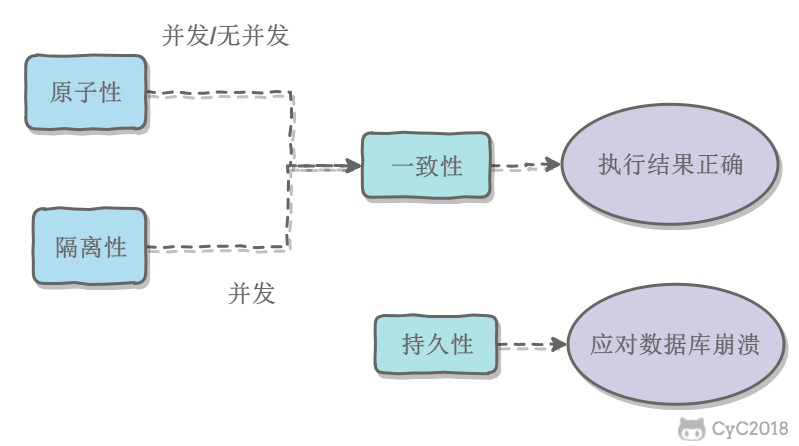

# 数据库-事务

[TOC]

## 事务

事务是指满足 ACID 特性的一组操作，可以通过 `commit` 提交一个事务，也可以用 `rollback` 进行回滚。

- 原子性（Atomicity）：事务被视为不可分割的最小单元，事务的所有操作要么全部提交成功，要么全部失败回滚，不能存在部分成功的情况。
- 一致性（Consistency）：数据库在事务执行前后都保持一致性状态。在一致性状态下，所有事务对一个数据的读取结果都是相同的。
- 隔离性（Isolation）：一个事务所做的修改在最终提交以前，对其它事务是不可见的。
- 持久性（Durability）：一旦事务提交，则其所做的修改将会永远保存到数据库中。即使系统发生崩溃，事务执行的结果也不能丢失。

事务的 ACID 特性概念简单，但不是很好理解，主要是因为这几个特性不是一种平级关系：

- 只有满足一致性，事务的执行结果才是正确的。
- 在无并发的情况下，事务串行执行，隔离性一定能够满足。此时只要能满足原子性，就一定能满足一致性。
- 在并发的情况下，多个事务并行执行，事务不仅要满足原子性，还需要满足隔离性，才能满足一致性。
- 事务满足持久化是为了能应对数据库崩溃的情况。



## 事务隔离级别

### 并发一致性问题

1. 丢失修改

丢失修改也就是一个事务的修改被另一个事务给覆盖了，导致这个事务的修改丢失。T1 和 T2 两个事务都对一个数据进行修改，T1 先修改，T2 随后修改，T2 的修改覆盖了 T1 的修改。现在的数据库管理系统基本都可以避免这个问题。

|        T1        |       T2       |
| :--------------: | :------------: |
|  update var(30)  |                |
|                  | update var(50) |
| select var -> 50 |                |
|     var = 50     |    var = 50    |

2. 脏读

脏读也就是读取到了其他事务尚未提交的修改。T1 修改一个数据，T2 随后读取这个数据。如果 T1 撤销了这次修改，那么 T2 读取的数据是脏数据。

|        T1        |        T2        |
| :--------------: | :--------------: |
| select var -> 50 |                  |
|  update var(30)  |                  |
|                  | select var -> 30 |
|     rollback     |                  |
|     var = 50     |     var = 30     |

3. 不可重复读

不可重复读也就是一个事务中两次读取同一个数据，发现数据不一样了。T2 读取一个数据，T1 对该数据做了修改。如果 T2 再次读取这个数据，此时读取的结果和第一次读取的结果不同。

|        T1        |        T2        |
| :--------------: | :--------------: |
| select var -> 50 |                  |
|                  | select var -> 50 |
|  update var(30)  |                  |
|                  | select var -> 30 |
|     var = 30     |     var = 30     |

4. 幻读

幻读和不可重复读很像，但是幻读侧重于对数据的插入，而不可重复读侧重于更新和删除。如果一个事务 T1 先检查 `id = 1` 的记录不存在，然后想插入一条 `id = 1` 的记录，但是在这之前事务 T2 先插入了一条 `id = 1` 的记录并提交了，那么 T1 就发现冲突，插入失败，对于 T1 来说好像之前读的是幻觉一样。

[不可重复读和幻读的区别](https://www.zhihu.com/question/47007926)

### 事务的隔离级别

产生并发不一致性问题主要原因是破坏了事务的隔离性，解决方法是通过并发控制来保证隔离性。并发控制可以通过封锁来实现，但是封锁操作需要用户自己控制，相当复杂。数据库管理系统提供了事务的隔离级别，让用户以一种更轻松的方式处理并发一致性问题。

数据库管理系统提供了四种事务隔离级别：

- 未提交读（READ UNCOMMITTED）：事务中的修改，即使没有提交，对其他事务也是可见的。
- 提交读（READ COMMITTED）：一个事务只能读取已经提交的事务所做的修改。换句话说，一个事务所做的修改在提交之前对其他事务是不可见的。该隔离级别是大多数数据库默认的隔离级别，比如 Oracle。
- 可重复读（REPEATABLE READ）：保证在同一个事务中多次读取同样数据的结果是一样的。该隔离级别是 MySQL 的默认隔离级别。
- 可串行化（SERIALIZABLE）：强制事务串行执行。需要加锁实现，而其他隔离级别通常不需要。

这四种隔离级别和对应可能存在的并发一致性问题的关系如下表：

| 隔离级别 | 丢失修改 | 脏读 | 不可重复读 | 幻读 |
| :-----: | :-----: | :--: | :-------: | :--: |
| 未提交读 |    ×    |  √   |     √     |  √   |
|  提交读  |    ×    |  ×   |     √     |  √   |
| 可重复读 |    ×    |  ×   |     ×     |  √   |
| 可串行化 |    ×    |  ×   |     ×     |  ×   |

事务相关的 SQL 语句：

```sql
select @@tx_isolation;  -- 查看当前表的隔离级别
set session transaction isolation level read committed;  -- 临时设置当前会话的事务隔离级别为 read committed
begin;  -- 开启一个事务
commit;  -- 提交事务
rollback;  -- 回滚事务
```

## 事务的实现

事务的隔离性由锁来实现。原子性、一致性、持久性通过数据库的 redo log 和 undo log 来完成。redo log 称为重做日志，用来保证事务的原子性和持久性。undo log 用来保证事务的一致性。

[数据库事务原子性、一致性是怎样实现的？ - 沈杰的回答 - 知乎](https://www.zhihu.com/question/30272728/answer/132403859)