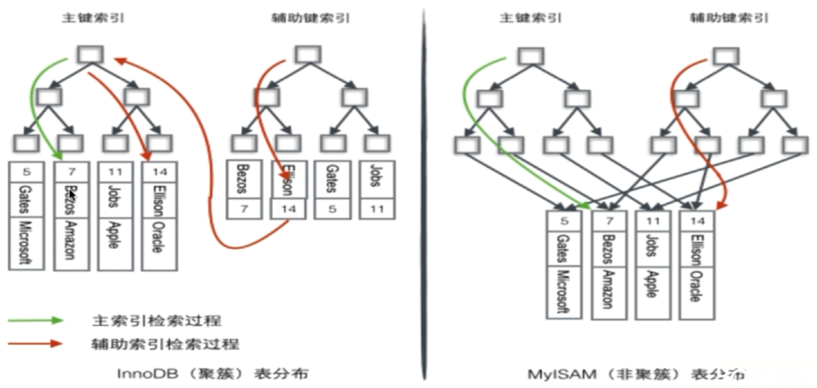
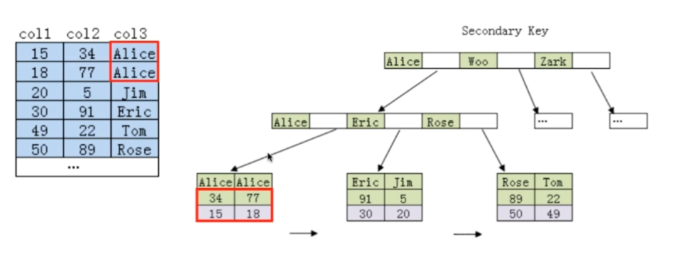

# 数据库-索引

[TOC]

## 为什么要使用索引

使用索引的主要用途就是**增加查询速度**。如果不使用索引，那么在表中查找一个记录就需要遍历很多条目。并且如果表中记录很多时，内存中是放不下的，需要多次读取磁盘，而读取磁盘是很慢的。

但是使用索引也是有代价的，建立和维护索引需要额外时间，并且需要更多存储空间。

一些索引不适合的情况：

- 对于在查询过程中很少使用或参考的列，不应该创建索引，维护索引成本大于收益。
- 对于那些只有很少数据值的列（比如性别），不应该创建索引。
- 对于那些定义为 image，text 和 bit 数据类型的列，不应该创建索引。
- 当修改次数远大于读取次数，不应该建立索引，频繁修改会导致索引维护成本高。

## 索引类型

- 主键索引（Primary Key）
- 唯一索引（Unique）
- 普通索引
- 联合索引
- 全文索引（FullText）

---

**主键索引与唯一索引的区别**

- 主键一定会创建一个唯一索引，但是有唯一索引的列不一定是主键。
- 主键不允许为空值，唯一索引列允许空值。
- 一个表只能有一个主键，但是可以有多个唯一索引。
- 主键可以被其他表引用为外键，唯一索引列不可以。
- 主键是一种约束，而唯一索引是一种索引，是表的冗余数据结构，两者有本质的差别。

---

## 优化索引

1. 二叉搜索树

非平衡的二叉搜索树的查找效率退化为 O(n)。

2. 平衡二叉搜索树

结点多的时候深度太深，对于数据库来说，需要多次磁盘 IO，速度慢。

3. B 树

B 树结点要存数据，如果数据多的话，内存里存不下。且 B 树对于范围查找的能力比较弱。

4. B+ 树

非叶子结点仅仅存索引，叶子结点才存数据，叶子结点可以是存在硬盘中的，因此磁盘读写代价更小。

---

**为什么 B+ 树更适合用来做存储索引**

- B+ 树高度低，磁盘 IO 次数少，磁盘 IO 速度相比内存读写太慢了。
- B+ 树的查询效率更加稳定，因为非叶子节点不存数据，因此任何数据的查询都必须访问到叶子结点。
- B+ 树叶子节点是连成一个链表的，可以直接遍历链表，更有利于对数据库的扫描以及**范围查询**。

---

[InnoDB 一棵 B+树可以存放多少行数据？](https://www.cnblogs.com/leefreeman/p/8315844.html)

[InnoDB 引擎中页的概念](https://segmentfault.com/a/1190000008545713)

5. 哈希索引

通过使用哈希运算得到桶下标，然后遍历桶中条目查找特定记录，可以快速缩小查找的范围，速度快。

哈希索引的缺点：

- 只能满足等值查询 `=` 或者存在性查询 `IN`，不能使用范围查询。
- 无法进行排序。
- 不能利用部分索引键查询。
- 不能避免表扫描（还是要遍历桶中的条目）。
- 遇到大量哈希值相等的情况时，性能不一定比 B+ 树索引高（极端情况下所有记录都在一个桶中时，相当于全表扫描）。

1. 位图（BitMap）索引

已知支持位图索引的主流数据库是 Oracle，MySQL 不支持，这里就不讨论了。

## 聚集索引和非聚集索引

InnoDB 存储引擎表是索引组织表，表中的数据按照主键顺序存放，聚集索引就是根据主键构造一颗 B+ 树，同时叶子结点中存放的就是整行的数据。

InnoDB 非聚集索引中的叶子结点存放了聚集索引键，可以根据这个键去聚集索引中查找某一行的数据。

---

在 InnoDB 中：

- 若一个主键被定义，该主键则作为聚集索引。
- 若没有主键被定义，该表的第一个唯一非空索引作为聚集索引。
- 若不满足以上条件，InnoDB 内部会生成一个 6 字节长整型隐藏主键（聚集索引）。
- 非聚集索引存储相关键位和其对应的聚集索引值，包含两次查找，首先根据非聚集索引找到聚集索引值，然后根据聚集索引查找到数据条目。

---

下图可以看出 InnoDB 和 MyISAM 在索引组织上的区别，InnoDB 使用了聚集索引，其主键索引是聚集索引，其他索引是非聚集索引，而 MyISAM 没有使用聚集索引，其主键索引和辅助键索引都是非聚集索引。



## 如何定位和优化慢查询

### 1. 根据慢日志定位慢查询 SQL

使用如下命令查看系统变量

```sql
show variables like '%quer%';
```

结果中有几个字段：

- long_query_time：查询时间超过这个的就会被记录到慢查询日志中。
- slow_query_log：是否开启慢查询日志记录。
- slow_query_log_file：慢查询日志位置。

修改变量，修改后要重新连接数据库。**这种方式在数据库重启后会恢复，要想重启后还是保持，需要在配置文件里修改。**

```sql
set global slow_query_log = on;  -- 开启慢查询日志记录
set global long_query_time = 1;  -- 设置超时时间为 1 秒
```

使用如下命令查看慢查询数目（仅仅是本次会话的）。

```sql
show status like '%slow_queries%';
```

### 2. 使用 explain 等工具分析 SQL

```sql
# explain [一个 SQL 语句]
explain select * from table where id = 1;
```

结果中的关键字段：

- type：表示 MySQL 查找记录的方式，从最好到最差的连接类型为 system > const > eq_ref > ref > fulltext > ref_or_null > index_merge > unique_subquery > index_subquery > range > index > ALL，const 代表一次就命中，ALL 代表扫描了全表才确定结果。一般来说,得保证查询至少达到 range 级别，最好能达到 ref。
- extra：extra 中出现以下 2 项意味着 MySQL 根本不能使用索引，效率会受到很大影响，应尽可能对此进行优化：

| extra 项        | 说明                                                                                                                                                          |
| --------------- | ------------------------------------------------------------------------------------------------------------------------------------------------------------- |
| Using filesort  | 表示 MySQL 会对结果使用一个外部索引排序，而不是从表里按索引次序读到相关内容。可能在内存或者磁盘上进行排序。MySQL 中无法利用索引完成的排序操作称为“文件排序”。 |
| Using temporary | 表示 MySQL 在对查询结果排序时使用临时表。常见于排序 order by 和分组查询 group by。                                                                            |

### 3. 修改 SQL 或者让 SQL 尽量走索引

根据具体情况修改。

## 联合索引的最左匹配原则以及为什么需要满足最左匹配

联合索引的最左匹配原则：

1. MySQL 会从左向右匹配直到遇到范围查询 `>, <, between, like` 就停止索引（但是当前这个字段可以使用到索引），比如 `a=3 AND b=4 AND c>5 AND d=6`，如果建立 `(a, b, c, d)` 顺序的联合索引，d 就用不到索引了，如果建立 `(a, b, d, c)` 顺序的联合索引，则所有索引都可以用到，且 a，b，d 的顺序可以更改。
2. 对于联合索引最左匹配规则来说， `=` 和 `IN` 可以乱序，比如 `a=1 AND b=2 AND c=3`，建立 `(a, b, c)` 索引时 `a, b, c` 可以任意顺序，MySQL 的查询优化器会帮你优化成索引可以识别的形式。

**为什么需要满足最左匹配**

MySQL 创建联合索引的规则是，首先根据第一个字段进行排序，在此基础上然后再根据第二个字段进行排序，以此类推。仅使用后面的字段是无法走索引的。比如下图联合索引是 `(col3, col2)`，要想利用索引查询首先得根据 `col3` 的值来进行 B+ 树的查找。



## 一些问题

**索引是建立得越多越好吗**

建立和维护索引也是有成本的，比如：

- 数据量小的表不需要建立索引，建立会增加额外的索引开销。
- 数据变更需要维护索引，因此索引越多维护成本也越高。
- 更多的索引意味着需要更多空间。

因此索引并不是越多越好。

---

**常见的不走索引的 SQL**

```sql
SELECT * FROM A WHERE A.a = A.b;  -- 不走索引

-- 字段参与计算或者使用了函数运算就不会走索引
SELECT `sname` FROM `stu` WHERE `age` + 10 = 30;  -- 不会使用索引，因为所有索引列参与了计算
SELECT `sname` FROM `stu` WHERE LEFT(`date`,4) < 1990;  -- 不会使用索引，因为使用了函数运算，原理与上面相同

-- 模糊查询时，如果查询条件前面带了 % 就不会走索引
SELECT * FROM `tb` WHERE `uname` LIKE 'xxx%';  -- 走索引
SELECT * FROM `tb` WHERE `uname` LIKE '%xxx%';  -- 不走索引

-- 使用正则表达式不走索引，这应该很好理解，所以这就是为什么在 SQL 中很难看到 regexp 关键字的原因

-- 字符串与数字比较不使用索引
CREATE TABLE `a` (`a` char(10));
EXPLAIN SELECT * FROM `a` WHERE `a` = "1";  -- 走索引
EXPLAIN SELECT * FROM `a` WHERE `a` = 1;  -- 不走索引，同样也是使用了函数运算

-- 如果条件中有 or，即使其中有条件带索引也不会使用。换言之，就是要求使用的所有字段，都必须建立索引，建议尽量避免使用 or 关键字
SELECT * FROM dept WHERE dname = 'xxx' OR loc = 'xx' OR deptno = 45;

-- MySQL 内部优化器会对 SQL 语句进行优化，如果优化器估计使用全表扫描要比使用索引快，则不使用索引
```
