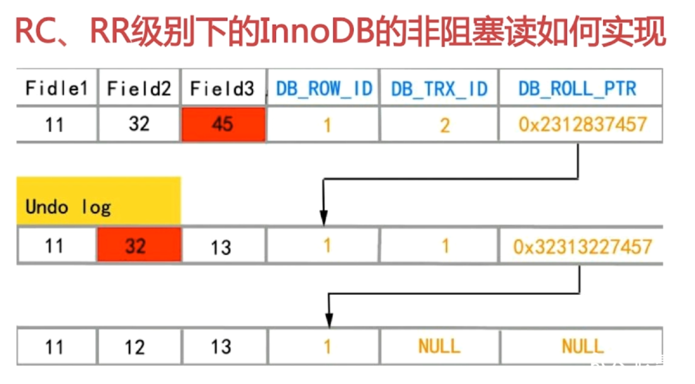
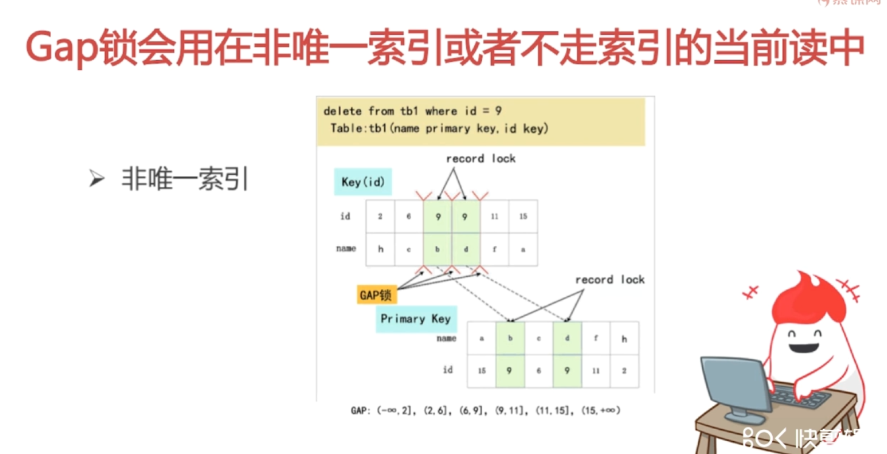
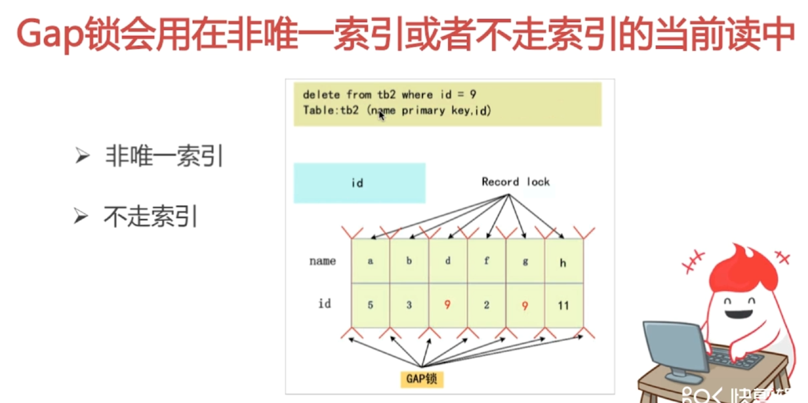
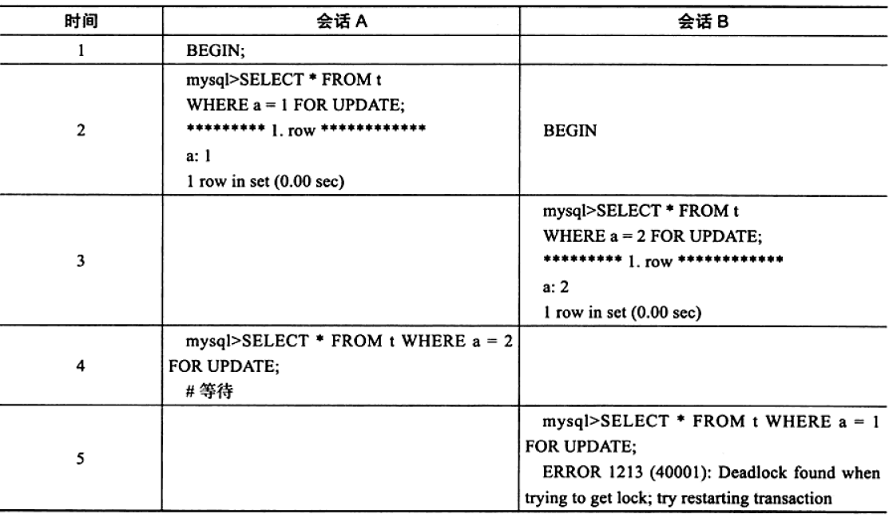
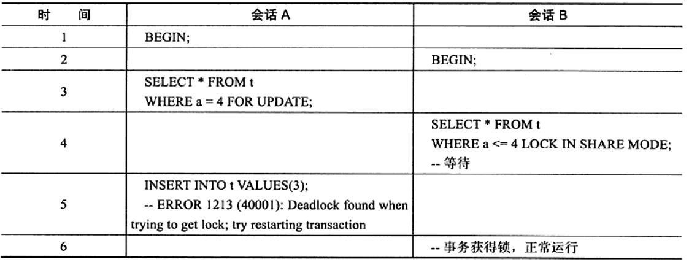

# 数据库-锁

[TOC]

## 数据库中锁的类型

### 行级锁

- 共享锁（读锁，S 锁）：一个事务对一条记录上了共享锁后，其他事务也还能上共享锁，但不能上排他锁。
- 排他锁（写锁，X 锁）：一个事务对一条记录上了排他锁后，其他事物不能上任何锁。

共享锁和排他锁的兼容性（兼容性是指上了一个锁后还能上另一个锁）如下：

|     |   X   |   S   |
| :-: | :---: | :---: |
|  X  | 不兼容 | 不兼容 |
|  S  | 不兼容 |  兼容  |

需要注意的是，共享锁和排他锁都是行锁，兼容是指对同一行记录的兼容性情况。

### 表级锁

此外 InnoDB 还支持多粒度锁定，允许事务在行级和表级上的锁同时存在。为了支持这种方式，InnoDB 还有一种叫做意向锁的锁。意向锁意味着事务希望在更细粒度上加锁。比如如果一个事务想要在某条记录上加排他锁，就需要在数据库、表、页上加意向排他锁（IX 锁），最后在记录上加 X 锁，如果过程中任何一个部分需要等待，那么加锁操作都要等待粗粒度锁的完成。

- 意向共享锁（IS 锁）：事务想要获得一张表中某几行的共享锁。
- 意向排他锁（IX 锁）：事务想要获得一张表中某几行的排他锁。

表级锁与行级锁的兼容性如下表：

|     |  IS   |  IX   |   S   |   X   |
| :-: | :---: | :---: | :---: | :---: |
| IS  |  兼容  |  兼容  |  兼容  | 不兼容 |
| IX  |  兼容  |  兼容  | 不兼容 | 不兼容 |
|  S  |  兼容  | 不兼容 |  兼容  | 不兼容 |
|  X  | 不兼容 | 不兼容 | 不兼容 | 不兼容 |

### MyISAM 与 InnoDB 在锁方面的区别

- MyISAM 默认用的是表级锁，不支持行级锁。
- InnoDB 默认用的是行级锁，也支持表级锁。

InnoDB 的行锁是通过给索引上的索引项加锁来实现的。这就意味着，**只有通过索引条件检索数据，InnoDB才使用行级锁，否则，InnoDB将使用表锁**。

## InnoDB 可重复读隔离级别下如何避免幻读

InnoDB 在 REPEATABLE READ 级别下，有两种读取数据的方式，即**快照读和当前读**。

针对两种读取方式，InnoDB 避免幻读的方式不一样：

- 快照读：通过 MVCC（Multi-Version Concurrency Control，多版本并发控制）。读取快照中的数据。实现方式有不加锁的非阻塞读，以及简单的 `select` 语句。
- 当前读：通过 NEXT-KEY 锁。读取当前最新的数据。实现方式有 `select ... lock in share mode`, `select ... for update`, `update`, `delete`, `insert`。

> NEXT-KEY 锁由行锁 + Gap 锁组成。

```sql
# 在 REPEATABLE READ 下，事务首次执行快照读的时机会影响后续读取结果，创建快照的时机决定了读取事务的版本，快照读还是有避免幻读的能力

# 先快照再修改
select * from account where id = 1;  # 事务 1 先快照读
update account set balance = 0 where id = 1;  # 事务 2 执行修改
select * from account where id = 1;  # 事务 1 再次读取时，读的是快照，不是事务 2 修改后的值
select * from account where id = 1 lock in share mode;  # 事务 1 执行当前读，则会读到事务 2 修改后的值

# 先修改再快照
update account set balance = 0 where id = 1;  # 事务 2 先执行修改
select * from account where id = 1;  # 事务 1 快照读，此时读到的是事务 2 修改后的值
```

MVCC 在不同隔离级别下的行为不一样：

- READ COMMITTED 级别下，总是读取行的最新版本，如果行被锁定，就读取该行版本的一个最新的快照。
- REPEATABLE READ 级别下，总是读取这个事务开始时的行数据。

**RC、RR 级别下的 InnoDB 的非阻塞读如何实现**

- 数据行里的 DB_TRX_ID、DB_ROLL_PTR、DB_ROW_ID 字段
- Undo 日志
- Read View



- **DB_TRX_ID**：最近一次对本行记录做修改的事务 ID。
- **DB_ROLL_PTR**：回滚指针，写入回滚段 rollback segment 的 undo 日志记录。
- **DB_ROW_ID**：行号。

Undo记录：存储旧版本数据。

**NEXT-KEY 锁**

NEXT-KEY 锁由行锁 + Gap 锁组成。

Gap 锁在 READ UNCOMMITTED 和 READ COMMITTED 下没有，在 REPEATABLE READ 和 SERIALIZABLE 下默认有。

Gap 锁会锁住一个范围内的记录，但不包括记录本身。行锁只会锁住确定的某条记录。

对于主键索引或者唯一索引

- 如果 where 条件全部命中，则不会加 Gap 锁，只会加行锁。
- 如果 where 条件部分命中或者都没命中，则会加 Gap 锁。



非唯一索引：锁住 (6, 11] 区间，注意如果此时插入 ("dd", 6)，name 是主键，即使 id 不在区间内，但是 "dd" 按照字母顺序在 "f" 前面，插入时还是会锁住。



## 两阶段锁协议

两阶段锁协议（2PL，Two Phase Locking）规定加锁和解锁分为两个阶段执行：

- 对任何数据的读写之前，必须申请对该数据加锁。
- 在释放一个锁后，事务不再申请和获得其他任何锁。

遵循两阶段锁协议的事务的交叉调度是可串行化的。但是可串行化的若干事务未必遵循两阶段锁协议。

另外遵循两阶段锁协议的事务也可能发生死锁，比如互相企图获得对方占有的锁。

## 死锁产生的原因

### AB-BA 死锁

事务 T1 修改记录 A，在记录 A 上加了排他锁，然后又想修改记录 B；事务 T2 修改记录 B，在记录 B 上加了排他锁，然后企图修改记录 A。这时两个事务都互相持有对方需要的资源，且都无法释放自己的资源，因此导致了死锁。



解决方案：

程序中对于多个数据的操作应该按照一样的顺序进行，比如都是先修改 A 再修改 B。

### 读锁和写锁互相等待

事务 A 持有了一个记录的写锁，这时事务 B 想要获取一个范围内的读锁，其中包括事务 A 上了写锁的那个记录。然后事务 A 又想修改事务 B 
上了读锁的范围内的数据，这时产生了读锁和写锁的互相等待。



解决方案：

尽量避免出现读锁和写锁互相等待的情况。如果出现了，就只能使用 InnoDB 的回滚方法。

## 数据库解决死锁的方法

- 超时回滚：当两个事务互相等待时，如果一个事务等待超时，就进行回滚，另一个等待的事务就能继续进行。
- 等待图（wait-for graph）：InnoDB 采用的方式，根据锁的信息链表和事务等待链表构建一张图，在每个事务请求锁并发生等待时，以深度优先搜索的方式进行回路判断，若发现图中存在回路，说明造成了死锁。如果发现死锁，如果是 AB-BA 死锁，InnoDB 选择回滚 undo 量最小的事务；如果是读写锁互相等待型死锁，InnoDB 选择回滚 undo 量大的事务。