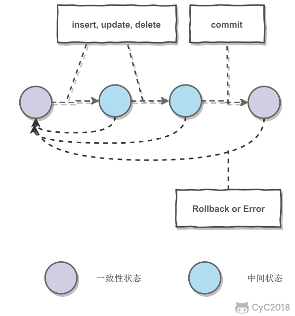
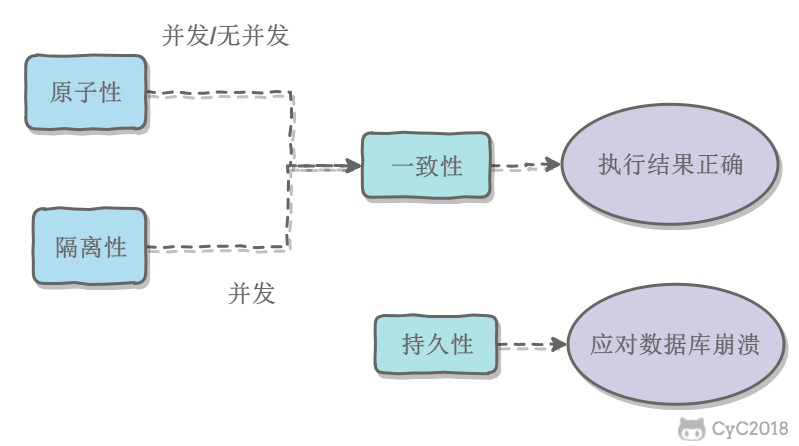
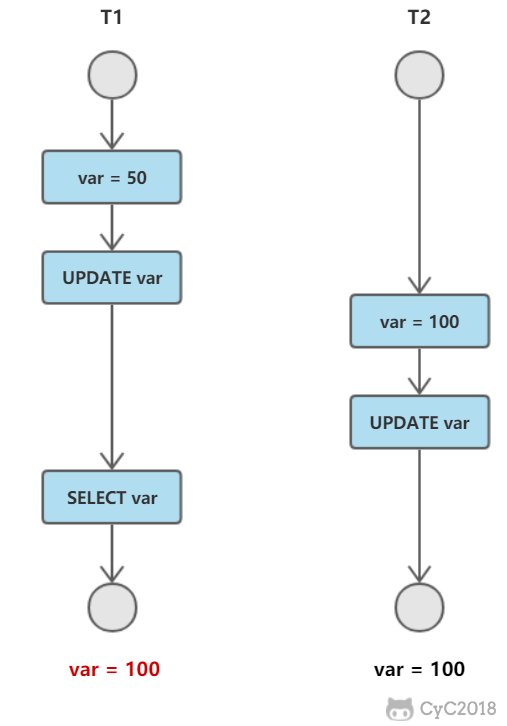
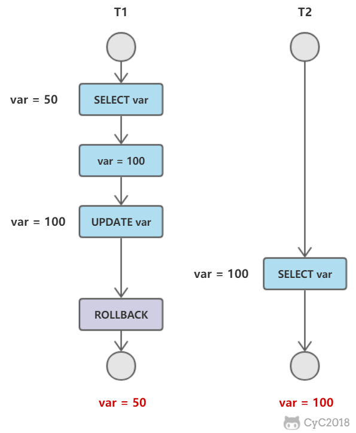
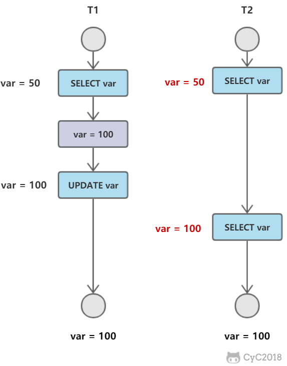
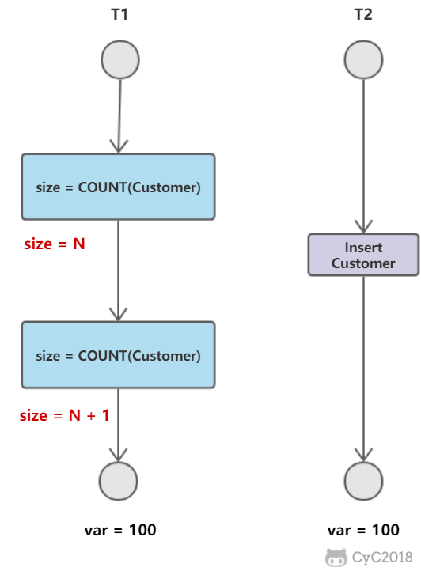

# 数据库

要点：

- 索引
- 事务
- 事务隔离级别
- 设计范式

## 索引

[索引.md](索引.md)

## 事务

事务是指满足ACID特性的一组操作，可以通过commit提交一个事务，也可以用rollback进行回滚。

### ACID

- 原子性（Atomicity）：事务被视为不可分割的最小单元，事务的所有操作要么全部提交成功，要么全部失败回滚。
- 一致性（Consistency）：数据库在事务执行前后都保持一致性状态。在一致性状态下，所有事务对一个数据的读取结果都是相同的。
- 隔离性（Isolation）：一个事务所做的修改在最终提交以前，对其它事务是不可见的。
- 持久性（Durability）：一旦事务提交，则其所做的修改将会永远保存到数据库中。即使系统发生崩溃，事务执行的结果也不能丢失。

事务的 ACID 特性概念简单，但不是很好理解，主要是因为这几个特性不是一种平级关系：

- 只有满足一致性，事务的执行结果才是正确的。
- 在无并发的情况下，事务串行执行，隔离性一定能够满足。此时只要能满足原子性，就一定能满足一致性。
- 在并发的情况下，多个事务并行执行，事务不仅要满足原子性，还需要满足隔离性，才能满足一致性。
- 事务满足持久化是为了能应对数据库崩溃的情况。

## 事务隔离级别

### 并发一致性问题

#### 1. 丢失修改

T1 和 T2 两个事务都对一个数据进行修改，T1 先修改，T2 随后修改，T2 的修改覆盖了 T1 的修改。现在的数据库管理系统基本都可以避免这个问题。

#### 2. 脏读

T1 修改一个数据，T2 随后读取这个数据。如果 T1 撤销了这次修改，那么 T2 读取的数据是脏数据。

#### 3. 不可重复读

T2 读取一个数据，T1 对该数据做了修改。如果 T2 再次读取这个数据，此时读取的结果和第一次读取的结果不同。

#### 4. 幻读

T1 读取某个范围的数据，T2 在这个范围内插入新的数据，T1 再次读取这个范围的数据，此时读取的结果和和第一次读取的结果不同。

产生并发不一致性问题主要原因是破坏了事务的隔离性，解决方法是通过并发控制来保证隔离性。并发控制可以通过封锁来实现，但是封锁操作需要用户自己控制，相当复杂。数据库管理系统提供了事务的隔离级别，让用户以一种更轻松的方式处理并发一致性问题。

### 封锁

### 隔离级别

数据库管理系统提供了四种事务隔离级别

- 未提交读（READ UNCOMMITED）：事务中的修改，即使没有提交，对其他事务也是可见的。
- 提交读（READ COMMITED）：一个事务只能读取已经提交的事务所做的修改。换句话说，一个事务所做的修改在提交之前对其他事务是不可见的。
- 可重复读（REPEATABLE READ）：保证在同一个事务中多次读取同样数据的结果是一样的。
- 可串行化（SERIALIZABLE）：强制事务串行执行。需要加锁实现，而其他隔离级别通常不需要。

隔离级别和对应可能存在的并发一致性问题：

| 隔离级别 | 丢失修改 | 脏读 | 不可重复读 | 幻读 |
| -------- | ------- | ---- | --------- | --- |
| 未提交读 | ×       | √    | √         | √    |
| 提交读   | ×       | ×    | √         | √    |
| 可重复读 | ×       | ×    | ×         | √    |
| 可串行化 | ×       | ×    | ×         | ×    |

## 设计范式