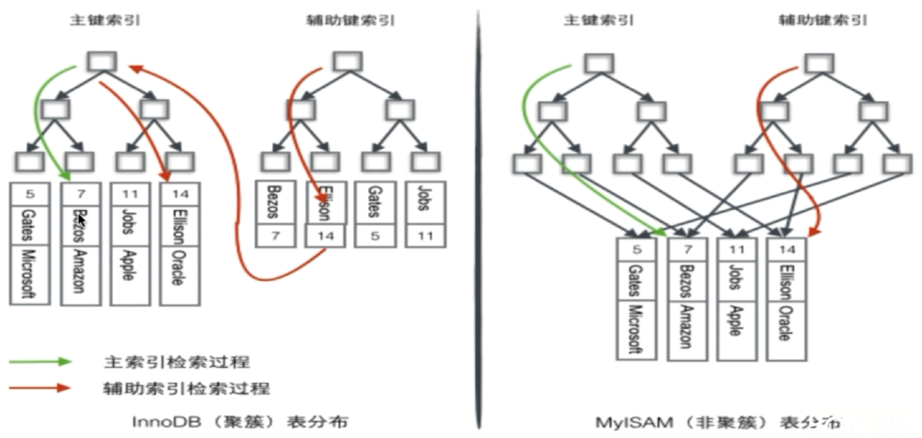
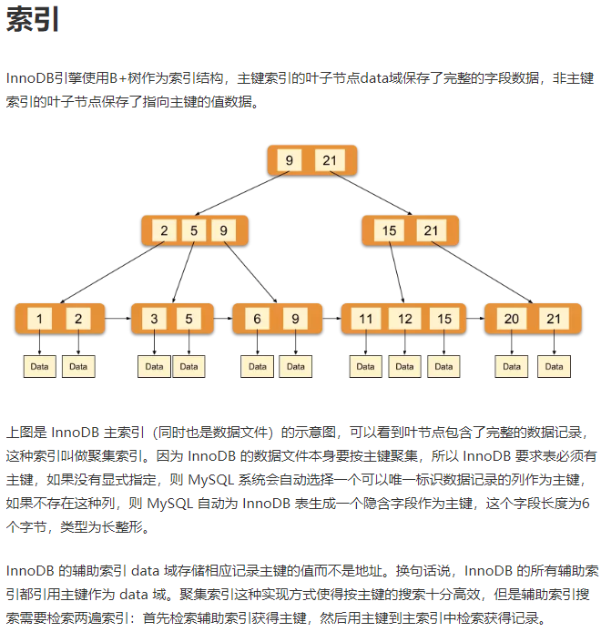
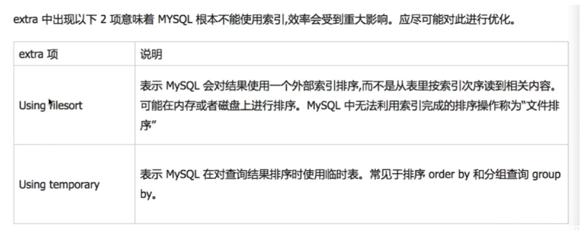

# 索引

要点：

- 为什么要使用索引
- 什么样的信息可以成为索引
- 优化索引
- 密集索引和稀疏索引
- 如何定位和优化慢查询
- 联合索引的最左匹配原则的成因
- 索引是建立得越多越好吗

## 为什么要使用索引

如果不使用索引，我们要进行全表扫描来查找一个数据的话，在数据量较大的时候，时间复杂度是线性的，而且如果数据量大到比内存要大的时候，还需要多次读写磁盘，这种方式效率显然很低。而使用索引可以像查字典一样快速定位到数据所在的位置。

## 什么样的信息可以成为索引

主键、唯一键和普通键等

## 优化索引

### 二叉搜索树

非平衡的二叉搜索树的查找效率退化为 O(n)。

### 平衡二叉搜索树

结点多的时候深度太深，对于数据库来说，需要多次磁盘IO，速度慢。

### B树

结点要存数据，如果数据多的话，在内存里是存不下的。

### B+树

非叶子结点仅仅存索引，叶子结点才存数据，叶子结点可以是存在硬盘中的，因此磁盘读写代价更小。

B+树更适合用来做存储索引

1. B+树的磁盘读写代价更低
2. B+树的查询效率更加稳定，因为非叶子节点不存数据，因此任何数据的查询都必须走到叶子结点中去
3. B+树更有利于对数据库的扫描

### Hash

通过使用hash运算得到桶下标，然后遍历桶中entry就可以找到，速度很快。

缺点：

- 只能满足“=”或者“IN”，不能使用范围查询；
- 无法用来避免排序操作
- 不能利用部分索引键查询
- 不能避免表扫描（还是要遍历桶中的entry）
- 遇到大量hash值相等的情况后，性能不一定比B树索引高（都在一个桶中时，退化成线性）

### BitMap

已知支持BitMap的主流数据库是Oracle，MySQL不支持。

## 密集索引和稀疏索引

密集索引（聚集索引）
稀疏索引（辅助索引）

在InnoDB中

- 若一个主键被定义，该主键则作为密集索引
- 若没有主键被定义，该表的第一个唯一非空索引作为密集索引
- 若不满足以上条件，InnoDB内部会生成一个隐藏主键（密集索引）
- 非主键索引存储相关键位和其对于的主键值，包含两次查找





## 如何定位和优化慢查询

### 1. 根据慢日志定位慢查询SQL

使用如下命令查看系统变量

```sql
show variables like '%quer%';
```

long_query_time：查询时间超过这个的就会被记录到慢查询日志中


slow_query_log：是否开启慢查询日志记录
slow_query_log_file：慢查询日志位置


修改变量，修改后要重新连接数据库。**如果数据库重启后会恢复，除非在配置文件里修改。**

```sql
set global slow_query_log = on;  # 开启慢查询日志记录
set global long_query_time = 1;  # 设置超时时间为1秒
```

使用如下命令查看慢查询数目（仅仅是本次会话的）。

```sql
show status like '%slow_queries%';
```

### 2. 使用explain等工具分析SQL

```sql
# explain [一个SQL语句]
explain select * from table where id = 1;
```

#### 关键字段

**type**：mysql找到需要的数据行的方式，如下图所示，出现红色的表示本次查询走的是全表扫描，可能需要优化。


**extra**



### 3. 修改SQL或者让SQL尽量走索引

## 联合索引的最左匹配原则的成因

### 最左匹配原则

1. MySQL会一直向右匹配直到遇到范围查询（>, <, between, like）就停止索引，比如a=3 and b=4 and c>5 and d=6，如果建立(a, b, c, d)顺序的联合索引，d就用不到索引了，如果建立(a, b, d, c)顺序的联合索引，则所有索引都可以用到，且a，b，d的顺序可以更改。
2. “=”和“IN”可以乱序，比如a=1 and b=2 and c=3，建立(a, b, c)索引可以任意顺序，mysql查询优化器会帮你优化成索引可以识别的形式。

### 成因

MySQL创建联合索引的规则是，首先根据第一个字段进行排序，在此基础上然后再根据第二个字段进行排序。仅使用第二个字段是无法走索引的。比如下图联合索引是(col3, col2)，要想利用索引查询首先得根据col3的值来进行B+树的查找。


## 索引是建立得越多越好吗

答案当然是否定的。

- 数据量小的表不需要建立索引，建立会增加额外的索引开销。
- 数据变更需要维护索引，因此索引越多维护成本也越高。
- 更多的索引意味着需要更多空间。

