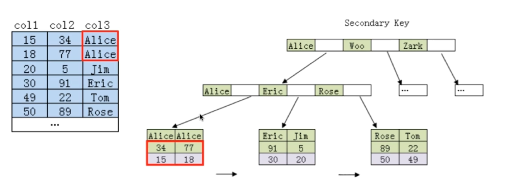

# 索引

[TOC]

## 为什么要使用索引

如果不使用索引，那么在表中查找一个记录就需要遍历整个表，非常耗时，并且如果表中记录很多时，内存中是放不下的，需要多次读写磁盘。而使用索引，可以像查字典一样，快速查找到某个记录。

## 索引类型

- 主键索引（Primary Key）
- 唯一索引（Unique）
- 普通索引
- 联合索引
- 全文索引（FullText）

### 主键索引与唯一索引的区别

- 主键一定会创建一个唯一索引，但是有唯一索引的列不一定是主键。
- 主键不允许为空值，唯一索引列允许空值。
- 一个表只能有一个主键，但是可以有多个唯一索引。
- 主键可以被其他表引用为外键，唯一索引列不可以。
- 主键是一种约束，而唯一索引是一种索引，是表的冗余数据结构，两者有本质的差别。

## 优化索引

### 二叉搜索树

非平衡的二叉搜索树的查找效率退化为 O(n)。

### 平衡二叉搜索树

结点多的时候深度太深，对于数据库来说，需要多次磁盘 IO，速度慢。

### B 树

B 树结点要存数据，如果数据多的话，内存里存不下。且 B 树对于范围查找的能力比较弱。

### B+ 树

非叶子结点仅仅存索引，叶子结点才存数据，叶子结点可以是存在硬盘中的，因此磁盘读写代价更小。

B+ 树更适合用来做存储索引：

1. B+ 树高度低，磁盘 IO 次数少，代价更低。
2. B+ 树的查询效率更加稳定，因为非叶子节点不存数据，因此任何数据的查询都必须访问到叶子结点。
3. B+ 树叶子节点是连成一个链表的，可以直接遍历链表，更有利于对数据库的扫描以及范围查询。

### Hash

通过使用 hash 运算得到桶下标，然后遍历桶中条目（Entry）就可以找到，速度很快。

缺点：

- 只能满足等值查询“=”或者存在性查询“IN”，不能使用范围查询。
- 无法进行排序。
- 不能利用部分索引键查询。
- 不能避免表扫描（还是要遍历桶中的条目）。
- 遇到大量 hash 值相等的情况时，性能不一定比 B+ 树索引高（都在一个桶中时，退化成线性）。

### BitMap

已知支持 BitMap 的主流数据库是 Oracle，MySQL 不支持。

## 聚集索引和非聚集索引

聚集索引将数据块按照特定的物理顺序排序来匹配聚集索引的顺序，所有行的数据在物理上的存储按照聚集索引的顺序来存储，因此一个表只能有一个聚集索引（物理存储顺序只能有一个）。

非聚集索引上索引的顺序与数据行物理存储的顺序是无关的，它上面只有一个指向数据实际物理位置的指针（InnoDB 上是一个记录的聚集索引的索引值）。

在 InnoDB 中：

- 若一个主键被定义，该主键则作为聚集索引。
- 若没有主键被定义，该表的第一个唯一非空索引作为聚集索引。
- 若不满足以上条件，InnoDB 内部会生成一个 6 字节长整型隐藏主键（聚集索引）。
- 非聚集索引存储相关键位和其对应的聚集索引值，包含两次查找，首先根据非聚集索引找到聚集索引值，然后根据聚集索引查找到数据条目。


## 如何定位和优化慢查询

### 1. 根据慢日志定位慢查询SQL

使用如下命令查看系统变量

```sql
show variables like '%quer%';
```

long_query_time：查询时间超过这个的就会被记录到慢查询日志中


slow_query_log：是否开启慢查询日志记录
slow_query_log_file：慢查询日志位置


修改变量，修改后要重新连接数据库。**如果数据库重启后会恢复，除非在配置文件里修改。**

```sql
set global slow_query_log = on;  # 开启慢查询日志记录
set global long_query_time = 1;  # 设置超时时间为 1 秒
```

使用如下命令查看慢查询数目（仅仅是本次会话的）。

```sql
show status like '%slow_queries%';
```

### 2. 使用 explain 等工具分析 SQL

```sql
# explain [一个 SQL 语句]
explain select * from table where id = 1;
```

#### 关键字段

**type**：MySQL 找到需要的数据行的方式，如下图所示，出现红色的表示本次查询走的是全表扫描，可能需要优化。


**extra**


### 3. 修改 SQL 或者让 SQL 尽量走索引

## 联合索引的最左匹配原则的成因

### 最左匹配原则

1. MySQL 会一直向右匹配直到遇到范围查询（>, <, between, like）就停止索引，比如 `a=3 and b=4 and c>5 and d=6`，如果建立 `(a, b, c, d)` 顺序的联合索引，d 就用不到索引了，如果建立 `(a, b, d, c)` 顺序的联合索引，则所有索引都可以用到，且 a，b，d 的顺序可以更改。
2. “=”和“IN”可以乱序，比如 `a=1 and b=2 and c=3`，建立 `(a, b, c)` 索引可以任意顺序，MySQL 查询优化器会帮你优化成索引可以识别的形式。

### 成因

MySQL 创建联合索引的规则是，首先根据第一个字段进行排序，在此基础上然后再根据第二个字段进行排序。仅使用第二个字段是无法走索引的。比如下图联合索引是 `(col3, col2)`，要想利用索引查询首先得根据 col3 的值来进行 B+ 树的查找。



## 索引是建立得越多越好吗

答案当然是否定的。

- 数据量小的表不需要建立索引，建立会增加额外的索引开销。
- 数据变更需要维护索引，因此索引越多维护成本也越高。
- 更多的索引意味着需要更多空间。
