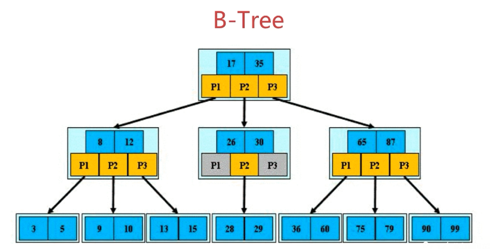
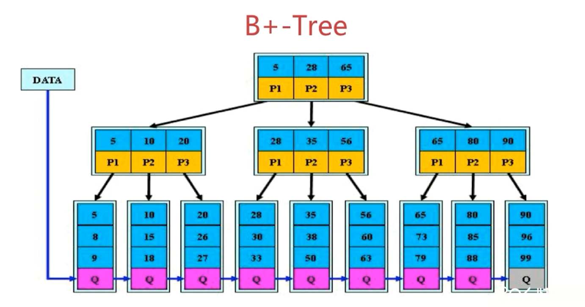

# B 树与 B+树

## B 树

[B 树](https://zh.wikipedia.org/wiki/B树)

1. 根结点至少包括两个孩子
2. 树中每个结点最多包含有 m 个孩子（m>=2）
3. 除了根结点和叶子结点外，其他每个结点至少有 ceil(m/2) 个结点
4. 所有叶子结点都位于同一层
5. 假设每个非叶子结点中包含有 n 个关键字信息，其中 `Ki(i=1...n)` 为关键字，且关键字按升序排序 `K(i-1) < Ki`；关键字的个数 n 必须满足 `[ceil(m / 2) - 1] <= n <= m - 1`；非叶子结点的指针 P[1], P[2], ..., P[M]，其中 P[1] 指向关键字小于 K[1] 的子树，P[M] 指向关键字大于 K[M - 1] 的子树，其他 P[i] 指向关键字范围在 K[i-1] 到 K[i] 之间的子树。

第 5 条类似二叉搜索树，不过变成了 M 叉

## B+树

[B+树](https://zh.wikipedia.org/wiki/B%2B树)

定义与 B 树基本相同，除了

1. 非叶子结点的子树指针与关键字个数相同
2. 非叶子结点的子树指针 P[i]，指向关键字 `[K[i], K[i+1])` 的子树（大于等于 K[i] 不是硬性要求）
3. 非叶子结点仅仅用来索引，数据都保存在叶子结点中
4. 所有叶子结点均有一个链表指针指向下一个叶子结点，且按照大小顺序链接（方便支持范围统计）

## 相关阅读

[B 树和 B+树的插入、删除图文详解](https://www.cnblogs.com/nullzx/p/8729425.html)
