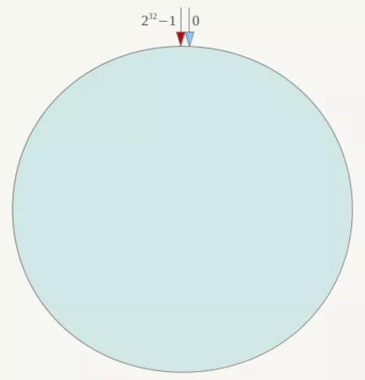
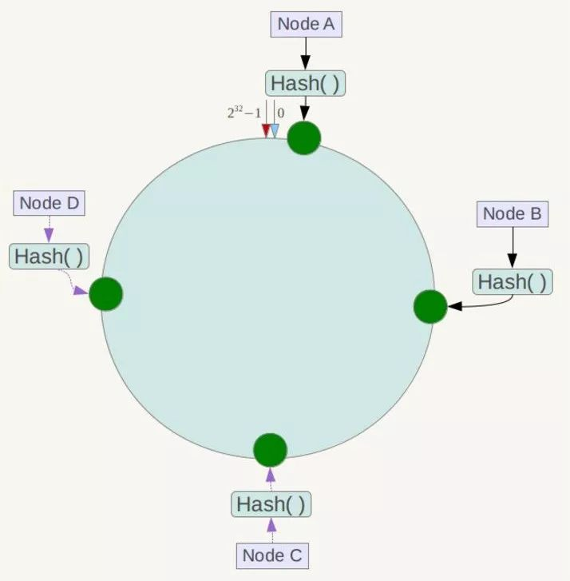
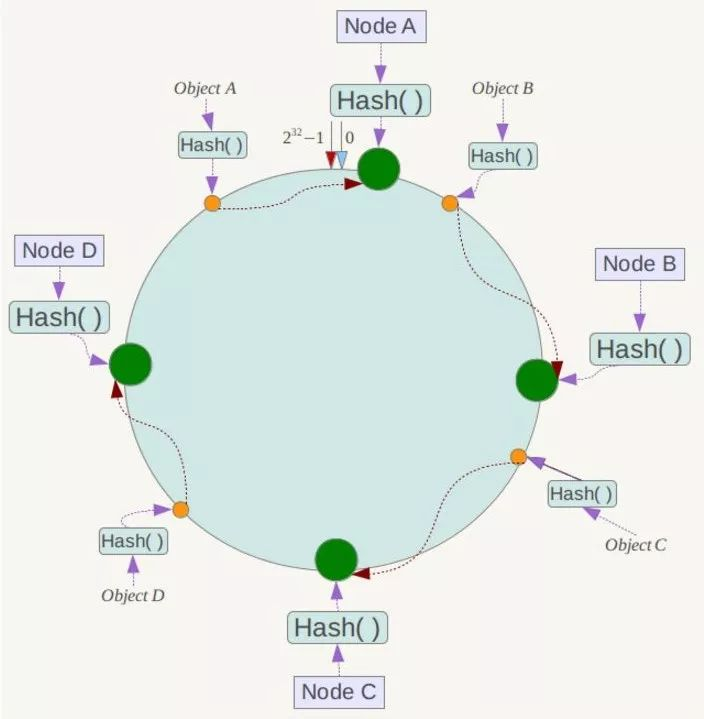
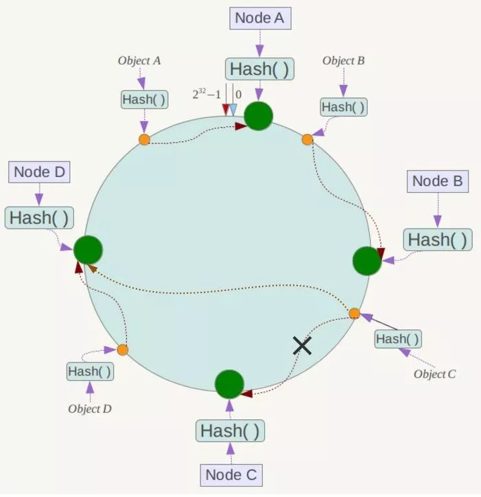
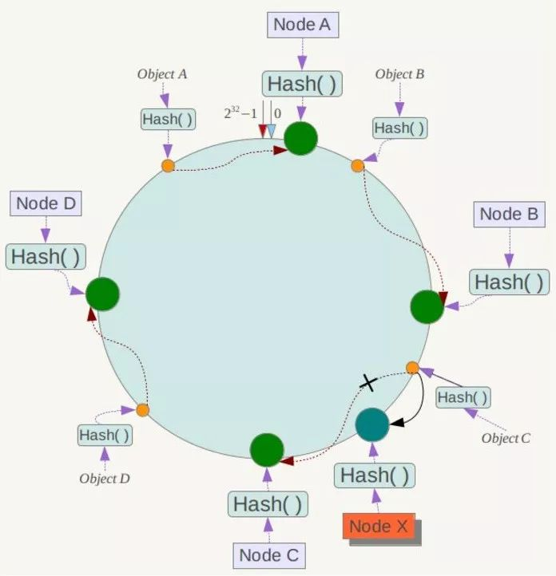
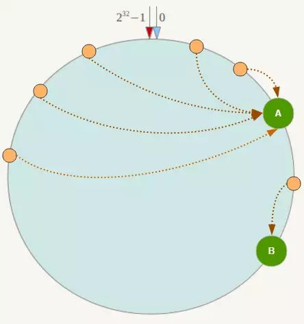
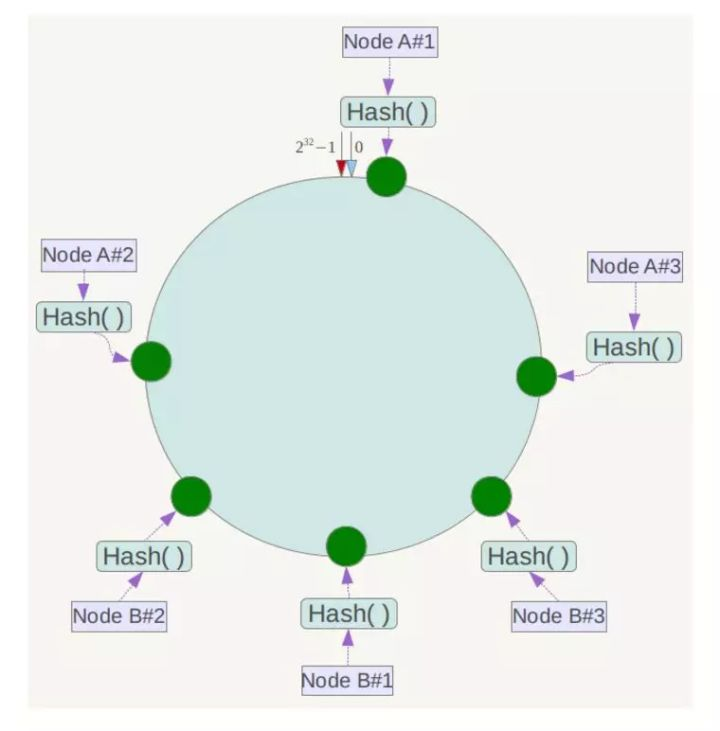

# 一致性哈希算法

[TOC]

## 为什么需要一致性哈希

首先假设有一个分布式存储系统，并且服务器通过计算哈希并取模的方式来决定数据应该存储在哪个节点上。

如果取模的方式是对节点数量进行取模，一旦节点需要扩容或者缩容，那么所有数据都需要重新映射，否则就会出现数据丢失、扩容前后映射到的节点不一致的情况。

如果取模是对一个固定值进行取模，那么不管如何扩容和缩容，取模后的值就不会变了。

## 原理

一致性哈希算法不是对结点数量取模，而是对一个固定的值（Redis 是 2^32）取模，将哈希值空间组织成虚拟的圆环。

将结点的某个属性进行哈希运算，映射到这个圆环上。

数据进行哈希运算，映射到圆环上，然后顺时针找到最近的一个存储节点，存储到该结点上。

假设 Node C 宕机，那么数据会映射到下一个最近的结点即 Node D 上。只有宕机结点到其逆时针最近的结点之间的数据会受到影响（映射到 Node B 和 Node C 之间的那些数据）会受到影响。

如果新增了一个结点 Node X，此时 Node A，Node B 和 Node D 仍然不会受到影响。只有新增结点到其逆时针最近的结点之间的数据会受影响（映射到 Node B 和 Node X 之间的那些数据）。

可以看出通过引入一致性哈希算法，不管增减结点都只需要对一小部分数据进行重新处理。提高了可用性和扩展性。

## 数据倾斜问题

当存储结点很少时，可能出现如上图所示，大量数据存储到 Node A 而少量存储到 Node B，导致倾斜。

解决方法是引入虚拟结点，对每个服务结点映射到多个位置，好比有了多个服务结点。最终存储时根据虚拟结点找到真实结点然后存储。实际中虚拟结点数量通常设置为 32 甚至更高。

