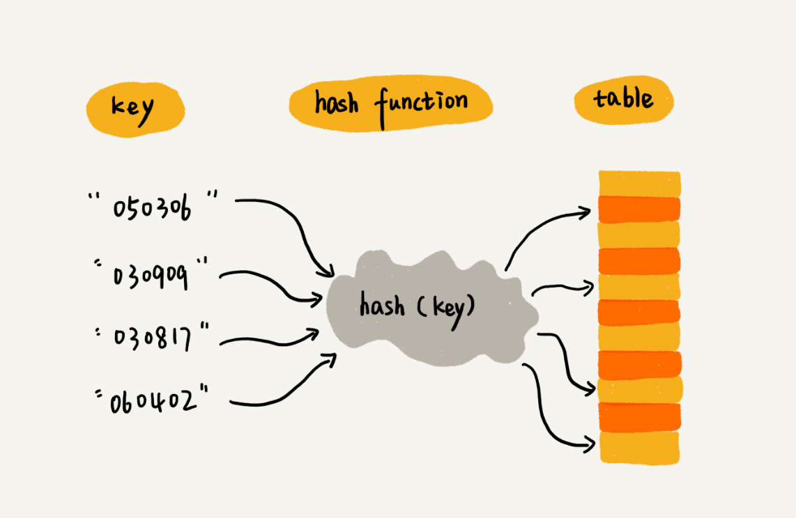
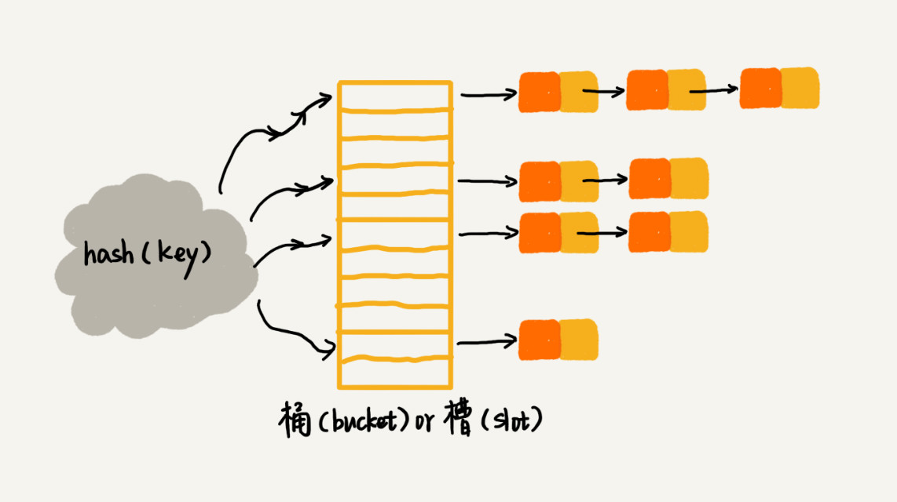
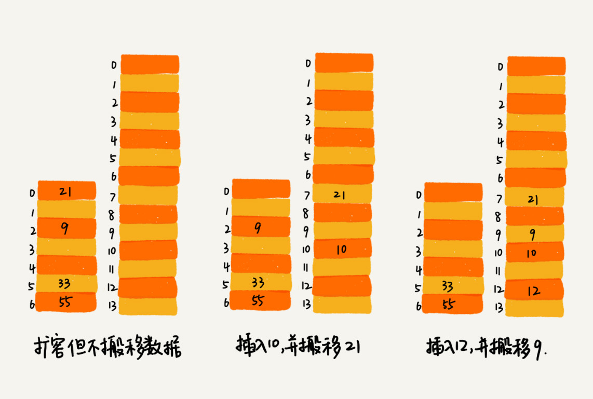
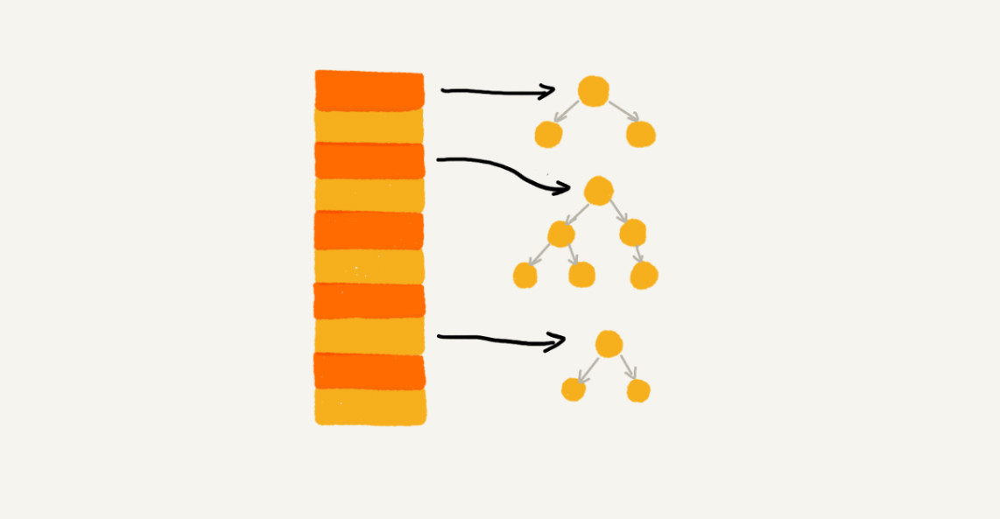

# 哈希表

## 基础知识

**哈希表（散列表）用的是数组支持按照下标随机访问数据的特性，所以散列表其实就是数组的一种扩展，由数组演化而来。可以说，如果没有数组，就没有散列表。**

通过 hash 函数把元素的 key 映射为下标，然后将数据存储在数组中对应下标的位置，或者从对应下标的位置取出。



哈希表中的关键就是哈希函数，哈希函数设计的基本要求：

1. 散列函数计算得到的散列值是一个非负整数。
2. 如果 `key1 == key2`，那 `hash(key1) == hash(key2)`。
3. 如果 `key1 != key2`，那 `hash(key1) != hash(key2)`。

**哈希冲突的问题是无法完全避免**的，因为数组的存储空间总是有限的。常用的哈希冲突解决办法有**开放寻址法**和**链表法**。

### 开放寻址法

开放寻址法的核心思想是，如果出现了冲突，就重新找一个空位，将其插入。比较简单的重新查找的方法是**线性探测**。如果发现冲突，就从当前位置依次往后找，直到找到空位。如果到数组末尾还没有空位，就从数组头开始找。

如果是查找元素，就先用哈希函数找到对应位置，比较两个元素是否相同，如果不同，就依次往后找，直到找到空位，就说明不存在。

删除时有点特殊，不能直接设置为空，否则查找就会出现问题，可以标记为 `deleted`。这样查找的时候如果碰到 `deleted` 还可以继续往后找。

我们用**装载因子（load factor）**来表示空位的多少。Java 中 HashMap 的默认装载因子是 0.75。

```
loadFactor = 哈希表中总的元素个数 size / 散列表数组的长度 capacity
```

### 拉链法

拉链法在解决哈希冲突中用的更多。即如果哈希值相同的，都被链到一个链表中。查找的时候，只要先根据哈希函数找到对应的链表，然后遍历链表就能找到。



## 如何设计一个工业级的哈希表

### 如何设计哈希函数

- 哈希函数不能太复杂，过于复杂的哈希函数，势必会消耗很多计算时间，也就间接的影响到哈希表的性能。
- 哈希函数生成的值要尽可能随机并且均匀分布。

### 装载因子过大怎么办

动态扩容，然后原哈希表中每个元素重新根据哈希函数计算出新的存储位置。另外随着元素的删除，还可以动态缩容。

### 如何避免低效扩容

使用**渐进式哈希**。

为了解决一次性扩容耗时过多的情况，我们可以将扩容操作穿插在插入操作的过程中，分批完成。当装载因子触达阈值之后，我们只申请新空间，但并不将旧的哈希表中的数据搬移到新的哈希表中。

当有新数据要插入时，我们将新数据插入新哈希表中，并且从旧的哈希表中拿出一个数据放入到新哈希表。



这期间的查询操作怎么来做呢？对于查询操作，为了兼容了新、旧哈希表中的数据，我们先从新哈希表中查找，如果没有找到，再去旧的哈希表中查找。

### 如何选择冲突解决方法

数据量小，装载因子小时，适合用开放寻址法，Java 的 ThreadLocalMap 用的就是开放寻址法。

基于链表的哈希冲突处理方法比较适合存储大对象、大数据量的哈希表，而且，比起开放寻址法，它更加灵活，支持更多的优化策略，比如用红黑树代替链表。Java 的 HashMap 就是用链表法，而且 JDK 1.8 之后如果链表太长（默认超过8）时，会转为红黑树。根据 JDK 1.8 中的文档描述，在哈希函数比较均匀的情况下，一个链表转化为红黑树的概率小于千分之一。


