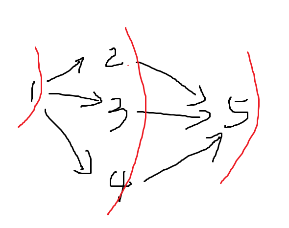

# 拼多多2020届学霸批笔试

## 1.严格递增序列

**题目描述**

有两个数组A和B，其中A是几乎严格递增的（几乎的意思是只要替换掉一个元素就是严格递增的）。问能否在数组B中找到一个数字，替换掉数组A中的那个元素，使得数组A严格递增。如果有多个这样的数字，就选择最大的。如果没有满足条件的数字，输出“NO”，否则按顺序输出数组A中的元素。

**用例**

第一行若干个数字表示数组A；第二行若干个数字表示数组B；输出严格递增的数组A，或者如果没有满足条件的，输出“NO”。

```
输入
3 6 7 4 10
5 1 2 8 9

输出
3 6 7 9 10
```

```
输入
51 2 60
21 3 25

输出
NO
```

**解答**

首先找到后一个元素比前一个元素小的位置index，这时有两种可能：

1. A[index+1]是要被替换的元素；
2. A[index]是要被替换的元素。

先找B中是否存在能替换A[index+1]的元素。这样是因为能替换A[index+1]的话，肯定是满足条件的最大的数字。如果找不到，再找能替换A[index]的元素，如果还没有就输出“NO”。

```java
import java.util.Arrays;
import java.util.Scanner;

public class Solution {
    public static int findMax(int[] arr, int low, int high) {
        int max = Integer.MIN_VALUE;
        for (int i = 0; i < arr.length; i++) {
            if (arr[i] > low && arr[i] < high) max = Math.max(max, arr[i]);
        }
        return max;
    }

    public static void main(String[] args) {
        Scanner sc = new Scanner(System.in);
        String[] line1 = sc.nextLine().split(" ");
        String[] line2 = sc.nextLine().split(" ");
        int[] arr1 = new int[line1.length];
        int[] arr2 = new int[line2.length];
        for (int i = 0; i < line1.length; i++) arr1[i] = Integer.parseInt(line1[i]);
        for (int i = 0; i < line2.length; i++) arr2[i] = Integer.parseInt(line2[i]);

        // 找到后一个元素比当前元素小的位置
        int idx = 0;
        while (idx < arr1.length - 1 && arr1[idx] < arr1[idx + 1]) idx++;

        // 看能否替换 arr1[idx+1]
        int low = arr1[idx];  // 满足条件的数字范围的下界
        int high = idx + 2 < arr1.length ? arr1[idx + 2] : Integer.MAX_VALUE;  // 满足条件的数字范围的上界
        int tmp = findMax(arr2, low, high);  // 寻找 arr2 中 (low, high) 范围内的最大数字
        if (tmp != Integer.MIN_VALUE) {
            arr1[idx + 1] = tmp;
            System.out.println(Arrays.toString(arr1));
            return;
        }

        // 如果上面不行，就看能否替换 arr1[idx]
        low = idx - 1 > -1 ? arr1[idx - 1] : Integer.MIN_VALUE;
        high = idx + 1 < arr1.length ? arr1[idx + 1] : Integer.MAX_VALUE;
        tmp = findMax(arr2, low, high);
        if (tmp != Integer.MIN_VALUE) {
            arr1[idx] = tmp;
            System.out.println(Arrays.toString(arr1));
            return;
        }

        // 不能找到满足的数字
        System.out.println("NO");
    }
}
```

## 2.字符串是否可以连成环

**题目描述**

假设有两个字符串A，B，如果A的最后一个字符与B的第一个字符相同，就说A和B可以连接起来。现在给一个字符串数组，问这个数组里面的字符串能否连成一个环。

**用例**

第一行若干个字符串，表示字符串数组。字符串中只有会大写字母。

```
输入
CAT TIGER RPC
输出
true
```

```
输入
CAT TIGER
输出
false
```

**解答**

深度优先搜索

```java
import java.util.Scanner;

public class Solution {
    private char lastChar = '#';  // 表示最后一个使用的字符串的结尾字符
    private int size = 0;  // 表示还有多少个字符串可以使用

    public boolean stringLoop(String[] strings) {
        size = strings.length;
        boolean[] flags = new boolean[size];  // true 表示已经字符串已经使用过了

        for (int i = 0; i < strings.length; i++) {
            String str = strings[i];
            // 使用这个字符串
            char tmp = lastChar;
            lastChar = str.charAt(str.length() - 1);
            flags[i] = true;
            size--;

            // 如果能构成一个链，且链尾部字符串的结尾字符与链头部字符串的头部字符相同，返回 true
            if (dfs(strings, flags) && str.charAt(0) == lastChar) return true;

            // 恢复没使用这个字符串的状态
            size++;
            flags[i] = false;
            lastChar = tmp;
        }

        return false;
    }

    public boolean dfs(String[] strings, boolean[] flags) {
        // 字符串都用完了，说明连成了一个链
        if (size == 0) return true;

        for (int i = 0; i < strings.length; i++) {
            if (flags[i]) continue;  // 如果这个字符串用过了，跳过
            String str = strings[i];
            char ch = str.charAt(0);
            if (ch != lastChar) continue;  // 如果这个字符串不是以 lastChar 这个字符开头的，说明连接不了，跳过

            // 使用这个字符串
            char tmp = lastChar;
            lastChar = str.charAt(str.length() - 1);
            flags[i] = true;
            size--;

            if (dfs(strings, flags)) return true;

            // 恢复没使用这个字符串的状态
            size++;
            flags[i] = false;
            lastChar = tmp;
        }
        return false;
    }

    public static void main(String[] args) {
        Scanner sc = new Scanner(System.in);
        String[] strings = sc.nextLine().split(" ");
        Solution solution = new Solution();
        System.out.println(solution.stringLoop(strings));
    }
}
```

## 3.任务排列题

**题目描述**

有若干个任务1到n，任务之间有依赖关系，比如任务2依赖任务1的话，就必须任务1完成后才能做任务2。给你这几个任务的分别的完成时间，求使得所有任务完成的平均时间最短的任务排列方案。

**用例**

第一行表示5个任务，6个依赖关系；第二行是5个任务的分别的完成时间；后面6行是依赖关系，右边依赖左边。

```
输入
5 6
1 2 1 1 1
1 2
1 3
1 4
2 5
3 5
4 5

输出
1 3 4 2 5
```

**解答**

依赖关系可以用一个有向无环图表示，然后使用一个优先队列来BFS就可以了。使用优先队列保证时间短的先做。



```java
import java.util.PriorityQueue;
import java.util.Scanner;

public class Solution {
    public static class Task {
        public int id;
        public int time;
        public Task next;

        public Task(int id, int time) {
            this.id = id;
            this.time = time;
        }
    }

    public static void main(String[] args) {
        Scanner sc = new Scanner(System.in);
        int n = sc.nextInt(), m = sc.nextInt();

        Task[] tasks = new Task[n + 1];
        for (int i = 1; i <= n; i++) tasks[i] = new Task(i, sc.nextInt());

        int[] inEdges = new int[n + 1];  // 入度数组
        // 构建图的邻接链表
        for (int i = 0; i < m; i++) {
            int a = sc.nextInt(), b = sc.nextInt();  // b 依赖 a
            inEdges[b]++;  // b 的入度加 1
            Task head = tasks[a];
            Task newTask = new Task(b, tasks[b].time);
            newTask.next = head.next;
            head.next = newTask;
        }

        PriorityQueue<Task> priorityQueue = new PriorityQueue<>((t1, t2) -> {
            if (t1.time == t2.time) return t1.id - t2.id;
            return t1.time - t2.time;
        });

        // 把入度为 0 的结点加入优先队列中，作为 bfs 的初始结点
        for (int i = 1; i <= n; i++) {
            if (inEdges[tasks[i].id] == 0) priorityQueue.add(tasks[i]);
        }

        while (!priorityQueue.isEmpty()) {
            Task task = priorityQueue.poll();
            System.out.print(task.id + " ");
            while ((task = task.next) != null) {
                // 某个结点入度为 0 时，添加到优先队列中
                if (--inEdges[task.id] == 0)
                    priorityQueue.add(tasks[task.id]);
            }
        }
    }
}
```

## 4.搭积木

**题目描述**

有N个积木，每个积木的长和宽都是相同的为 l[i]，高度为1，另外每个积木的质量是 w[i]。积木只能一个个竖着往上搭，且对于任何一个积木，它上面的积木的长宽都要小于它，每个积木能承受的重量是它自己重量的7倍。问最高能搭多高。

1 <= N <= 100
1 <= Li <= 1000
1 <= Wi <= 1000


**用例**

第一行为每个积木的长和宽。第二行为每个积木的质量。

```
输入
1 2 3 4 5 6 7 8 9 10
1 1 1 1 1 1 1 1 1 10

输出
9
```

**解答**

```java
```