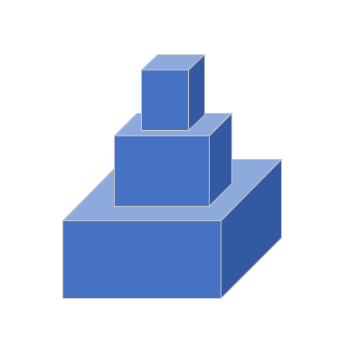

# 拼多多2020届学霸批笔试

## 1.严格递增序列

**题目描述**

有两个数组A和B，其中A是几乎严格递增的（几乎的意思是只要替换掉一个元素就是严格递增的）。问能否在数组B中找到一个数字，替换掉数组A中的那个元素，使得数组A严格递增。如果有多个这样的数字，就选择最大的。如果没有满足条件的数字，输出“NO”，否则按顺序输出数组A中的元素。

**用例**

第一行若干个数字表示数组A；第二行若干个数字表示数组B；输出严格递增的数组A，或者如果没有满足条件的，输出“NO”。

```
输入
3 6 7 4 10
5 1 2 8 9

输出
3 6 7 9 10
```

```
输入
51 2 60
21 3 25

输出
NO
```

**解答**

首先找到后一个元素比前一个元素小的位置index，这时有两种可能：

1. A[index+1]是要被替换的元素；
2. A[index]是要被替换的元素。

先找B中是否存在能替换A[index+1]的元素。这样是因为能替换A[index+1]的话，肯定是满足条件的最大的数字。如果找不到，再找能替换A[index]的元素，如果还没有就输出“NO”。

```java

```

## 2.字符串是否可以连成环

**题目描述**

假设有两个字符串A，B，如果A的最后一个字符与B的第一个字符相同，就说A和B可以连接起来。现在给一个字符串数组，问这个数组里面的字符串能否连成一个环。

**用例**

第一行若干个字符串，表示字符串数组。

```
输入
CAT TIGER RPC
输出
true
```

```
输入
CAT TIGER
输出
false
```

**解答**

深度优先搜索

```java

```

## 3.任务排列题

**题目描述**

有若干个任务1到n，任务之间有依赖关系，比如任务2依赖任务1的话，就必须任务1完成后才能做任务2。给你这几个任务的分别的完成时间，求使得所有任务完成的平均时间最短的任务排列方案。

**用例**

第一行表示5个任务，6个依赖关系；第二行是5个任务的分别的完成时间；后面6行是依赖关系，右边依赖左边。

```
输入
5 6
1 2 1 1 1
1 2
1 3
1 4
2 5
3 5
4 5

输出
1 3 4 2 5
```

**解答**

依赖关系可以用一个有向无环图表示，然后使用一个优先队列来BFS就可以了。使用优先队列保证时间短的先做。


```java
import java.util.PriorityQueue;
import java.util.Scanner;

public class Solution {
    public static class Task {
        public int id;
        public int time;
        public Task next;

        public Task(int id, int time) {
            this.id = id;
            this.time = time;
        }
    }

    public static void main(String[] args) {
        Scanner sc = new Scanner(System.in);
        int n = sc.nextInt(), m = sc.nextInt();

        Task[] tasks = new Task[n + 1];
        for (int i = 1; i <= n; i++) tasks[i] = new Task(i, sc.nextInt());

        int[] inEdges = new int[n + 1];  // 入度数组
        // 构建图的邻接链表
        for (int i = 0; i < m; i++) {
            int a = sc.nextInt(), b = sc.nextInt();  // b 依赖 a
            inEdges[b]++;  // b 的入度加 1
            Task head = tasks[a];
            Task newTask = new Task(b, tasks[b].time);
            newTask.next = head.next;
            head.next = newTask;
        }

        PriorityQueue<Task> priorityQueue = new PriorityQueue<>((t1, t2) -> {
            if (t1.time == t2.time) return t1.id - t2.id;
            return t1.time - t2.time;
        });

        // 把入度为 0 的结点加入优先队列中，作为 bfs 的初始结点
        for (int i = 1; i <= n; i++) {
            if (inEdges[tasks[i].id] == 0) priorityQueue.add(tasks[i]);
        }

        while (!priorityQueue.isEmpty()) {
            Task task = priorityQueue.poll();
            System.out.print(task.id + " ");
            while ((task = task.next) != null) {
                // 某个结点入度为 0 时，添加到优先队列中
                if (--inEdges[task.id] == 0)
                    priorityQueue.add(tasks[task.id]);
            }
        }
    }
}
```

## 4.搭积木

**题目描述**

有N个积木，每个积木的长和宽都是相同的为 l[i]，高度为1，另外每个积木的质量是 w[i]。积木只能一个个竖着往上搭，且对于任何一个积木，它上面的积木的长宽都要小于它，每个积木能承受的重量是它自己重量的7倍。问最高能搭多高。



**用例**

第一行为每个积木的长和宽。第二行为每个积木的质量。

```
输入
1 2 3 4 5 6 7 8 9 10
1 1 1 1 1 1 1 1 1 10

输出
9
```

**解答**

```java
```