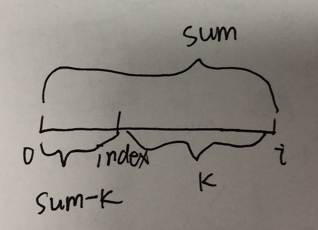

# 求最长连续子数组问题

**题目描述**

给定一个整数数组 num[] 和一个值 key，求满足和为 key 最长的子数组的长度（子数组是数组中连续的数字组成的）。

**解答**

方法一：暴力法

```java
public static int maxLength(int[] arr, int k) {
    if (arr.length == 0) return 0;
    int max = 0;

    for (int i = 0; i < arr.length; i++) {
        int sum = arr[i];
        int tmp = 0;
        for (int j = i + 1; j < arr.length; j++) {
            sum += arr[j];
            if (sum == k) tmp = j - i + 1;
        }
        max = Math.max(max, tmp);
    }

    return max;
}
```

方法二：从前往后累加，并用一个 map 存储到这个位置的 sum 到它的下标的映射（如果 map 中有键为 sum 的就不添加）。



```java
public static int maxLength(int[] arr, int k) {
	if (arr == null || arr.length == 0) return 0;

	Map<Integer, Integer> map = new HashMap<Integer, Integer>();
	map.put(0, -1); // important
	int len = 0;
	int sum = 0;
	for (int i = 0; i < arr.length; i++) {
		sum += arr[i];
		// 如果 map 中有键为 sum-k 的元素，其下标为 index，那就说明 index 到 i 这个范围内的数的和为 k，见上图
		// 动态更新最大长度 len，即如果 i-index 大于 len，就更新len
		if (map.containsKey(sum - k)) {
			len = Math.max(i - map.get(sum - k), len);
		}

        // 如果没有键为 sum 的元素就添加
		if (!map.containsKey(sum)) {
			map.put(sum, i);
		}
	}
	return len;
}
```
