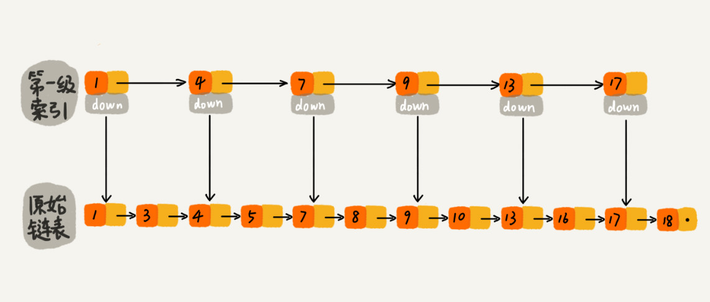
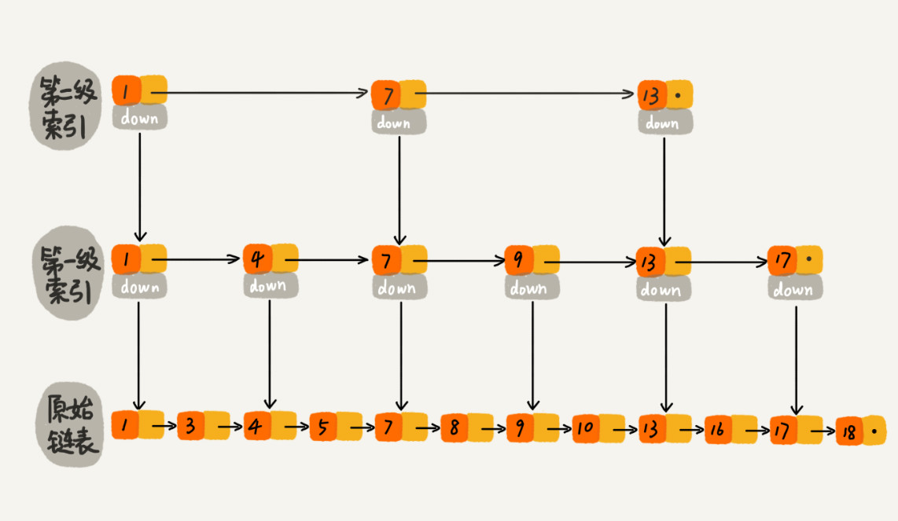
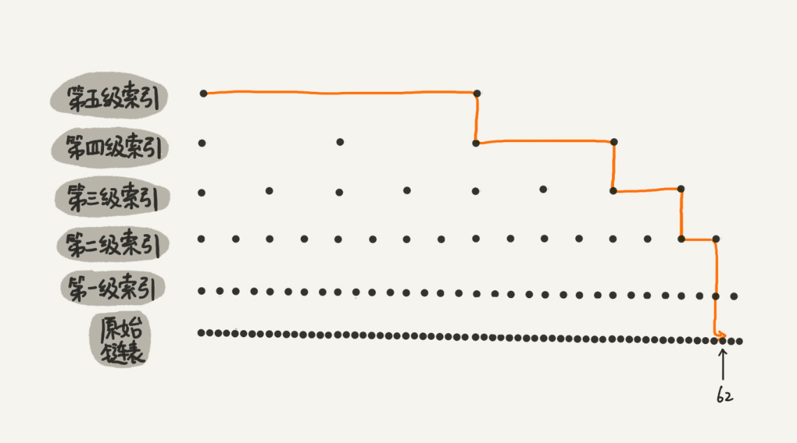
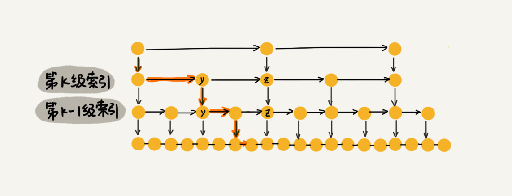
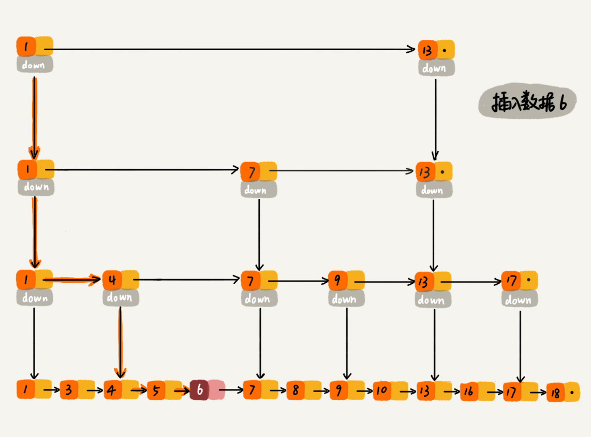
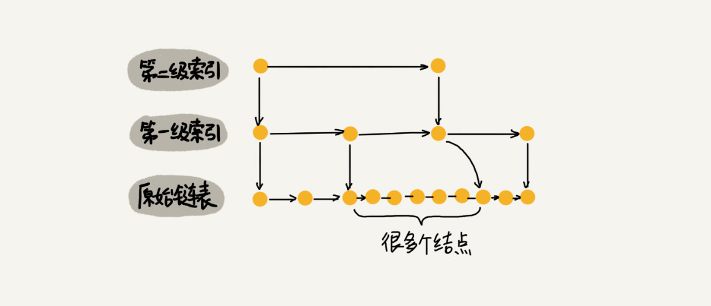
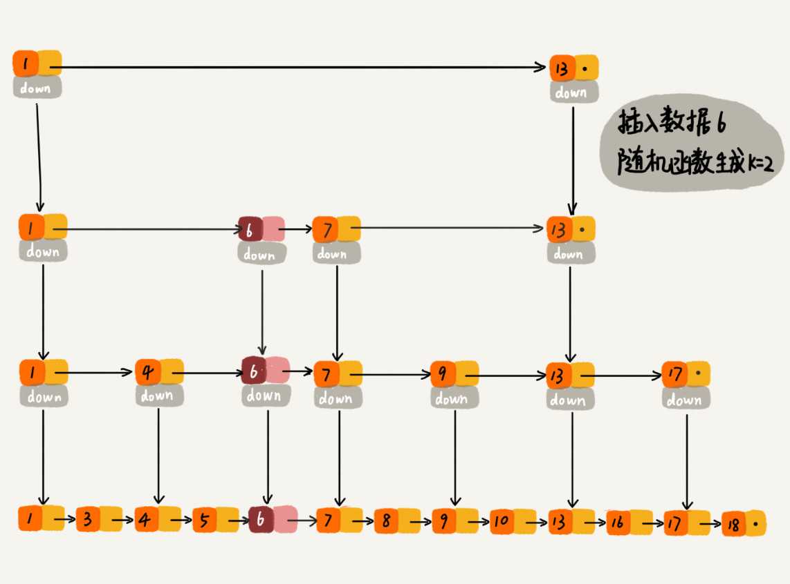

# 跳表

[TOC]

**跳表就是在一个链表的基础上增加了多级的索引，以减小查找的范围**。每一级索引都是在下一级的基础上隔若干个结点建立一个本级的索引结点。通过使用跳表，链表也能实现类似“二分查找”的功能。

原来没有索引的时候，查找 62 需要遍历 62 个结点，现在只需要遍历 11 个结点。

在跳表中查询一个数据的时间复杂度是 `O(MlogN)`，其中 M 是每一层最多需要遍历的结点个数，N 是原始链表的结点个数。logN 也就是索引层数+1。**如果两个结点抽取一个索引，可以推论出 m=3**，如下图中所示，假设我们要找 x，在 k 层索引中，发现 y < x < z，那么在 k-1 层中，加上 y 对应的结点和 z 对应的结点一共也只有 3 个结点。

根据等比数列求和，可以得到跳表的空间复杂度为 `O(N)`，当然如果抽取索引的间隔越远，这个复杂度前的常数项就越小，但是相应查找的时间复杂度中常数就越大。

## 跳表的插入和删除

由于插入和删除都要先找到对应位置，而查找的时间复杂度是 `O(logN)`，因此插入和删除的时间复杂度是 `O(logN)`。

删除除了要删除原链表中的结点，还要删除索引中的结点。而且单链表中还要获取前驱结点。

## 跳表索引动态更新

如果一直往跳表中插入数据而不更新索引，就可能出现两个索引间数据非常多的情况，极端情况下会退化成单链表，因此需要更新索引。

为了动态更新索引，在我们插入数据的时候，可以选择同时将这个数据插入部分索引层中，至于如何选择插入到那一层，可以根据一个随机函数确定。

比如随机函数生成了值 K，那我们就将这个结点添加到第一级到第 K 级这 K 个级别的索引中。

[Redis源码学习之跳表](https://cloud.tencent.com/developer/article/1353762)

[跳表实现](https://github.com/wangzheng0822/algo/blob/master/java/17_skiplist/SkipList.java)
