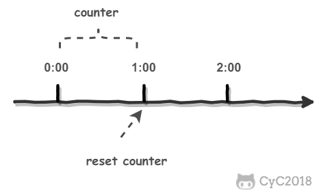
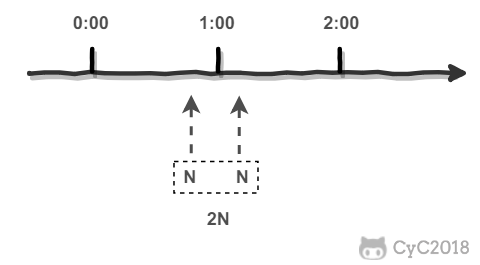
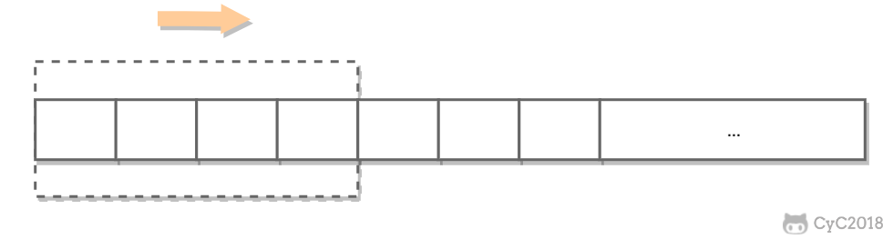
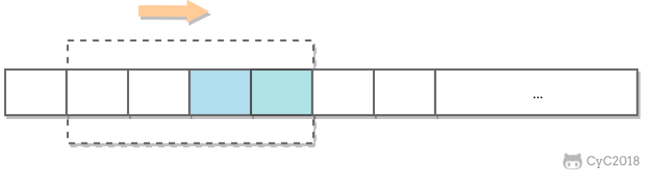
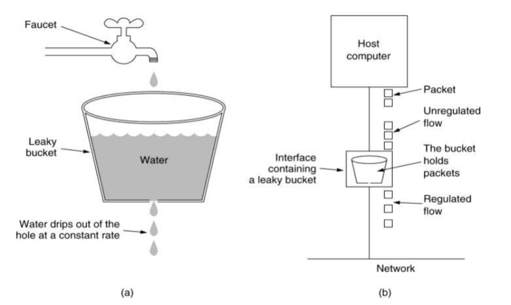
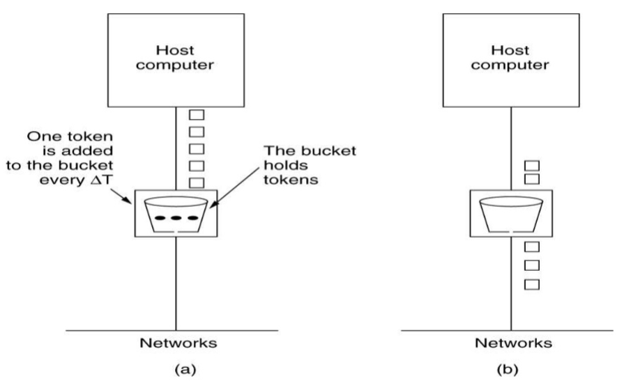

# 限流算法

[TOC]

## 为什么要限流

如果一段时间内请求的数量过大，就会给服务器造成很大压力，可能导致服务器无法提供其它服务。

## 计数器算法

计数器算法思想很简单，就是在一个时间段内对请求数进行计数，如果计数值达到一个阈值，就抛弃后面的请求，等到下一个时间段开始时，重置计数器。

但是这种方法不能处理两个时间段之间突发流量的问题。比如阈值是 N，在时间段 1 的最后来了 N 个请求，没有超过阈值，然后在时间段 2 的开始来了 N 个请求，也没有超过阈值，但是在这个很短的时间内，请求数达到了 2N，流量太大，可能导致处理不过来。

## 滑动窗口算法

滑动窗口算法是计数器算法的一种改进。它将原来的时间窗口划分为若干个小的时间窗口，并且向后滑动。

由于窗口会滑动，当滑动到包括两个时间段的临界位置在内时，就能控制这个窗口的流量大小。因此可以解决计数器临界位置的情况。

## 漏桶算法

漏桶是一种以恒定速率处理请求的容器。请求到来时，会先进入到缓存中，如果缓存满了，请求会被丢弃。漏桶以恒定速率“漏”出缓存里的请求，这样不管请求频率如何，处理的频率都是恒定的。

漏桶算法虽然能保证请求处理速率稳定，但是可能出现处理者闲置的情况，也就是处理者还能进行处理，但是漏桶并把请求给处理者。

## 令牌桶算法

令牌桶算法是有一个令牌发生器，以固定速率向桶中发令牌，如果桶是满的就抛弃。当一个请求到来时，处理者要先去桶中拿一个令牌，如果拿到了，就处理请求，如果拿不到，就抛弃请求。

令牌桶算法和漏桶算法的区别在于，漏桶算法桶中存放的是请求，并以固定速率“漏”出请求；令牌桶算法中桶中存放的是令牌，并以固定速率往桶中加令牌。
