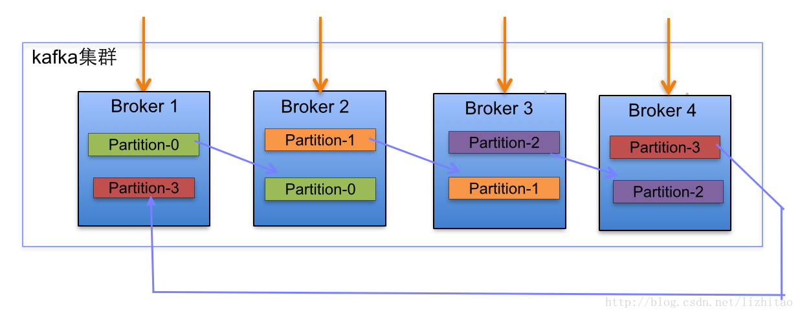
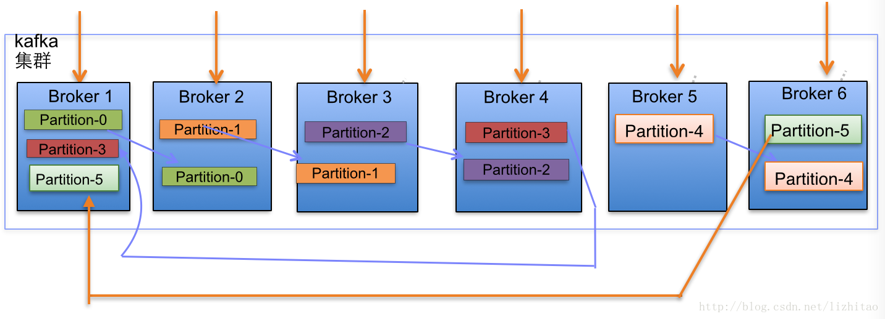

# Kafka

[TOC]

## 消息模型

Kafka 也是使用的标准的发布-订阅模型。与 [RocketMQ](RocketMQ.md) 类似。唯一的区别是 Kafka 中队列不叫队列，而叫做分片（Partition），含义和功能是一样的。

**Kafka 能否保证消息的顺序消费？**

根据 Kafka 的消息模型，同一个主题下的每一条消息会发送到不同分片上，不同分片之间是并行消费的，因此一个主题是不能保证消费顺序的，但是每个分片之内是可以保证消费顺序的。

### 持久性

Kafka 使用文件存储消息，这就直接决定 Kafka 在性能上严重依赖文件系统的本身特性。且无论任何操作系统下，对文件系统本身的优化几乎没有可能。文件缓存/直接内存映射等是常用的手段。因为 Kafka 是对日志文件进行 append 操作，因此磁盘检索的开支是较小的。同时为了减少磁盘写入的次数，broker 会将消息暂时缓存起来，当消息的个数（或尺寸）达到一定阀值时，再写入到磁盘，这样减少了磁盘 IO 调用的次数。

### 性能

需要考虑的影响性能点很多，除磁盘 IO 之外，我们还需要考虑网络 IO，这直接关系到 Kafka 的吞吐量问题。

Kafka 并没有提供太多高超的技巧，对于生产者，可以将消息缓存起来，当消息的条数达到一定阀值时，批量发送给 broker；对于消费者也是一样，批量 fetch 多条消息。不过消息量的大小可以通过配置文件来指定。对于 Kafka broker 端，似乎有个 sendfile 系统调用可以潜在的提升网络 IO 的性能：将文件的数据映射到系统内存中，socket直接读取相应的内存区域即可，而无需进程再次copy和交换。

其实对于 producer/consumer/broker 三者而言，CPU 的开支应该都不大，因此启用消息压缩机制是一个良好的策略。压缩需要消耗少量的 CPU 资源，不过对于 Kafka 而言，网络 IO 更应该需要考虑。可以将任何在网络上传输的消息都经过压缩。Kafka支持 gzip/snappy 等多种压缩方式。

### 生产

Kafka 中消息被发送到哪个分片由生产者自己来决定。生产者可以使用随机、哈希、轮询等方式来决定把消息发送到哪个分片。生产者将会和主题下所有 partition leader 保持 socket 连接。消息由生产者直接通过 socket 发送到 broker，中间不会经过任何“路由层”。其中 partition leader 的位置（host:port）注册在 zookeeper 中，生产者作为 zookeeper 客户端，已经注册了 watch 用来监听 partition leader 的变更事件。

Kafka 支持异步发送，将多条消息暂且在客户端缓存起来，并将他们批量的发送到 broker，小数据 IO 太多，会拖慢整体的网络延迟，批量延迟发送事实上提升了网络效率。不过这也有一定的隐患，比如说当生产者失效时，那些尚未发送的消息将会丢失。

### 消费

消费者向 broker 发送 fetch 请求，并告知其获取消息的偏移量 offset。此后消费者将会获得一定条数的消息。消费者也可以重置 offset 来重新消费消息。

Kafka 采用 pull 模式来消费消息，这样的好处是消费者可以根据自己的消费能力来消费消息数据，并且可以自己控制消费的 offset。

Kafka 由消费者自己来控制 offset，消费者可以在本地保存最后消费的 offset，并定期向 zookeeper 注册 offset。

## 底层存储

每个分片在文件系统中是一个目录，每个分片由几个部分组成。

### 1. segment 分段

比如 test0-0 目录，保存了 partition0 的日志，这里面的日志文件也不只是一个，而是被切断成了多个段，每段叫做一个 segment，每个 segment 其实包含了两个文件，一个 log 文件，记录消息，另一个是 index 文件，这是 log 文件的索引文件，这两个文件总是成对出现的。这种分段的方式便于消费者快速的查询到想要定位的消息。

### 2. offset 偏移量

Kafka 用 offset 来区别每条不同的消息，offset 是有序的数字，相当于消息的 id，长度 20 位，不够 20 位的补 0。比如第一条消息的 offset 就是 00000000000000000001。

### 3. 日志文件

每个 segment 的 log 文件和 index 文件，都以上一个 segment 最后一条消息的 offset 来命名。也就是说，该 partition 的第一段，log 文件和 index 文件的名字分别是 `00000000000000000000.log` 和 `00000000000000000000.index`，log 文件里的第一条日志的 offset 就会是 00000000000000000001。假设第一段里面存了 1000 条消息然后分段了（分段的方式是可以配置的），那么第二段的文件名就是 `00000000000000001000.log` 和 `00000000000000001000.index`，log 文件里的第一条消息的 offset 将是 00000000000000001001。

### 4. log 文件的存储格式

log 文件定义了严格的存储格式，以便快速查询消息。

每条消息的内容由以下部分组成：

|         关键字         |                                   解释                                    |
| :-------------------: | :-----------------------------------------------------------------------: |
|     8 byte offset     | 这是该条消息在 partition 中的绝对 offset。能表示这是 partition 的第多少条消息 |
|    4 byte message     |                               message 大小                                |
|     4 byte CRC32      |                           用 CRC32 校验 message                           |
|    1 byte "magic"     |                    表示本次发布 Kafka 服务程序协议版本号                    |
|  1 byte "attributes"  |                  表示为独立版本、或标识压缩类型、或编码类型                  |
|   4 byte key length   |            表示 key 的长度，当 key 为 -1 时，K byte key 字段不填            |
|      K byte key       |                                   可选                                    |
| 4 byte payload length |                              实际消息数据长度                              |
|  value bytes payload  |                                实际消息数据                                |

### 5. index 文件的存储方式

index 文件是二进制存储的，里面的每条索引都记录了消息的相对 offset 和在文件中的物理位置。这里的相对 offset 和 log 文件里的绝对 offset 不同，相对 offset 是每个 segment 都从 1 开始的，而绝对 offset 在整个 partition 中都是唯一的。

假设第一个 segment 记录了 1000 条消息，第二段 segment 记录了 1234 条消息，那么第二段 segment 的 log 文件里大概是这样的（后面的数字是消息在 partition 绝对 offset，实际上 log 文件有自己的存储格式）：

```
Message1001
Message1002
Message1003
Message1004
Message1005
Message1006
....
Message2234
```

那么index文件里的内容可能是这样的：

```
1,0  // 代表 segment 的第一条消息，也就是 Message1001，在 segment 最开头的位置
3,22  // 代表 segment 的第三条消息，也就是 Message1003，从第 22 个偏移量开始
6,45
10,77
...
1230,8765  // 代表 segment 的第 1230 条消息，也就是 Message2230，从第 8765 个偏移量开始
```

每行的第一个数代表某条消息在此 segment 的相对 offset，第二个数代表这条消息在 log 文件中的文件指针偏移量（单位还没搞明白，好像是byte）。

可以看到，index文件没有记录每一条消息的偏移量，而是采用**稀疏索引**的方式，隔几条记录一次，这样使得索引文件的变的比较小，但是在查询时要付出一点的性能损失。

只要消费者从 index 文件定位了消息的位置，就能快速的从 log 文件里找到这条消息。

### 6. 分段的策略

segment 分段有两种方式，按大小和按文件生成时间。

- 按大小：server.properties 中的 `log.segment.bytes` 定义了每段的 log 文件的大小上限，如果超出该上限则后面的消息会创建新文件来存储。该配置项默认值是 `1014*1024*1024`。该配置可以在创建 topic 时额外指定，不使用配置文件的配置项。
- 按生成时间：server.properties 中的 `log.roll.hours` 定义了按创建时间分组的方式。如果一个 log 文件创建时间达到了该配置中的小时数，即使文件大小没有达到 `log.segment.bytes`，后面的消息也会创建新文件。该配置可以在创建 topic 时额外指定，不使用配置文件的配置项。

## Kafka 如何做到每秒发布百万条消息

[Kafka 如何做到每秒发布百万条消息](https://blog.csdn.net/antony9118/article/details/71699651)

## 消息传输担保机制

Kafka 有三种消息传输担保机制，默认保证消息收发层面上

- **at-most-once**：发送一次，无论成败，将不会重发。
- **at-least-once**：消息至少发送一次，如果消息未能接受成功，可能会重发，直到接收成功。这个通常是首选，相比于 at-most-once 而言，重复接收数据总比丢失数据要好。
- **exactly-once**：消息只会发送一次。这种方式 Kafka 并没有严格实现。

## 复制

Kafka 将每个分片数据复制到多个服务器上，任何一个分片有一个 leader 和多个 follower （可以没有）。备份的个数可以通过 broker 配置文件来设定。leader 处理所有的读写请求，follower 需要和 leader 保持同步。follower 和消费者一样，消费消息并保存在本地日志中。leader 负责跟踪所有的 follower 状态，如果 follower 落后太多或者失效，leader 将会把它从 replicas 同步列表中删除。

当所有的 follower 都将一条消息保存成功，此消息才被认为是 committed，那么此时消费者才能消费它。即使只有一个 replicas 实例存活，仍然可以保证消息的正常发送和接收，只要 zookeeper 集群存活即可。（不同于其他分布式存储，比如 hbase 需要多数存活才行）

当 leader 失效时，需在 followers 中选取出新的 leader，可能此时 follower 落后于 leader，因此需要选择一个 **up-to-date** 的 follower。选择 follower 时需要兼顾一个问题，就是新 leader 上所已经承载的 partition leader 的个数，如果一个服务器上有过多的 partition leader，意味着此服务器将承受着更多的 IO 压力。在选举新 leader 时，需要考虑到**负载均衡**。

## 集群 partitions/replicas 默认分配

以一个 Kafka 集群中 4 个 broker 举例，创建 1 个 topic 包含 4 个 partition，2 个 replication。数据流动如图所示



当集群中新增 2 节点，partition 增加到 6 个时分布情况如下



### 副本分配逻辑规则

- 在 Kafka 集群中，每个 broker 都有均等分配 partition 的 leader 机会。
- 上述图 broker 的 partition 中，箭头指向为副本，以 partition-0 为例：broker1 中 parition-0 为 leader，broker2 中 partition-0 为副本。
- 上述图中每个 broker（按照 brokerId 有序）依次分配主 partition，下一个 broker 为副本，如此循环迭代分配，多副本都遵循此规则。

### 副本分配算法

- 将所有 n 个 broker 和待分配的 m 个 partition 排序。
- 将第 i 个 partition 分配到第 `i mod n` 个 broker 上。
- 将第 i 个 partition 的第 j 个副本分配到第 `(i + j) mod n` 个 broker 上。