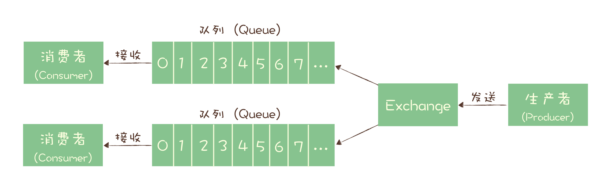

# RabbitMQ

## 消息模型

RabbitMQ 采用多个队列加 Exchange 的方式，生产者将消息发给 Exchange，Exchange 根据配置分发给相应的队列。

同一个消息如果要被多个消费者消费，需要配置 Exchange 将消息发到多个队列中，每个队列都存放一份完整的消息数据，每个队列可以为一个消费者提供消费服务，变相实现了发布-订阅的功能。具体配置参考[官方发布-订阅配置文档](https://www.rabbitmq.com/tutorials/tutorial-three-python.html)。