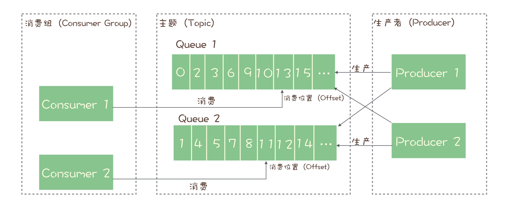

# RocketMQ

要点

- 消息模型

## 消息模型

RocketMQ 使用的是标准的发布-订阅模型。

在 RocketMQ 中也有队列这个概念，RocketMQ 中每个主题有多个队列，通过多个队列来实现多个实例的并行生产和消费。需要注意的是，RocketMQ 只能在队列上保证消息的有序性，主题层面无法保证消息的严格顺序。

RocketMQ 中，订阅者的概念是通过消费者组（Consumer Group）来体现的。每个消费者组都消费主题中的一份完整的消息，不同消费者组之间的消费进度互不影响。同一个消费者组中的消费者是竞争关系，每个消费者消费一部分消息，如果一条消息被 Consumer1 消费了，就不会被其他消费者消费。

主题消费过程中，由于消息需要被不同的组多次消费，所以消费完的消息并不会立即被删除，这就需要 RocketMQ 为每个消费者组在每个队列上维护一个消费位置（Consumer Offset），这个位置之前的消息都被消费过，后面的都没被消费。每成功消费一条消息，就让这个值加1。这个消费位置是非常重要的概念，使用消息队列的时候，丢消息的原因大多是由于消费位置处理不当导致的。
