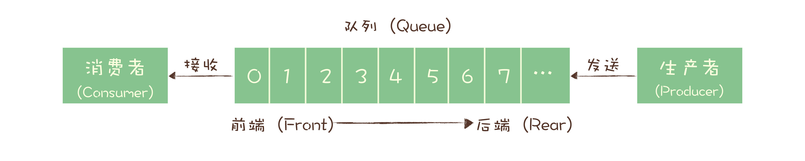
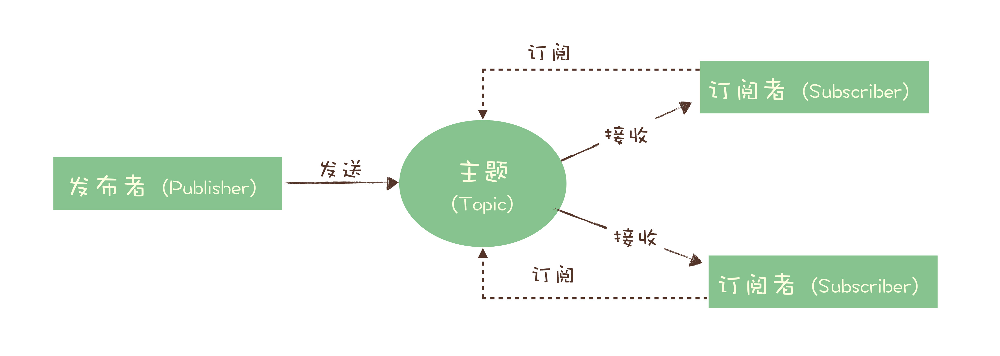

# 消息队列

[TOC]

## 消息队列的应用场景

**异步处理**

比如说一个秒杀系统有如下几个步骤

1. 风险控制
2. 库存锁定
3. 生成订单
4. 短信通知
5. 更新统计数据

但决定是否秒杀成功的只有前两个步骤，只要这两个步骤完成就可以给用户返回结果了，后面的步骤都可以异步执行。

- 可以更快地返回结果。
- 减少等待，自然实现了步骤之间的并发，提升系统总体性能。

---

**流量控制**

还是以秒杀系统为例，如果短时间内出现大量请求，系统仍然扛不住，这个时候我们就可以用消息队列来隔离网关和服务，以达到流量控制和保护后端服务。请求会暂存在消息队列中，后端服务会尽最大可能来消费，并且后端服务可以水平扩展。

但是这样也是有代价的：

- 增加了系统调用链环节，导致总体响应时间变长。
- 上下游系统都要将同步改为异步，增加了系统复杂度。

还有一种更简单的方法，如果能预估秒杀服务的处理能力，可以使用消息队列实现令牌桶。

牌桶控制流量的原理是：单位时间内只发放固定数量的令牌到令牌桶中，规定服务在处理请求之前必须先从令牌桶中拿出一个令牌，如果令牌桶中没有令牌，则拒绝请求。这样就保证了单位时间内能处理的请求不超过令牌的数量，起到了控制流量的作用。

实现的方式也很简单，不需要破坏原有的调用链，只要网关在处理 APP 请求时增加一个获取令牌的逻辑。

令牌桶可以简单地用一个有固定容量的消息队列加一个“令牌发生器”来实现：令牌发生器按照预估的处理能力，匀速生产令牌并放入令牌队列（如果队列满了则丢弃令牌），网关在收到请求时去令牌队列消费一个令牌，获取到令牌则继续调用后端秒杀服务，如果获取不到令牌则直接返回秒杀失败。

---

**服务解耦**

以电商平台为例，当创建一个订单时：

1. 支付系统需要发起支付流程；
2. 风控系统需要审核订单的合法性；
3. 客服系统需要给用户发短信告知用户；
4. 经营分析系统需要更新统计数据；
5. ...

这些订单下游的系统都需要实时获得订单数据。随着业务不断发展，这些订单下游系统不断的增加，不断变化，并且每个系统可能只需要订单数据的一个子集，负责订单服务的开发团队不得不花费很大的精力，应对不断增加变化的下游系统，不停地修改调试订单系统与这些下游系统的接口。任何一个下游系统接口变更，都需要订单模块重新进行一次上线，对于一个电商的核心服务来说，这几乎是不可接受的。

所有的电商都选择用消息队列来解决类似的系统耦合过于紧密的问题。引入消息队列后，订单服务在订单变化时发送一条消息到消息队列的一个主题 Order 中，所有下游系统都订阅主题 Order，这样每个下游系统都可以获得一份实时完整的订单数据。

无论增加、减少下游系统或是下游系统需求如何变化，订单服务都无需做任何更改，实现了订单服务与下游服务的解耦。

---

**发布订阅**

---

**连接流计算任务和数据**

---

**消息广播给大量接收者**

## 主题和队列有什么区别

### 两种模型

消息队列基本上有两种模型，队列模型和发布-订阅模型，**他们最大的区别就是一份消息能不能被消费多次**。这里讲的两种模型及其他概念都是业务层模型，不是底层实现，比如 Kafka 和 RocketMQ 都是发布订阅模型，但底层实现是不一样的。

#### 队列模型

严格符合队列的定义，即 FIFO。队列模型中，每个消息只能被消费一次，如果要多个消费者都能消费，就需要多个队列，消息要复制多份。

#### 发布-订阅模型

消息的发送方称为发布者，接收方称为订阅者，服务端存放消息的容器称为主题。发布者把消息发送到主题中，订阅者在接收消息前需要订阅主题。“订阅”既是一个动作，还可以认为是主题在消费时的一个逻辑副本，每份订阅中，订阅者都可以接收到主题的所有消息。

当订阅者只有一个时，发布-订阅模型就和队列模型基本一样了。

现代的消息队列产品大多是发布-订阅模型，如 [Kafka](Kafka.md) 和 [RocketMQ](RocketMQ.md)，但也有例外，典型的如 [RabbitMQ](RabbitMQ.md)。

## 消息丢失问题

### 如何检测消息丢失

利用一个队列中消息是有序的这个特点。对发送到一个队列中的消息进行编号，编号是连续的。然后消费端接收一个队列的消息时进行检查，看消息序号是否连续，如果不连续说明丢失了。

### 如何防止消息丢失

**生产阶段**

使用确认机制。生产者每次发送一个消息都要收到一个确认消息或者错误消息，如果是错误消息，就要进行处理，比如进行重试等。可以采用同步阻塞的方式或者异步回调的方式。

---

**存储阶段**

配置 Broker 参数。

- 配置消息存储在磁盘后再给生产者一个确认。这样即使 Broker 宕机，由于消息已经写入磁盘，还可以恢复。
- 如果是多个 Broker，可以配置消息至少发送到了 2 个以上 Broker 再给生产者一个确认。这样如果某个 Broker 宕机，其他 Broker 还可以替代上来。

---

**消费阶段**

同样使用确认机制。当消费者**拉取消息并处理成功后**才给 Broker 发送一个确认。这样如果消费者宕机，由于没有发送确认，消息还能被再次消费。

## 重复消费问题

### 什么情况下会出现重复消费的问题

采用确认机制的方法中，如果消息消费发送成功或者消费成功，但是返回的确认消息在网络传输时丢失，那么就会重试，会产生消息重复消费的问题。这时如果消费者的处理逻辑不是幂等的，就会导致结果与预期不符。消息重复消费的问题是必然存在的，消息队列无法彻底解决，需要消费者进行处理。

### 如何解决重复消费的问题

主要是保证消费者的操作是幂等的。实现幂等性有如下方法：

**1. 利用数据库的唯一键约束实现幂等**

在数据库中的消息表中根据某一个或几个字段设置一个唯一键，消费者消费时如果插入数据库时出现唯一键冲突，那么说明消息已经被消费过了，就不用重复消费了。这个方法不一定要关系型数据库，只要是支持“insert if not exist”语义的存储系统都可以，比如 Redis 的 SETNX。

**2. 在更新数据前进行条件判断**

比如给消息增加一个版本号信息，更新数据前判断版本号是否与期望值一致。如果版本号不一致说明消息消费过了，就拒绝更新。更新成功后将期望版本号 +1，表示下一个期望的版本号。

**3. 记录并检查操作**

使用全局唯一 ID。执行更新操作前，先检查这个消息是否消费过。如果没有消费过就更新数据并设置这个消息为已消费。但是这个方法很难实现，有几个问题：

- 全局 ID 的生成不能同时满足简单、高可用和高性能。
- 检查消费状态，然后更新数据并且设置消费状态，这几个步骤不是原子性的，需要使用分布式事务或者分布式锁，这就涉及到分布式事务或者分布式锁的实现问题了，系统复杂性也提高了。

## 消息积压问题

### 什么情况下会出现消息积压的问题

消息积压问题是消息队列最常出现的问题。出现消息积压说明消费者的消费速度跟不上生产者的生产速度。通常消息队列本身的性能是比生产者和消费者的性能要强得多的，因此优化一般针对生产者和消费者。

**1. 生产者性能优化**

生产者的处理性能实际上和消息队列关系不大，通常都是自己本身的业务逻辑影响较大。如果说生产者发送消息的性能上不去，应该首先考虑是不是发送消息前的业务逻辑耗时太多。生产者性能优化通常使用**并发**或者**批量发送**的方法。根据业务情况进行选择。

**2. 消费者性能优化**

设计系统的时候，一定要保证消费者的消费速度大于生产者的生产速度，这样系统才能健康稳定的运行。

消费者的性能优化除了优化业务逻辑来加快消费速度以外，还可以**水平扩容**，增加消费者的并发数来提升整体消费性能。需要注意的是，**在扩容消费者的数量的同时，还要同步扩容主题中队列的数量，确保消费者的数量和队列的数量是相同的**，这样才能提高性能。

单纯扩容消费者数量时，对同一个消费者组而言，一个队列实际只能有一个消费者消费，这样是不能提高消费性能的。

### 消息积压了怎么处理

首先利用消息队列内置的监控功能，确认是什么原因导致了消息积压。

如果是单位时间内生产者发送到消息队列的消息突增，短时间内不能通过优化消费者逻辑来提升性能，那么唯一的解决方案就是扩容消费者的数量。

如果短时间内没有足够的服务器资源来进行扩容，那么只好将服务降级，关闭一些不重要的业务，减少生产者发送的消息数量，最低限度让系统还能够正常运转，服务一些重要业务。

还有一种不太常见的情况是，生产者发送和消费者消费的速度与原来相比都没有什么变化，那么就需要考虑是不是消费者消费失败导致一条消息反复消费的情况。这种情况也会拖慢整个系统的消费速度。可以查看消费者日志或者堆栈信息，看是否出错或者发生了死锁等。

[日志：每个软件工程师都应该知道的有关实时数据的统一抽象](https://www.kancloud.cn/kancloud/log-real-time-datas-unifying/58709)