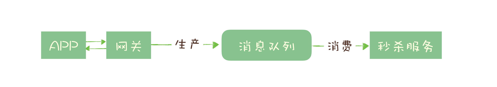
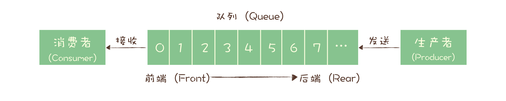
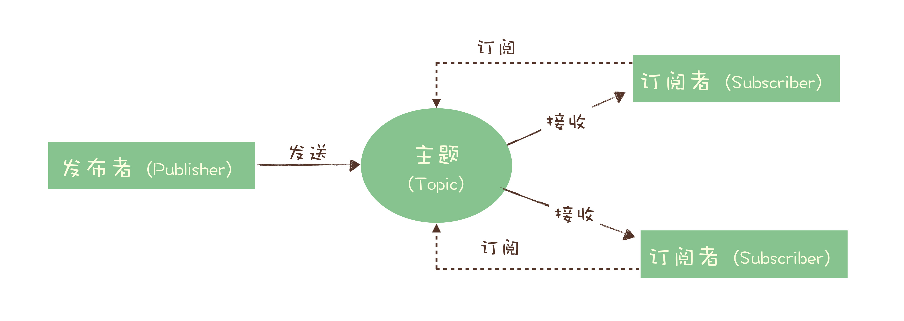

# 消息队列

## 消息队列的应用场景

**异步处理**

比如说一个秒杀系统有如下几个步骤

1. 风险控制
2. 库存锁定
3. 生成订单
4. 短信通知
5. 更新统计数据

但决定是否秒杀成功的只有前两个步骤，只要这两个步骤完成就可以给用户返回结果了，后面的步骤都可以异步执行。

- 可以更快地返回结果。
- 减少等待，自然实现了步骤之间的并发，提升系统总体性能。

**流量控制**

还是以秒杀系统为例，如果短时间内出现大量请求，系统仍然扛不住，这个时候我们就可以用消息队列来隔离网关和服务，以达到流量控制和保护后端服务。请求会暂存在消息队列中，后端服务会尽最大可能来消费，并且后端服务可以水平扩展。

但是这样也是有代价的：

- 增加了系统调用链环节，导致总体响应时间变长。
- 上下游系统都要将同步改为异步，增加了系统复杂度。

还有一种更简单的方法，如果能预估秒杀服务的处理能力，可以使用消息队列实现令牌桶。

牌桶控制流量的原理是：单位时间内只发放固定数量的令牌到令牌桶中，规定服务在处理请求之前必须先从令牌桶中拿出一个令牌，如果令牌桶中没有令牌，则拒绝请求。这样就保证了单位时间内能处理的请求不超过令牌的数量，起到了控制流量的作用。

实现的方式也很简单，不需要破坏原有的调用链，只要网关在处理 APP 请求时增加一个获取令牌的逻辑。

令牌桶可以简单地用一个有固定容量的消息队列加一个“令牌发生器”来实现：令牌发生器按照预估的处理能力，匀速生产令牌并放入令牌队列（如果队列满了则丢弃令牌），网关在收到请求时去令牌队列消费一个令牌，获取到令牌则继续调用后端秒杀服务，如果获取不到令牌则直接返回秒杀失败。

**服务解耦**

以电商平台为例，当创建一个订单时：

1. 支付系统需要发起支付流程；
2. 风控系统需要审核订单的合法性；
3. 客服系统需要给用户发短信告知用户；
4. 经营分析系统需要更新统计数据；
5. ...

这些订单下游的系统都需要实时获得订单数据。随着业务不断发展，这些订单下游系统不断的增加，不断变化，并且每个系统可能只需要订单数据的一个子集，负责订单服务的开发团队不得不花费很大的精力，应对不断增加变化的下游系统，不停地修改调试订单系统与这些下游系统的接口。任何一个下游系统接口变更，都需要订单模块重新进行一次上线，对于一个电商的核心服务来说，这几乎是不可接受的。

所有的电商都选择用消息队列来解决类似的系统耦合过于紧密的问题。引入消息队列后，订单服务在订单变化时发送一条消息到消息队列的一个主题 Order 中，所有下游系统都订阅主题 Order，这样每个下游系统都可以获得一份实时完整的订单数据。

无论增加、减少下游系统或是下游系统需求如何变化，订单服务都无需做任何更改，实现了订单服务与下游服务的解耦。

**发布订阅**

**连接流计算任务和数据**

**消息广播给大量接收者**

## 主题和队列有什么区别

### 两种模型

消息队列基本上有两种模型，队列模型和发布-订阅模型，**他们最大的区别就是一份消息能不能被消费多次**。这里讲的两种模型及其他概念都是业务层模型，不是底层实现，比如 Kafka 和 RocketMQ 都是发布订阅模型，但底层实现是不一样的。

#### 队列模型

严格符合队列的定义，即 FIFO。队列模型中，每个消息只能被消费一次，如果要多个消费者都能消费，就需要多个队列，消息要复制多份。

#### 发布-订阅模型

消息的发送方称为发布者，接收方称为订阅者，服务端存放消息的容器称为主题。发布者把消息发送到主题中，订阅者在接收消息前需要订阅主题。“订阅”既是一个动作，还可以认为是主题在消费时的一个逻辑副本，每份订阅中，订阅者都可以接收到主题的所有消息。

当订阅者只有一个时，发布-订阅模型就和队列模型基本一样了。

现代的消息队列产品大多是发布-订阅模型，如 [Kafka](Kafka.md) 和 [RocketMQ](RocketMQ.md)，但也有例外，典型的如 [RabbitMQ](RabbitMQ.md)。
