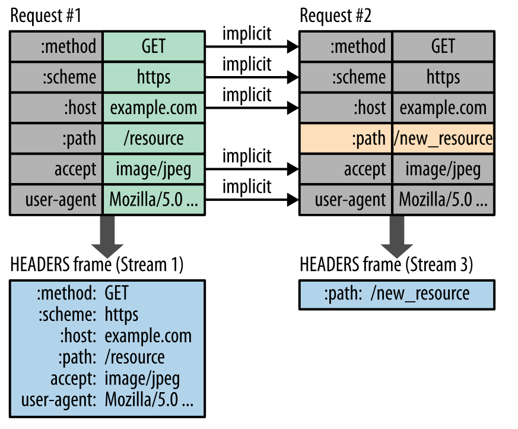

# HTTP

[TOC]

## URI

URI 包含 URL 和 URN。


## 报文格式

**请求报文**


**响应报文**


## HTTP请求方法

|  方法名  |                                    说明                                     |
| ------- | --------------------------------------------------------------------------- |
| GET     | 请求指定的页面信息，并返回实体主体。                                           |
| HEAD    | 类似于 GET 请求，只不过返回的响应中没有具体的内容，用于获取报头。                |
| POST    | 向指定资源提交数据进行处理请求（例如提交表单或者上传文件）。数据被包含在请求体中。 |
| PUT     | 从客户端向服务器传送的数据取代指定的文档的内容                                  |
| DELETE  | 请求服务器删除指定的数据。                                                    |
| CONNECT | HTTP/1.1 协议中预留给能够将连接改为管道方式的代理服务器。                       |
| OPTIONS | 允许客户端查看服务器的性能。                                                  |
| TRACE   | 回显服务器收到的请求，主要用于测试或诊断。                                     |
| PATCH   | 是对 PUT 方法的补充，用来对已知资源进行局部更新 。                              |

### GET 与 POST 比较

#### 作用

GET 用于获取资源，而 POST 用于传输实体主体。

#### 参数

GET 和 POST 的请求都能使用额外的参数，但是 GET 的参数是以查询字符串出现在 URL 中，而 POST 的参数存储在实体主体中。**不能因为 POST 参数存储在实体主体中就认为它的安全性更高，因为照样可以通过一些抓包工具（Fiddler）查看**。

因为 URL 只支持 ASCII 码，因此 GET 的参数中如果存在中文等字符就需要先进行编码。例如 `中文` 会转换为 `%E4%B8%AD%E6%96%87`，而空格会转换为 `%20`。POST 参数支持标准字符集。

```
GET /test/demo_form.asp?name1=value1&name2=value2 HTTP/1.1
```

```
POST /test/demo_form.asp HTTP/1.1
Host: w3schools.com
name1=value1&name2=value2
```

#### 安全

安全的 HTTP 方法不会改变服务器状态，也就是说它只是可读的。

GET 方法是安全的，而 POST 却不是，因为 POST 的目的是传送实体主体内容，这个内容可能是用户上传的表单数据，上传成功之后，服务器可能把这个数据存储到数据库中，因此状态也就发生了改变。

安全的方法除了 GET 之外还有：HEAD、OPTIONS。

不安全的方法除了 POST 之外还有 PUT、DELETE。

#### 幂等性

幂等的 HTTP 方法，同样的请求被执行一次与连续执行多次的效果是一样的，服务器的状态也是一样的。换句话说就是，幂等方法不应该具有副作用（统计用途除外）。

所有的安全方法也都是幂等的。

在正确实现的条件下，GET，HEAD，PUT 和 DELETE 等方法都是幂等的，而 POST 方法不是。

GET /pageX HTTP/1.1 是幂等的，连续调用多次，客户端接收到的结果都是一样的：

```
GET /pageX HTTP/1.1
GET /pageX HTTP/1.1
GET /pageX HTTP/1.1
GET /pageX HTTP/1.1
```

POST /add_row HTTP/1.1 不是幂等的，如果调用多次，就会增加多行记录：

```
POST /add_row HTTP/1.1   -> Adds a 1nd row
POST /add_row HTTP/1.1   -> Adds a 2nd row
POST /add_row HTTP/1.1   -> Adds a 3rd row
```

DELETE /idX/delete HTTP/1.1 是幂等的，即使不同的请求接收到的状态码不一样：

```
DELETE /idX/delete HTTP/1.1   -> Returns 200 if idX exists
DELETE /idX/delete HTTP/1.1   -> Returns 404 as it just got deleted
DELETE /idX/delete HTTP/1.1   -> Returns 404
```

#### 可缓存

如果要对响应进行缓存，需要满足以下条件：

- 请求报文的 HTTP 方法本身是可缓存的，包括 GET 和 HEAD，但是 PUT 和 DELETE 不可缓存，POST 在多数情况下不可缓存的。
- 响应报文的状态码是可缓存的，包括：200, 203, 204, 206, 300, 301, 404, 405, 410, 414, and 501。
- 响应报文的 Cache-Control 首部字段没有指定不进行缓存。

#### XMLHttpRequest

为了阐述 POST 和 GET 的另一个区别，需要先了解 XMLHttpRequest：

> XMLHttpRequest 是一个 API，它为客户端提供了在客户端和服务器之间传输数据的功能。它提供了一个通过 URL 来获取数据的简单方式，并且不会使整个页面刷新。这使得网页只更新一部分页面而不会打扰到用户。XMLHttpRequest 在 AJAX 中被大量使用。

在使用 XMLHttpRequest 的 POST 方法时，浏览器会先发送 Header 再发送 Data。但并不是所有浏览器会这么做，例如火狐就不会。
而 GET 方法 Header 和 Data 会一起发送。

## HTTP状态码

| 状态码 |              类别               |              含义               |
| ----- | ------------------------------ | ------------------------------ |
| 1xx   | Informational（信息性状态码）    | 接收的请求正在处理               |
| 2xx   | Success（成功状态码             | 请求正常处理完毕                 |
| 3xx   | Redirection（重定向状态码）      | 需要进行附加操作以完成请求        |
| 4xx   | Client Error（客户端错误状态码） | 服务器无法处理请求               |
| 5xx   | Server Error（服务器错误状态码） | Server Error（服务器错误状态码） |

### 1XX 信息

- **100 Continue**：表明到目前为止都很正常，客户端可以继续发送请求或者忽略这个响应。

### 2XX 成功

- **200 OK**
- **204 No Content**：请求已经成功处理，但是返回的响应报文不包含实体的主体部分。一般在只需要从客户端往服务器发送信息，而不需要返回数据时使用。
- **206 Partial Content**：表示客户端进行了范围请求，响应报文包含由 Content-Range 指定范围的实体内容。

### 3XX 重定向

- **301 Moved Permanently**：永久性重定向
- **302 Found**：临时性重定向
- **303 See Other**：和 302 有着相同的功能，但是 303 明确要求客户端应该采用 GET 方法获取资源。
- **304 Not Modified**：如果请求报文首部包含一些条件，例如：If-Match，If-Modified-Since，If-None-Match，If-Range，If-Unmodified-Since，如果不满足条件，则服务器会返回 304 状态码。
- **307 Temporary Redirect**：临时重定向，与 302 的含义类似，但是 307 要求浏览器不会把重定向请求的 POST 方法改成 GET 方法。

**注意**：虽然 HTTP 协议规定 301、302 状态下重定向时不允许把 POST 方法改成 GET 方法，但是大多数浏览器都会在 301、302 和 303 状态下的重定向把 POST 方法改成 GET 方法。

### 4XX 客户端错误

- **400 Bad Request**：请求报文中存在语法错误。
- **401 Unauthorized**：该状态码表示发送的请求需要有认证信息（BASIC 认证、DIGEST 认证）。如果之前已进行过一次请求，则表示用户认证失败。
- **403 Forbidden**：请求被拒绝。
- **404 Not Found**：没有找到请求的资源。

### 5XX 服务器错误

- **500 Internal Server Error**：服务器正在执行请求时发生错误。
- **502 Bad Gateway**：网关错误。
- **503 Service Unavailable**：服务器暂时处于超负载或正在进行停机维护，现在无法处理请求。
- **504 Gateway Timeout**：网关超时。

## HTTP/1.1

- 默认是长连接
- 支持流水线
- 支持同时打开多个 TCP 连接
- 支持虚拟主机
- 新增状态码 100
- 支持分块传输编码
- 新增缓存处理指令 max-age

### 长连接和短连接

**在 HTTP/1.0 中，默认使用的是短连接**。也就是说，浏览器和服务器每进行一次 HTTP 操作，就建立一次连接，但任务结束就中断连接。如果客户端浏览器访问的某个 HTML 或其他类型的 Web 页中包含有其他的 Web 资源，如 JavaScript 文件、图像文件、CSS 文件等，当浏览器每遇到这样一个 Web 资源，就会建立一个 HTTP 会话。

**从 HTTP/1.1 起，默认使用长连接**，用以保持连接特性。

使用长连接的 HTTP 协议，需要在响应头加入这个头部（HTTP/1.1 默认有）：

```
Connection: keep-alive
```

在 HTTP/1.1 中，如果要关闭，要加入这个头部：

```
Connection: close
```

在使用长连接的情况下，当一个网页打开完成后，客户端和服务器之间用于传输 HTTP 数据的 TCP 连接不会关闭，如果客户端再次访问这个服务器上的网页，会继续使用这一条已经建立的连接。**Keep-Alive 不会永久保持连接**，它有一个保持时间，可以在不同的服务器软件（如 Apache）中设定这个时间。**实现长连接要客户端和服务端都支持长连接**。

HTTP 协议本身是没有长短连接一说的，HTTP 协议是基于请求/响应模式的，因此只要服务端给了响应，本次 HTTP 请求就结束了。因此我们说的 HTTP 协议的长连接和短连接，实质上是 TCP 协议的长连接和短连接。

## HTTP/2.0

### HTTP/1.x 缺陷

HTTP/1.x 实现简单是以牺牲性能为代价的：

- 客户端需要使用多个连接才能实现并发和缩短延迟；
- 不会压缩请求和响应首部，从而导致不必要的网络流量；
- 不支持有效的资源优先级，致使底层 TCP 连接的利用率低下。

### 二进制分帧层

HTTP/2.0 将报文分成 HEADERS 帧和 DATA 帧，它们都是二进制格式的。


在通信过程中，只会有一个 TCP 连接存在，它承载了任意数量的双向数据流（Stream）。

- 一个数据流（Stream）都有一个唯一标识符和可选的优先级信息，用于承载双向信息。
- 消息（Message）是与逻辑请求或响应对应的完整的一系列帧。
- 帧（Frame）是最小的通信单位，来自不同数据流的帧可以交错发送，然后再根据每个帧头的数据流标识符重新组装。


### 服务端推送

HTTP/2.0 在客户端请求一个资源时，会把相关的资源一起发送给客户端，客户端就不需要再次发起请求了。例如客户端请求 page.html 页面，服务端就把 script.js 和 style.css 等与之相关的资源一起发给客户端。


### 首部压缩

HTTP/1.1 的首部带有大量信息，而且每次都要重复发送。

HTTP/2.0 要求客户端和服务器同时维护和更新一个包含之前见过的首部字段表，从而避免了重复传输。

不仅如此，HTTP/2.0 也使用 Huffman 编码对首部字段进行压缩。

