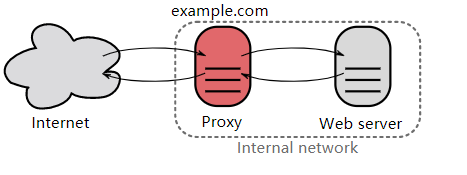

# HTTP 具体应用

[TOC]

## 连接管理

### 短连接与长连接

当浏览器访问一个包含多张图片的 HTML 页面时，除了请求访问的 HTML 页面资源，还会请求图片资源。如果每进行一次 HTTP 通信就要新建一个 TCP 连接，那么开销会很大。

长连接只需要建立一次 TCP 连接就能进行多次 HTTP 通信。

- 从 HTTP/1.1 开始默认是长连接的，如果要断开连接，需要由客户端或者服务器端提出断开，使用 `Connection : close`；
- 在 HTTP/1.1 之前默认是短连接的，如果需要使用长连接，则使用 `Connection : Keep-Alive`。

### 流水线

默认情况下，HTTP 请求是按顺序发出的，下一个请求只有在当前请求收到响应之后才会被发出。由于受到网络延迟和带宽的限制，在下一个请求被发送到服务器之前，可能需要等待很长时间。

流水线是在同一条长连接上连续发出请求，而不用等待响应返回，这样可以减少延迟。

## Cookie

HTTP 协议是无状态的，主要是为了让 HTTP 协议尽可能简单，使得它能够处理大量事务。HTTP/1.1 引入 Cookie 来保存状态信息。

Cookie 是服务器发送到用户浏览器并保存在本地的一小块数据，它会在浏览器之后向同一服务器再次发起请求时被携带上，用于告知服务端两个请求是否来自同一浏览器。由于之后每次请求都会需要携带 Cookie 数据，因此会带来额外的性能开销（尤其是在移动环境下）。

Cookie 曾一度用于客户端数据的存储，因为当时并没有其它合适的存储办法而作为唯一的存储手段，但现在随着现代浏览器开始支持各种各样的存储方式，Cookie 渐渐被淘汰。新的浏览器 API 已经允许开发者直接将数据存储到本地，如使用 Web storage API（本地存储和会话存储）或 IndexedDB。

### 1. 用途

- 会话状态管理（如用户登录状态、购物车、游戏分数或其它需要记录的信息）
- 个性化设置（如用户自定义设置、主题等）
- 浏览器行为跟踪（如跟踪分析用户行为等）

### 2. 创建过程

服务器发送的响应报文包含 Set-Cookie 首部字段，客户端得到响应报文后把 Cookie 内容保存到浏览器中。

```
HTTP/1.0 200 OK
Content-type: text/html
Set-Cookie: yummy_cookie=choco
Set-Cookie: tasty_cookie=strawberry

[page content]
```

客户端之后对同一个服务器发送请求时，会从浏览器中取出 Cookie 信息并通过 Cookie 请求首部字段发送给服务器。

```
GET /sample_page.html HTTP/1.1
Host: www.example.org
Cookie: yummy_cookie=choco; tasty_cookie=strawberry
```

### 3. 分类

- 会话期 Cookie：浏览器关闭之后它会被自动删除，也就是说它仅在会话期内有效。
- 持久性 Cookie：指定过期时间（Expires）或有效期（max-age）之后就成为了持久性的 Cookie。

```
Set-Cookie: id=a3fWa; Expires=Wed, 21 Oct 2015 07:28:00 GMT;
```

### 4. 作用域

Domain 标识指定了哪些主机可以接受 Cookie。如果不指定，默认为当前文档的主机（不包含子域名）。如果指定了 Domain，则一般包含子域名。例如，如果设置 Domain=mozilla.org，则 Cookie 也包含在子域名中（如 developer.mozilla.org）。

Path 标识指定了主机下的哪些路径可以接受 Cookie（该 URL 路径必须存在于请求 URL 中）。以字符 %x2F ("/") 作为路径分隔符，子路径也会被匹配。例如，设置 Path=/docs，则以下地址都会匹配：

- /docs
- /docs/Web/
- /docs/Web/HTTP

### 5. JavaScript

浏览器通过 `document.cookie` 属性可创建新的 Cookie，也可通过该属性访问非 HttpOnly 标记的 Cookie。

```
document.cookie = "yummy_cookie=choco";
document.cookie = "tasty_cookie=strawberry";
console.log(document.cookie);
```

### 6. HttpOnly

标记为 HttpOnly 的 Cookie 不能被 JavaScript 脚本调用。跨站脚本攻击 (XSS) 常常使用 JavaScript 的 `document.cookie` API 窃取用户的 Cookie 信息，因此使用 HttpOnly 标记可以在一定程度上避免 XSS 攻击。

```
Set-Cookie: id=a3fWa; Expires=Wed, 21 Oct 2015 07:28:00 GMT; Secure; HttpOnly
```

### 7. Secure

标记为 Secure 的 Cookie 只能通过被 HTTPS 协议加密过的请求发送给服务端。但即便设置了 Secure 标记，敏感信息也不应该通过 Cookie 传输，因为 Cookie 有其固有的不安全性，Secure 标记也无法提供确实的安全保障。

### 8. Session

除了可以将用户信息通过 Cookie 存储在用户浏览器中，也可以利用 Session 存储在服务器端，存储在服务器端的信息更加安全。

Session 可以存储在服务器上的文件、数据库或者内存中。也可以将 Session 存储在 Redis 这种内存型数据库中，效率会更高。

使用 Session 维护用户登录状态的过程如下：

- 用户进行登录时，用户提交包含用户名和密码的表单，放入 HTTP 请求报文中；
- 服务器验证该用户名和密码，如果正确则把用户信息存储到 Redis 中，它在 Redis 中的 Key 称为 Session ID；
- 服务器返回的响应报文的 Set-Cookie 首部字段包含了这个 Session ID，客户端收到响应报文之后将该 Cookie 值存入浏览器中；
- 客户端之后对同一个服务器进行请求时会包含该 Cookie 值，服务器收到之后提取出 Session ID，从 Redis 中取出用户信息，继续之前的业务操作。

应该注意 Session ID 的安全性问题，不能让它被恶意攻击者轻易获取，那么就不能产生一个容易被猜到的 Session ID 值。此外，还需要经常重新生成 Session ID。在对安全性要求极高的场景下，例如转账等操作，除了使用 Session 管理用户状态之外，还需要对用户进行重新验证，比如重新输入密码，或者使用短信验证码等方式。

### 9. 浏览器禁用 Cookie

此时无法使用 Cookie 来保存用户信息，只能使用 Session。除此之外，不能再将 Session ID 存放到 Cookie 中，而是使用 URL 重写技术，将 Session ID 作为 URL 的参数进行传递。

### 10. Cookie 与 Session 选择

- Cookie 只能存储 ASCII 码字符串，而 Session 则可以存储任何类型的数据，因此在考虑数据复杂性时首选 Session；
- Cookie 存储在浏览器中，容易被恶意查看。如果非要将一些隐私数据存在 Cookie 中，可以将 Cookie 值进行加密，然后在服务器进行解密；
- 对于大型网站，如果用户所有的信息都存储在 Session 中，那么开销是非常大的，因此不建议将所有的用户信息都存储到 Session 中。

## 缓存

### 1. 优点

- 缓解服务器压力；
- 降低客户端获取资源的延迟：缓存通常位于内存中，读取缓存的速度更快。并且缓存服务器在地理位置上也有可能比源服务器来得近，例如浏览器缓存。

### 2. 实现方法

- 让代理服务器进行缓存；
- 让客户端浏览器进行缓存。

### 3. Cache-Control

HTTP/1.1 通过 Cache-Control 首部字段来控制缓存。

## 通信数据转发

### 1. 代理

代理服务器接受客户端的请求，并且转发给其它服务器。

使用代理的主要目的是：

- 缓存
- 负载均衡
- 网络访问控制
- 访问日志记录

代理服务器分为正向代理和反向代理两种：

- 用户察觉得到正向代理的存在。


- 而反向代理一般位于内部网络中，用户察觉不到。



### 2. 网关

与代理服务器不同的是，网关服务器会将 HTTP 转化为其它协议进行通信，从而请求其它非 HTTP 服务器的服务。

### 3. 隧道

使用 SSL 等加密手段，在客户端和服务器之间建立一条安全的通信线路。
