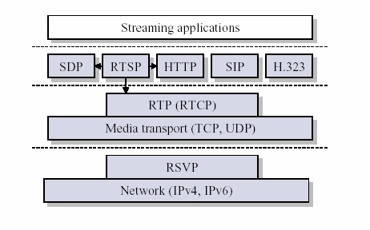

# RTP

## 实时传输协议 RTP

[RTP](https://zh.wikipedia.org/wiki/实时传输协议)

从图中可以看出，RTP 被划分在传输层，它建立在 UDP 上。同 UDP 协议一样，为了实现其实时传输功能，RTP 也有固定的封装形式。RTP 用来为端到端的实时传输提供时间信息和流同步，但并不保证服务质量。服务质量由 RTCP 来提供。

[参考](https://github.com/babosa/Course/blob/master/流媒体传输控制协议(RTSP%20RTP%20SDP)详解/rtp.md)

## 实时传输控制协议 RTCP

[RTCP](https://zh.wikipedia.org/wiki/实时传输控制协议)
