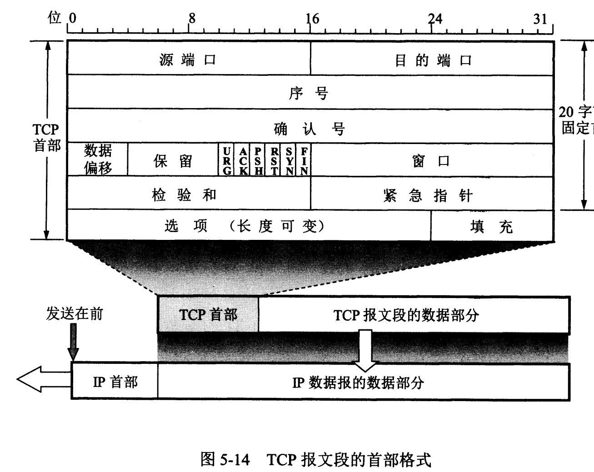
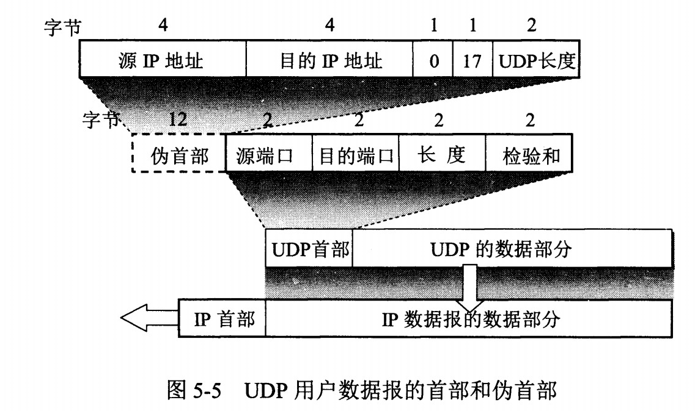
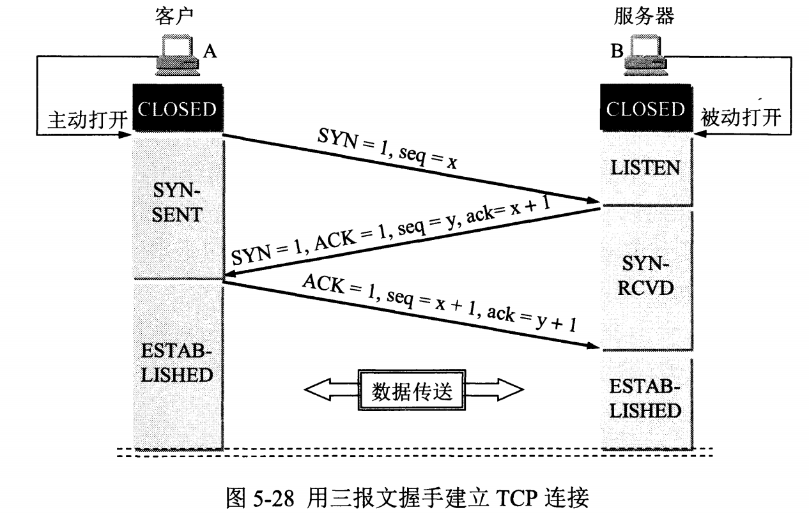
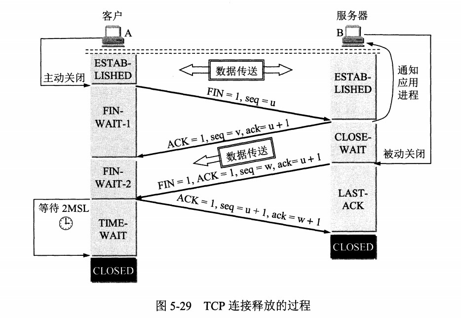
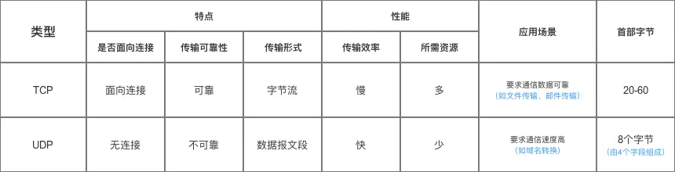
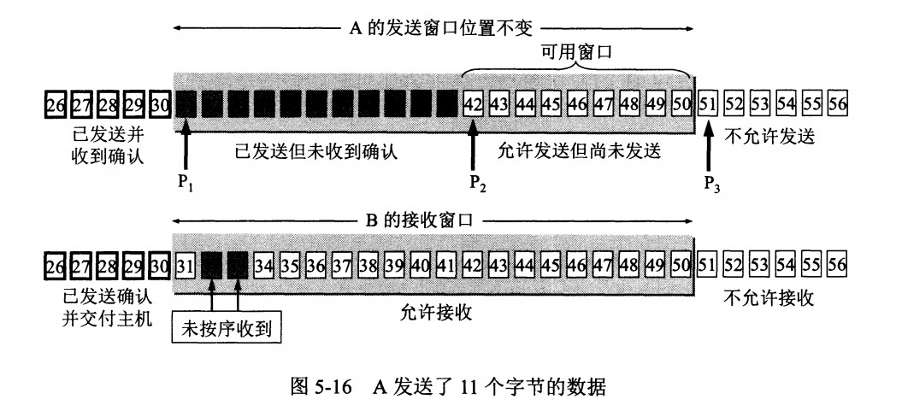
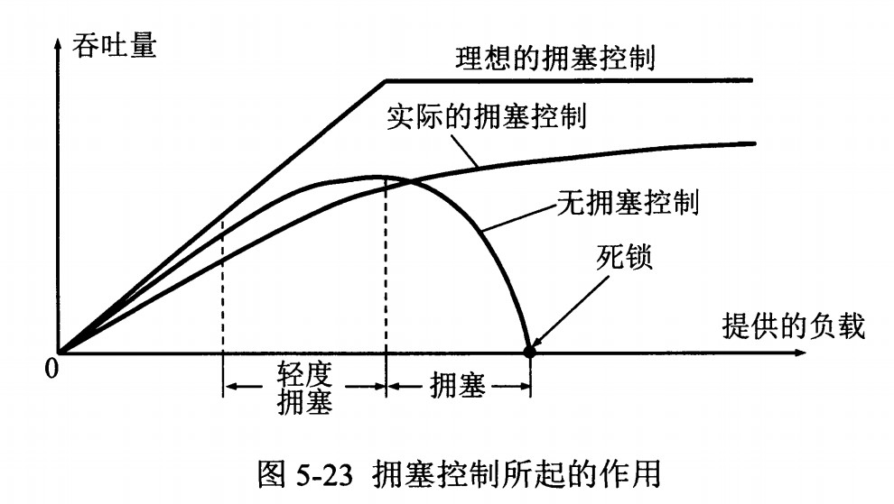
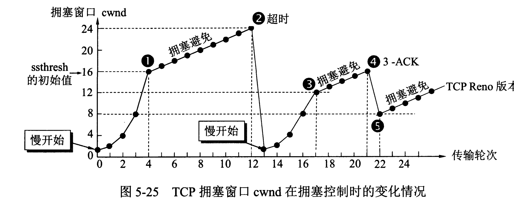
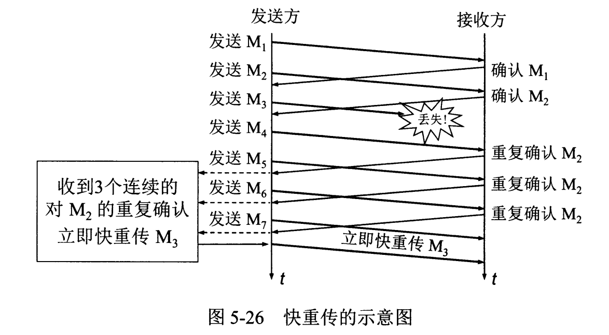

# 传输层

[TOC]

## TCP 和 UDP 报文结构

- TCP：传输控制协议（Transmission Control Protocol）
- UDP：用户数据报协议（User Datagram Protocol）

### TCP 报文

TCP 报文首部有 20 字节的固定部分，以及最多 40 字节的选项长度，因此首部最多 60 字节。数据偏移保存了该 TCP 报文首部长度。



- 源端口和目的端口
- 序号 ：用于对字节流进行编号，例如序号为 301，表示第一个字节的编号为 301，如果携带的数据长度为 100 字节，那么下一个报文段的序号应为 401。
- 确认号 ：期望收到的下一个报文段的序号。例如 B 正确收到 A 发送来的一个报文段，序号为 501，携带的数据长度为 200 字节，因此 B 期望下一个报文段的序号为 701，B 发送给 A 的确认报文段中确认号就为 701。
- 数据偏移 ：指的是数据部分距离报文段起始处的偏移量，实际上指的是首部的长度。
- 确认 ACK ：当 ACK=1 时确认号字段有效，否则无效。TCP 规定，在连接建立后所有传送的报文段都必须把 ACK 置 1。
- 同步 SYN ：在连接建立时用来同步序号。当 SYN=1，ACK=0 时表示这是一个连接请求报文段。若对方同意建立连接，则响应报文中 SYN=1，ACK=1。
- 终止 FIN ：用来释放一个连接，当 FIN=1 时，表示此报文段的发送方的数据已发送完毕，并要求释放连接。
- 窗口 ：窗口值作为接收方让发送方设置其发送窗口的依据。之所以要有这个限制，是因为接收方的数据缓存空间是有限的。

### UDP 报文



UDP 首部字段只有 8 个字节，包括源端口、目的端口、长度、检验和。12 字节的伪首部是为了计算检验和临时添加的。

## TCP 三次握手和四次挥手的过程

### TCP 三次握手



1. 服务器处于 **LISTEN** 状态，等待客户连接请求。
2. 客户端发送请求报文，设置标志位 **SYN**，序号 **seq=x**，进入 **SYN-SENT** 状态。
3. 服务器收到请求报文，返回确认报文，设置标志位 **SYN**，**ACK**，序号 **seq=y**，确认号 **ack=x+1**，进入 **SYN-RCVD** 状态。
4. 客户端收到服务器的确认报文，返回自己的确认报文，设置标志位 **ACK**，确认号 **ack=y+1**，进入 **ESTABLISHED** 状态。
5. 服务器收到客户端的确认报文，进入 **ESTABLISHED** 状态。

---

**为什么要三次握手？**

**原因一：双方都需要确认自己和对方的发送和接收正常，这样才能保证通信是可靠的**

- 第一次握手：发送方**什么都不能确认**；接收方**确认了对方发送正常，自己接收正常**。
- 第二次握手：发送方确认了：**自己发送、接收正常，对方发送、接收正常**；接收方确认了：**对方发送正常，自己接收正常**。
- 第三次握手：发送方确认了：**自己发送、接收正常，对方发送、接收正常**；接收方确认了：**自己发送、接收正常，对方发送、接收正常**。

**原因二：防止已经失效的连接请求报文突然又传送到了服务器，从而产生错误**

如果使用的是两次握手建立连接，假设有这样一种场景：**客户端发送了第一个请求连接并且没有丢失，只是因为在网络结点中滞留的时间太长了**，由于 TCP 的客户端迟迟没有收到确认报文，以为服务器没有收到，此时重新向服务器发送这条报文，此后客户端和服务器经过两次握手完成连接，传输数据，然后关闭连接。此时此前滞留的那一次请求连接，网络通畅了到达了服务器，这个报文本该是失效的，但是，两次握手的机制将会让客户端和服务器再次建立连接，这将导致不必要的错误和资源的浪费。

如果采用的是三次握手，就算是那一次失效的报文传送过来了，服务端接受到了那条失效报文并且回复了确认报文，但是客户端不会再次发出确认。由于服务器收不到确认，就知道客户端并没有请求连接。

---

### TCP 四次挥手

TCP 断开连接可以是连接的任何一方发起。这里以客户端发起为例。



1. 客户端发送连接释放报文，设置标志位 **FIN**，序号 **seq=u**，进入 **FIN-WAIT-1** 状态，这表示客户端没有数据要发送给服务器了。
2. 服务器收到连接释放报文，返回确认报文，设置标志位 **ACK**，序号 **seq=v**，确认号 **ack=u+1**，进入 **CLOSE-WAIT** 状态，表示服务器同意关闭连接请求，但是可能还有数据没发送完，因此处于半关闭状态。
3. 客户端收到服务器的确认报文，进入 **FIN-WAIT-2** 状态。
4. 数据全部传完后，服务器发送连接释放报文，设置标志位 **FIN**，**ACK**，序号 **seq=w**，确认号 **ack=u+1**，进入 **LAST-ACK** 状态，表示数据都传输完了，请求关闭连接。
5. 客户端收到连接释放报文，返回确认报文，设置标志位 **ACK**，序号 **seq=u+1**，确认号 **ack=w+1**，进入 **TIME-WAIT** 状态。
6. 服务器收到确认报文后，进入 **CLOSED** 状态。
7. 客户端在 **TIME-WAIT** 状态等待 2 MSL 后没有收到回复，说明服务器已经成功关闭连接，于是也进入 **CLOSED** 状态。

---

**为什么要四次挥手？**

关闭连接时，服务器收到对方的 FIN 报文时，**仅仅表示对方不再发送数据了**，但是还能接收数据，而自己也未必全部数据都发送给对方了，所以己方可以立即关闭，也可以发送一些数据给对方后，再发送 FIN 报文给对方来表示自己不再发送数据了，可以关闭连接。因此，己方 ACK 和 FIN 一般都会分开发送，从而导致多了一次。

[参考文章](https://blog.csdn.net/qzcsu/article/details/72861891)

---

**TIME-WAIT 的作用？**

客户端接收到服务器端的 FIN 报文后进入此状态，此时并不是直接进入 CLOSED 状态，还需要等待一个时间计时器设置的时间 2 MSL（最长报文段寿命，Maximum Segment Lifetime，是任何报文在网络上存在的最长的最长时间）。这么做有两个理由：

- 确保最后一个确认报文能够到达。如果服务端没收到客户端发送来的确认报文，那么就会重新发送连接释放请求报文，客户端等待一段时间就是为了处理这种情况的发生。
- 等待一段时间还可以让本连接持续时间内所产生的所有报文都从网络中消失，使得下一个新的连接不会出现旧的连接请求报文。

[MSL 的值是多少](https://blog.csdn.net/qwertyupoiuytr/article/details/71436967)

---

## TCP 和 UDP 的区别



- TCP 提供面向连接的服务。在传送数据之前必须先建立连接，数据传送结束后要释放连接。 TCP 不提供广播或多播服务。由于 TCP 要提供可靠的，面向连接的传输服务（TCP 的可靠体现在 TCP 在传递数据之前，会有三次握手来建立连接，而且在数据传递时，有确认、窗口、重传、拥塞控制机制，在数据传完后，还会断开连接用来节约系统资源），这难免会增加许多开销，如确认，流量控制，计时器以及连接管理等。这不仅使协议数据单元的首部增大很多，还要占用许多处理器资源。TCP 一般用于文件传输、发送和接收邮件、远程登录等场景。

- UDP 在传送数据之前不需要先建立连接，远程主机在收到 UDP 报文后，不需要给出任何确认。虽然 UDP 不提供可靠交付，但在某些情况下 UDP 确是一种最有效的工作方式（一般用于即时通信，[RTP](RTP.md)），比如： 语音、 视频 、直播等等。

## TCP 如何保证传输可靠性

TCP 使用确认机制 + 超时重传来实现可靠传输，如果一个已经发送的报文段在超时时间内没有收到确认，那么就重传这个报文段。

一个报文段从发送再到接收到确认所经过的时间称为往返时间 RTT，加权平均往返时间 RTTs 计算如下：

```
RTTs = (1 - a) * RTTs + a * RTT
```

其中，0 ≤ a ＜ 1，RTTs 随着 a 的增加更容易受到 RTT 的影响。

超时时间 RTO 应该略大于 RTTs，TCP 使用的超时时间计算如下：

```
RTO = RTTs + 4 * RTTd
```

其中 RTTd 为偏差的加权平均值。

## TCP 滑动窗口

滑动窗口是用来进行流量控制的，接收方可以根据自己的接收能力控制发送方发的数据量。窗口是缓存的一部分，用来暂时存放字节流。**发送方和接收方各有一个窗口，接收方通过 TCP 报文段中的窗口字段告诉发送方自己的窗口大小，发送方根据这个值和其它信息设置自己的窗口大小**。

发送窗口内的字节都允许被发送，接收窗口内的字节都允许被接收。如果发送窗口左部的字节已经发送并且收到了确认，那么就将发送窗口向右滑动一定距离，直到左部第一个字节不是已发送并且已确认的状态；接收窗口的滑动类似，接收窗口左部字节已经发送确认并交付主机，就向右滑动接收窗口。

接收窗口只会对窗口内最后一个按序到达的字节进行确认，例如接收窗口已经收到的字节为 {31, 34, 35}，其中 {31} 按序到达，而 {34, 35} 就不是，因此只对字节 {31} 进行确认。发送方得到一个字节的确认之后，就知道这个字节之前的所有字节都已经被接收。



TCP 还有一种延迟确认的机制，允许接收到几个连续包后发送最后一个的确认。

## TCP 流量控制

流量控制是为了控制发送方发送速率，保证接收方来得及接收。

接收方发送的确认报文中的窗口字段可以用来控制发送方窗口大小，从而影响发送方的发送速率。将窗口字段设置为 0，则发送方不能发送数据。

## TCP 拥塞控制

如果网络出现拥塞，分组将会丢失，此时发送方会继续重传，从而导致网络拥塞程度更高。因此当出现拥塞时，应当控制发送方的速率。这一点和流量控制很像，但是出发点不同。流量控制是为了让接收方能来得及接收，而拥塞控制是为了降低整个网络的拥塞程度。



TCP 主要通过四个算法来进行拥塞控制：**慢开始、拥塞避免、快重传、快恢复**。

发送方需要维护一个叫做拥塞窗口（cwnd，congestion window）的状态变量。注意拥塞窗口与发送方窗口的区别：**拥塞窗口只是一个状态变量，实际决定发送方能发送多少数据的是发送方窗口**。

为了便于讨论，做如下假设：

- 接收方有足够大的接收缓存，因此不会发生流量控制；
- 虽然 TCP 的窗口基于字节，但是这里设窗口的大小单位为报文段。



### 1. 慢开始与拥塞避免

发送的最初执行慢开始，令 cwnd=1，发送方只能发送 1 个报文段。当收到确认后，将 cwnd 加倍，因此之后发送方能够发送的报文段数量为：2、4、8 ...

注意到慢开始每个轮次都将 cwnd 加倍，这样会让 cwnd 增长速度非常快，从而使得发送方发送的速度增长速度过快，网络拥塞的可能性也就更高。设置一个慢开始门限 ssthresh，当 cwnd>=ssthresh 时，进入拥塞避免，每个轮次只将 cwnd 加 1。

如果出现了超时，则令 ssthresh=cwnd / 2，然后重新执行慢开始。

### 2. 快重传与快恢复

在接收方，要求每次接收到报文段都应该对最后一个已收到的有序报文段进行确认。例如已经接收到 M1 和 M2，此时收到 M4，应当发送对 M2 的确认。

在发送方，如果收到三个重复确认，那么可以知道下一个报文段丢失，此时执行快重传，立即重传下一个报文段。例如收到三个 M2，则 M3 丢失，立即重传 M3。

在这种情况下，只是丢失个别报文段，而不是网络拥塞。因此执行快恢复，令 ssthresh=cwnd / 2 ，cwnd=ssthresh，注意到此时直接进入拥塞避免。

慢开始和快恢复的快慢指的是 cwnd 的设定值，而不是 cwnd 的增长速率。慢开始 cwnd 设定为 1，而快恢复 cwnd 设定为 ssthresh。


