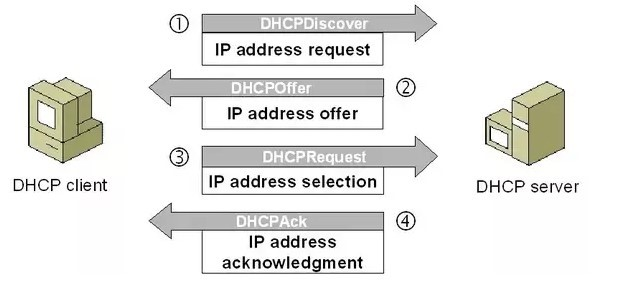
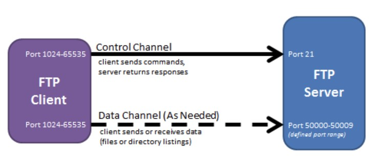
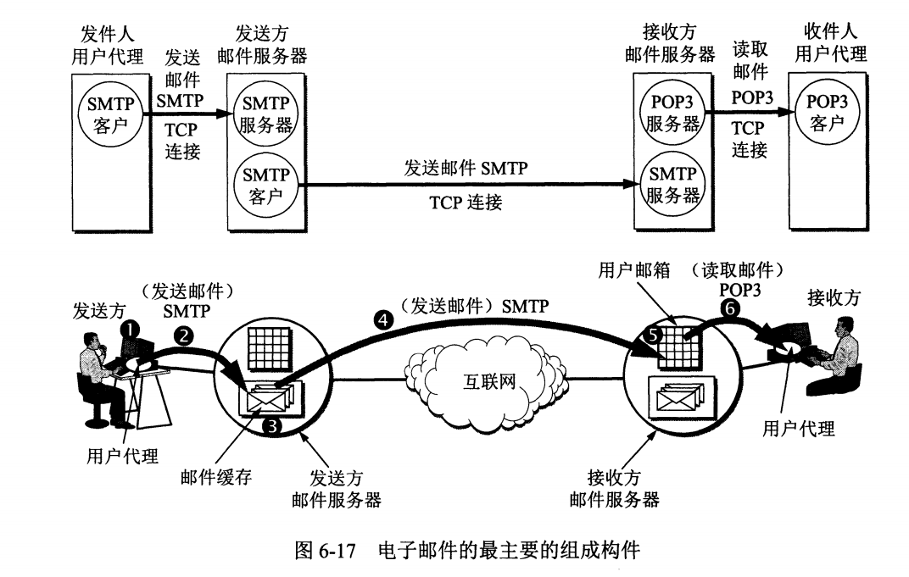

# 应用层

[TOC]

## 域名系统 DNS

DNS 是一个分布式数据库，提供了主机名和 IP 地址之间相互转换的服务。这里的分布式数据库是指，每个站点只保留它自己的那部分数据。

域名具有层次结构，从上到下依次为：根域名、顶级域名、二级域名。

DNS 可以使用 UDP 或者 TCP 进行传输，使用的端口号都为 53。大多数情况下 DNS 使用 UDP 进行传输，这就要求域名解析器和域名服务器都必须自己处理超时和重传从而保证可靠性。在两种情况下会使用 TCP 进行传输：

- 如果返回的响应超过的 512 字节（DNS 将最大的 UDP 数据包限制为 512 字节）。
- 区域传送（区域传送是主域名服务器向辅助域名服务器传送变化的那部分数据）。

## 动态主机配置协议 DHCP

DHCP (Dynamic Host Configuration Protocol) 提供了即插即用的连网方式，用户不再需要手动配置 IP 地址等信息。

DHCP 配置的内容不仅是 IP 地址，还包括子网掩码、网关 IP 地址。

DHCP 工作过程如下：

1. 客户端发送 Discover 报文，该报文的目的地址为 255.255.255.255:67，源地址为 0.0.0.0:68，被放入 UDP 中，该报文被广播到同一个子网的所有主机上。如果客户端和 DHCP 服务器不在同一个子网，就需要使用中继代理。
2. DHCP 服务器收到 Discover 报文之后，发送 Offer 报文给客户端，该报文包含了客户端所需要的信息。因为客户端可能收到多个 DHCP 服务器提供的信息，因此客户端需要进行选择。
3. 如果客户端选择了某个 DHCP 服务器提供的信息，那么就发送 Request 报文给该 DHCP 服务器。
4. DHCP 服务器发送 Ack 报文，表示客户端此时可以使用提供给它的信息。

## 文件传输协议 FTP

FTP 使用 TCP 进行连接，它需要两个连接来传送一个文件：

- 控制连接：服务器打开端口号 21 等待客户端的连接，客户端主动建立连接后，使用这个连接将客户端的命令传送给服务器，并传回服务器的应答。
- 数据连接：用来传送一个文件数据。

根据数据连接是否是服务器端主动建立，FTP 有主动和被动两种模式：

- **主动模式**：服务器端主动建立数据连接，其中服务器端的端口号为 20，客户端的端口号随机，但是必须大于 1024，因为 0~1023 是熟知端口号。

- **被动模式**：客户端主动建立数据连接，其中客户端的端口号由客户端自己指定，服务器端的端口号随机。

主动模式要求客户端开放端口号给服务器端，需要去配置客户端的防火墙。被动模式只需要服务器端开放端口号即可，无需客户端配置防火墙。但是被动模式会导致服务器端的安全性减弱，因为开放了过多的端口号。

## 电子邮件协议

一个电子邮件系统由三部分组成：用户代理、邮件服务器以及邮件协议。

邮件协议包含发送协议和读取协议，发送协议常用 SMTP，读取协议常用 POP3 和 IMAP。

### SMTP

SMTP 只能发送 ASCII 码，而互联网邮件扩充 MIME 可以发送二进制文件。MIME 并没有改动或者取代 SMTP，而是增加邮件主体的结构，定义了非 ASCII 码的编码规则。

### POP3

POP3 的特点是只要用户从服务器上读取了邮件，就把该邮件删除。但最新版本的 POP3 可以不删除邮件。

### IMAP

IMAP 协议中客户端和服务器上的邮件保持同步，如果不手动删除邮件，那么服务器上的邮件也不会被删除。IMAP 这种做法可以让用户随时随地去访问服务器上的邮件。

## 常用端口

|       应用       | 应用层协议 | 端口号  | 传输层协议 |            备注             |
| :--------------: | :--------: | :-----: | :--------: | :-------------------------: |
|     域名解析     |    DNS     |   53    |  UDP/TCP   | 长度超过 512 字节时使用 TCP |
| 动态主机配置协议 |    DHCP    |  67/68  |    UDP     |                             |
| 简单网络管理协议 |    SNMP    | 161/162 |    UDP     |                             |
|   文件传送协议   |    FTP     |  20/21  |    TCP     |  控制连接 21，数据连接 20   |
|   远程终端协议   |   TELNET   |   23    |    TCP     |                             |
|  超文本传送协议  |    HTTP    |   80    |    TCP     |                             |
| 简单邮件传送协议 |    SMTP    |   25    |    TCP     |                             |
|   邮件读取协议   |    POP3    |   110   |    TCP     |                             |
| 网际报文存取协议 |    IMAP    |   143   |    TCP     |                             |
