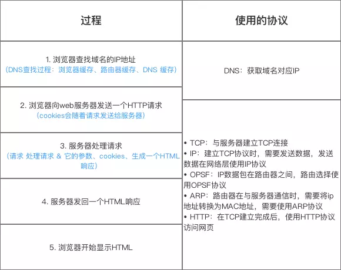

# 浏览器中输入 URL 后发生了什么

## 在浏览器中输入 URL 到显示的过程

大致分为以下几个过程：

1. 浏览器进行 URL 解析，判断是否为合法 URL。
2. 对域名进行 DNS 解析，得到对应域名的 IP 地址。DNS 缓存查找：浏览器缓存、操作系统缓存、路由器缓存、ISP 缓存、根域名服务器。
3. 与目标服务器建立 TCP 连接。
4. 向服务器发送 HTTP 请求。
5. 服务器处理请求并返回 HTTP 响应报文。
6. 浏览器接收到响应，并解析渲染页面。
7. 断开连接。

## 相关阅读

[前端经典面试题: 从输入 URL 到页面加载发生了什么？](https://segmentfault.com/a/1190000006879700)

[在浏览器输入 URL 回车之后发生了什么？（超详细版）](https://mp.weixin.qq.com/s?__biz=MzAxNjk4ODE4OQ==&mid=2247486652&idx=1&sn=098387ac80727dfa9422f39e7bb6d6b6&chksm=9bed2dceac9aa4d8998e90aa6598596a5095483482c3986ab7f05a2b63989b3fe8ea1552890a&mpshare=1&scene=1&srcid=&sharer_sharetime=1568449408082&sharer_shareid=6fa69df0bf20aef3fd0f4b65f54b3610#rd)
